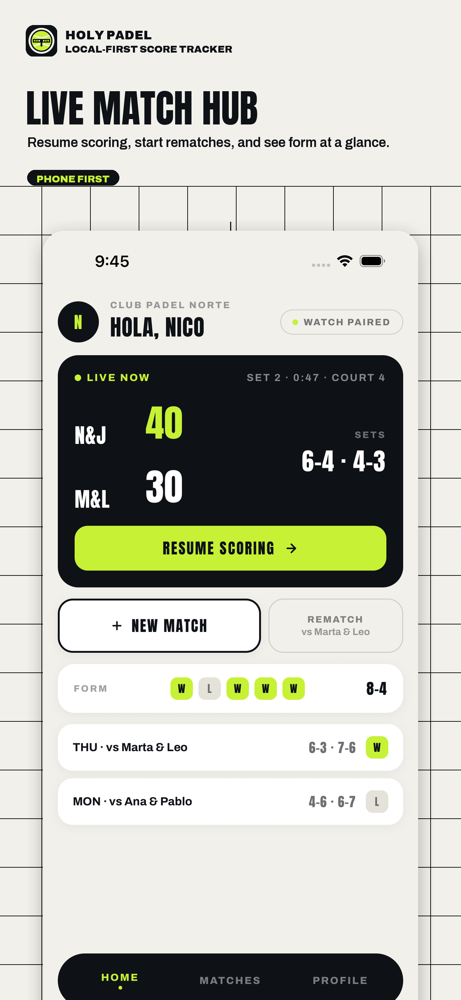
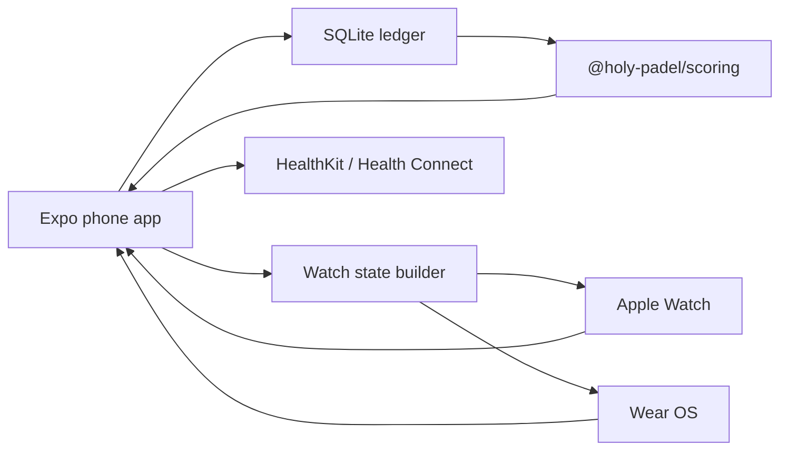

# Holy Padel

[](https://github.com/NxT-Solutions/holy-padel/actions/workflows/ci.yml)

Local-first padel scoring for the match you are actually playing: fast rally entry,
FIP-aware scoring, private match history, form stats, Apple Watch and Wear OS
companions, and optional workout logging.

Holy Padel is an open-source Expo / React Native app built around one simple idea:
the phone is the truth. The phone stores the match ledger locally, computes every
score from point events, and mirrors the live state to watches. Nothing leaves the
device by default.

<p align="center">
  
  
  
  
  
</p>

## What it does

- Score every rally from the phone or paired watch.
- Handle real padel formats: best-of-1 or best-of-3, advantage or golden point,
  set tie-breaks, and optional super tie-break third sets.
- Keep an append-only local match ledger in SQLite.
- Resume, pause, undo, stop-and-save, or discard live matches.
- Show match history, recent form, head-to-head context, and finished-match stats.
- Mirror live score to Apple Watch and Wear OS without duplicating scoring logic.
- Optionally write completed matches to Apple Health / Health Connect.

## Product tour

| Score fast | Mirror to the wrist | Keep the ledger | Know your form |
| --- | --- | --- | --- |
|  |  |  |  |
| Big scoring targets, clear status, fast undo. | Watches mirror the phone and send simple intents back. | Matches stay local and remain reviewable. | Recent form and profile stats stay close to the match. |

## Why it exists

Most score apps are either too generic, too cloud-shaped, or too casual about the
rules. Padel scoring has enough texture that the app should understand the sport:
deuce modes, tie-break serve handoff, partial matches when court time ends, and
watches that help without becoming a second source of truth.

Holy Padel treats a match as a small local event stream:

```text
Match setup + ordered point events -> computed score snapshot
```

Undo is not a special mutation. It is just "remove the last point and recompute."
That keeps the app predictable, testable, and easy to sync.

## Documentation

| Start here | For |
| --- | --- |
| [Human project guide](docs/project-guide.md) | Non-technical readers, open-source visitors, product overview |
| [Technical overview](docs/technical-overview.md) | Developers who want the architecture, data model, sync model, and build map |
| [FIP scoring spec](docs/fip-scoring-spec.md) | The scoring rules the engine implements |
| [Watch sync contract](docs/watch-sync.md) | Phone-to-watch payloads and watch-to-phone intents |
| [Generated GitNexus wiki](docs/gitnexus-wiki/README.md) | Graph-generated module docs for deeper code navigation |

## Architecture



The watches render state and send intents like `score`, `undo`, `pause`, and
`stop`. They do not run the scoring engine. The phone applies every intent to the
local ledger, recomputes the score, then pushes the next state back.

## Monorepo map

| Path | Responsibility |
| --- | --- |
| `apps/mobile` | Expo app, screens, navigation, SQLite adapter, watch sync |
| `apps/mobile/modules/health-log` | Local Expo module for Apple Health / Health Connect writes |
| `apps/mobile/modules/watch-bridge` | Local Expo module for WatchConnectivity / Wearable Data Layer |
| `apps/mobile/targets/watch` | SwiftUI Apple Watch target generated with `@bacons/apple-targets` |
| `apps/watch-wear` | Kotlin + Compose Wear OS companion |
| `packages/scoring` | Pure TypeScript FIP scoring engine and golden vectors |
| `packages/db` | SQLite schema, migrations, and typed repositories |
| `packages/scoring-swift` | Swift scoring port checked against golden vectors |
| `packages/scoring-kotlin` | Kotlin scoring port checked against golden vectors |
| `docs` | Human docs, scoring contract, watch contract, generated code wiki |
| `design` | Source design files, FIP PDF, screenshot assets |

## Stack

- Turborepo + pnpm workspaces
- Expo / React Native + expo-router
- Tamagui design system
- TypeScript strict mode with `exactOptionalPropertyTypes`
- SQLite through `expo-sqlite`
- SwiftUI watchOS target
- Kotlin + Jetpack Compose Wear OS app
- Biome for linting and formatting
- Playwright, Vitest, fast-check, Gradle, Swift Package tests, and native CI jobs

## Run it locally

```sh
pnpm install
pnpm dev
```

For the mobile app:

```sh
pnpm --filter @holy-padel/mobile dev
pnpm --filter @holy-padel/mobile web
pnpm --filter @holy-padel/mobile ios
pnpm --filter @holy-padel/mobile android
```

This app uses custom native modules and watch targets, so Expo Go is not the right
runtime for native testing. Use a dev build for iOS/Android.

## Verify it

```sh
pnpm check
pnpm --filter @holy-padel/mobile e2e
```

`pnpm check` runs Biome, TypeScript, and unit/property tests across the workspace.
The mobile E2E suite runs Playwright against the Expo web build with a fresh local
database per spec.

Native and companion coverage lives in separate workflows:

| Workflow | What it checks |
| --- | --- |
| `ci` | Biome, typecheck, unit/property tests, web build, Playwright E2E |
| `native-e2e` | Maestro flows on an Android emulator |
| `watch-wear` | Wear OS Gradle build |
| `watchos` | Apple Watch simulator build |
| `watch-bridge` | Kotlin + Swift compile checks for the phone-side watch bridge |
| `engine-ports` | Swift and Kotlin scoring ports against golden vectors |

## Regenerate code intelligence docs

GitNexus is used to keep a generated module wiki in Markdown:

```sh
pnpm gitnexus:wiki
```

The generated pages are committed under `docs/gitnexus-wiki`, while
`.gitnexusignore` keeps those pages out of future graph analysis so the index does
not feed on its own output.

## Design language

Holy Padel uses a court-bold visual system: dark match surfaces, lime scoring
accents, compact typography, and dense match cards that are built for repeated use
during real court time. The source of truth is [DESIGN.md](DESIGN.md) plus
`apps/mobile/src/theme/colors.ts`.

Store-ready screenshots live in `design/store-screenshots/app-store-6.7`.

## Privacy

The default data model is local-first:

- Match events are stored in SQLite on the device.
- The scoring engine is pure and has no I/O.
- Watches receive only the current display payload and send back simple intents.
- Health logging is opt-in and write-only.
- There is no account system and no default cloud sync.

## Contributing

Small, focused PRs are easiest to review. Before changing scoring behavior, update
the scoring spec, regenerate golden vectors, and keep the TypeScript, Swift, and
Kotlin engines aligned.

Useful references:

- [Technical overview](docs/technical-overview.md)
- [FIP scoring spec](docs/fip-scoring-spec.md)
- [Watch sync contract](docs/watch-sync.md)
- [Generated GitNexus wiki](docs/gitnexus-wiki/README.md)

Main is protected. Required checks are `quality`, `e2e`, and `web-build`; native
jobs should still be reviewed before merging native-touching changes.
