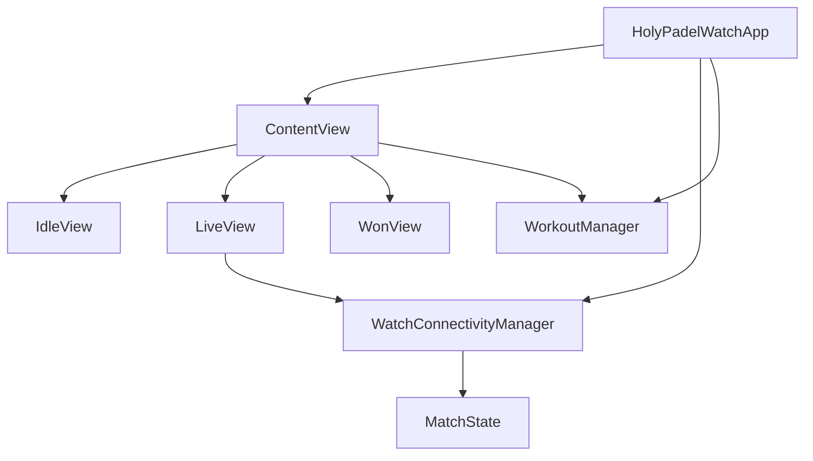

# Apple Watch App

The Apple Watch app lives in `apps/mobile/targets/watch`. It is a SwiftUI companion for the mobile app that mirrors the phone’s live match state, sends user intents back to the phone, and starts or pauses a watch workout while a match is live.

The watch does not run scoring logic. The phone is the single source of truth: it computes the score, owns match lifecycle decisions, persists matches, and pushes rendered state to the watch.



## Responsibilities

The Apple Watch module handles four things:

1. Decode the phone’s latest match snapshot into `MatchState`.
2. Render the correct SwiftUI screen for `MatchState.phase`.
3. Send score and match-control intents back to the phone through `WatchConnectivity`.
4. Drive `WorkoutManager` from match phase and pause state.

It intentionally does not:

- compute points, games, sets, tie-breaks, or winners;
- persist match results;
- resolve conflicts between watch and phone state;
- keep independent scoring state on the watch.

## Entry Point

`HolyPadelWatchApp` in `index.swift` is the watch app entry point.

```swift
@main
struct HolyPadelWatchApp: App {
    @StateObject private var sync = WatchConnectivityManager()
    @StateObject private var workout = WorkoutManager()

    var body: some Scene {
        WindowGroup {
            ContentView()
                .environmentObject(sync)
                .environmentObject(workout)
        }
    }
}
```

Two long-lived objects are created at app startup:

- `WatchConnectivityManager` owns the mirrored `MatchState` and phone communication.
- `WorkoutManager` owns workout and heart-rate tracking.

Both are injected into `ContentView` using `environmentObject`.

## State Model

`MatchState.swift` defines the decoded form of the phone payload documented in `docs/watch-sync.md`.

```swift
struct MatchState: Decodable {
    var v: Int = 1
    var phase: Phase = .idle
    var clock: String = ""
    var court: String?
    var setLabel: String = ""
    var teamA = TeamState()
    var teamB = TeamState()
    var pointA: String = "0"
    var pointB: String = "0"
    var games: String = ""
    var status: String = ""
    var paused: Bool = false
    var startedAt: Double?
    var won: WonState?
    var last: LastState?

    static let idle = MatchState()
}
```

`phase` controls top-level routing:

```swift
enum Phase: String, Decodable {
    case idle
    case live
    case won
}
```

Supporting structs keep the payload small and presentation-ready:

- `TeamState` contains `short` and `serving`.
- `WonState` contains `winnerShort`, `scoreLine`, and `duration`.
- `LastState` contains the previous lineup/result shown on the idle screen.

### Defensive Decoding

`MatchState.init(from:)` uses `decodeIfPresent` for every field and falls back to defaults when fields are missing.

That is deliberate: the state payload is latest-wins. A malformed or partial field should not discard the entire update. The next successful phone update will self-heal the watch display.

Example pattern:

```swift
pointA = try c.decodeIfPresent(String.self, forKey: .pointA) ?? "0"
teamA = try c.decodeIfPresent(TeamState.self, forKey: .teamA) ?? TeamState()
paused = try c.decodeIfPresent(Bool.self, forKey: .paused) ?? false
```

Contributors should preserve this behavior when adding state fields. New optional fields should either be optional or have a safe default.

## Watch Connectivity

`WatchConnectivityManager` is the bridge between the watch and the phone.

```swift
final class WatchConnectivityManager: NSObject, ObservableObject {
    @Published private(set) var state: MatchState = .idle
}
```

On initialization it activates `WCSession.default` when WatchConnectivity is supported:

```swift
guard WCSession.isSupported() else { return }
let session = WCSession.default
session.delegate = self
session.activate()
```

### Phone to Watch

The phone sends state using either:

- `updateApplicationContext`
- `sendMessage`

Both transports carry the same shape:

```swift
{ "state": "<json>" }
```

Incoming payloads flow through `apply(_:)`:

```swift
private func apply(_ payload: [String: Any]) {
    guard let json = payload["state"] as? String,
          let data = json.data(using: .utf8),
          let decoded = try? JSONDecoder().decode(MatchState.self, from: data)
    else { return }

    DispatchQueue.main.async { self.state = decoded }
}
```

The manager applies state from:

- `activationDidCompleteWith`, using `session.receivedApplicationContext`
- `didReceiveApplicationContext`
- `didReceiveMessage`

All successful state updates publish to SwiftUI through `@Published private(set) var state`.

### Watch to Phone

Every outgoing watch intent goes through `send(path:body:)`.

```swift
private func send(path: String, body: String) {
    WKInterfaceDevice.current().play(.click)
    let session = WCSession.default
    let payload: [String: Any] = ["path": path, "body": body]

    if session.isReachable {
        session.sendMessage(payload, replyHandler: nil) { _ in
            session.transferUserInfo(payload)
        }
    } else {
        session.transferUserInfo(payload)
    }
}
```

This gives the user immediate haptic feedback, then prefers the live channel when reachable. If the phone is not reachable, or `sendMessage` fails, the intent is queued with `transferUserInfo`.

Public intent methods map directly to documented watch-sync paths:

| Method | Path | Body |
|---|---|---|
| `score(_:)` | `/holy-padel/score` | `"A"` or `"B"` |
| `undo()` | `/holy-padel/undo` | `""` |
| `startLast()` | `/holy-padel/start-last` | `""` |
| `pause()` | `/holy-padel/pause` | `""` |
| `stop()` | `/holy-padel/stop` | `""` |
| `cancel()` | `/holy-padel/cancel` | `""` |
| `end()` | `/holy-padel/end` | `""` |

`end()` is kept as a legacy alias for the won screen’s `DONE` action. The phone treats it like `stop`.

## Screen Routing

`ContentView` is the top-level UI router. It reads `sync.state.phase` and chooses one screen:

```swift
switch sync.state.phase {
case .idle:
    IdleView(state: sync.state, onStartLast: sync.startLast)
case .live:
    LiveView(...)
case .won:
    WonView(state: sync.state, onEnd: sync.end)
}
```

The background uses `Court.ink` across all phases.

`ContentView` also syncs workout state from match state:

```swift
.onAppear {
    syncWorkout(to: sync.state.phase)
}
.onChange(of: sync.state.phase) { _, newPhase in
    syncWorkout(to: newPhase)
}
.onChange(of: sync.state.paused) { _, isPaused in
    if isPaused {
        workout.pause()
    } else {
        workout.resume()
    }
}
```

`syncWorkout(to:)` starts the workout when the match is live and ends it otherwise:

```swift
private func syncWorkout(to phase: Phase) {
    if phase == .live {
        workout.start(startedAtMs: sync.state.startedAt)
    } else {
        workout.end()
    }
}
```

The execution flow from `ContentView.syncWorkout(to:)` continues into `WorkoutManager.start(startedAtMs:)`, then `beginSession`, and eventually `finishTracking`.

## Screens

### `IdleView`

`IdleView` is shown when `phase == .idle`.

It displays:

- `NO LIVE MATCH`
- optional last result from `state.last`
- a `START MATCH` button wired to `onStartLast`
- secondary text prompting setup on phone

If `state.last` exists, the view renders `ResultBadge` and the previous line:

```swift
if let last = state.last {
    HStack(spacing: 6) {
        ResultBadge(won: last.won)
        Text(last.line)
    }
}
```

The start button calls `WatchConnectivityManager.startLast()`, which sends `/holy-padel/start-last`.

### `LiveView`

`LiveView` is shown when `phase == .live`.

It uses a sideways paged `TabView` with two tabs:

- `ControlsTab`
- `ScoreTab`

```swift
TabView(selection: $tab) {
    ControlsTab(...)
        .tag(Tab.controls)
    ScoreTab(...)
        .tag(Tab.score)
}
.tabViewStyle(.page)
```

The initial tab is `Tab.score`, because scoring is the primary interaction during a rally.

### `ScoreTab`

`ScoreTab` is the live scoreboard surface. It contains:

- a compact header;
- one tappable `TeamScoreRow` for team A;
- a separator;
- one tappable `TeamScoreRow` for team B.

The header shows live heart rate when available:

```swift
if liveBpm > 0 {
    Text("\(liveBpm)♥")
} else {
    Text(state.clock)
}
```

It also displays set/game context:

```swift
Text([state.setLabel, state.games].filter { !$0.isEmpty }.joined(separator: "  "))
```

The live/paused indicator is derived from `state.paused`.

Team rows call `onScore("A")` or `onScore("B")`. When paused, scoring is disabled:

```swift
.disabled(paused)
.opacity(paused ? 0.35 : 1)
```

### `ControlsTab`

`ControlsTab` contains match control actions:

- `UNDO`
- `PAUSE` or `RESUME`
- `STOP & SAVE`
- guarded `CANCEL MATCH`

`UNDO` is disabled while paused:

```swift
CircleIcon(...)
    .disabled(state.paused)
    .opacity(state.paused ? 0.35 : 1)
```

`STOP & SAVE` calls `onStop`, mapped to `/holy-padel/stop`. The phone is responsible for saving the current match state and crediting the leader if needed.

`CANCEL MATCH` opens a confirmation dialog before calling `onCancel`:

```swift
.confirmationDialog("Discard this match?", isPresented: $confirmingCancel) {
    Button("Discard", role: .destructive, action: onCancel)
    Button("Keep playing", role: .cancel) {}
} message: {
    Text("The score will be lost.")
}
```

### `WonView`

`WonView` is shown when `phase == .won`.

It renders:

- `"MATCH WON"`
- `state.won?.winnerShort`, falling back to `state.teamA.short`
- `state.won?.scoreLine`, falling back to `state.games`
- optional duration plus `"SAVED TO PHONE"`
- `DONE`, wired to `onEnd`

`onEnd` calls `WatchConnectivityManager.end()`, which sends `/holy-padel/end`.

## Shared UI Pieces

`Screens.swift` also defines small private components:

- `CircleIcon` renders compact SF Symbol action buttons.
- `TeamScoreRow` renders a tappable team row and score.
- `ServingDot` shows the serving indicator.
- `ResultBadge` shows `W` or `L` for the last match result.

These are private to `Screens.swift`, keeping the public screen surface limited to `IdleView`, `LiveView`, and `WonView`.

## Theme

`Theme.swift` defines the watch palette in `Court`:

```swift
enum Court {
    static let ink = Color(red: 14.0 / 255.0, green: 17.0 / 255.0, blue: 22.0 / 255.0)
    static let lime = Color(red: 198.0 / 255.0, green: 241.0 / 255.0, blue: 53.0 / 255.0)
    static let white = Color.white
}
```

This mirrors the mobile theme in `apps/mobile/src/theme/colors.ts` and the Wear OS `CourtColors`.

Use `Court.ink`, `Court.lime`, and `Court.white` for watch UI additions instead of introducing local color literals.

## Lifecycle Summary

A typical live match flow is:

1. `HolyPadelWatchApp` creates `WatchConnectivityManager` and `WorkoutManager`.
2. `WatchConnectivityManager` activates `WCSession`.
3. The phone sends `{ "state": "<json>" }`.
4. `apply(_:)` decodes `MatchState` and publishes it.
5. `ContentView` routes by `state.phase`.
6. When `phase == .live`, `syncWorkout(to:)` calls `workout.start(startedAtMs:)`.
7. The user taps a team row in `ScoreTab`.
8. `WatchConnectivityManager.score(_:)` sends `/holy-padel/score`.
9. The phone updates the canonical match and pushes a new state snapshot.
10. When the match is paused, `ContentView` calls `workout.pause()`.
11. When the match leaves live state, `ContentView` calls `workout.end()`.

## Contribution Notes

When adding fields to the watch state payload, update `MatchState` with defensive decoding and keep the phone-side `/holy-padel/state` payload compatible.

When adding watch actions, route them through `WatchConnectivityManager.send(path:body:)` so they get haptics, reachable delivery, and queued fallback behavior consistently.

When changing scoring behavior, do not add scoring logic here. Update the phone/scoring engine and let the phone publish a new rendered `MatchState`.

When changing live-match lifecycle behavior, check both `ContentView.syncWorkout(to:)` and the pause observer, because workout start/end is phase-driven while workout pause/resume is `state.paused`-driven.