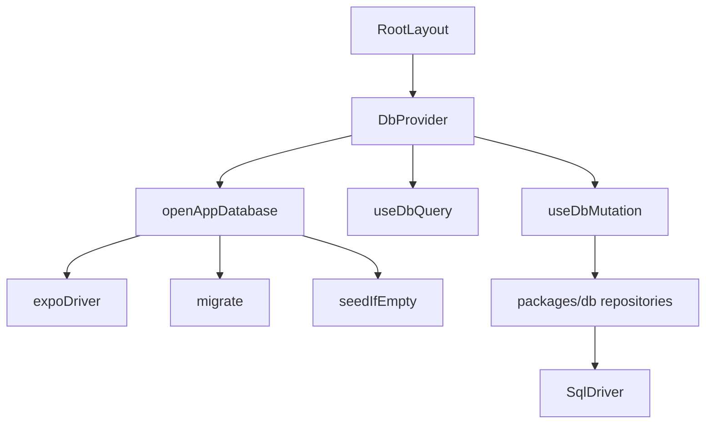
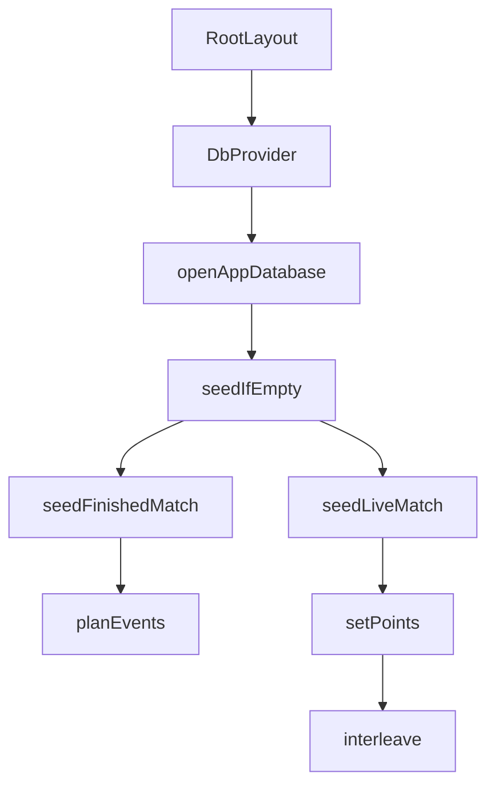

# Database Layer

The database layer stores the app’s local roster, match metadata, and event-sourced point log in SQLite. It is split into two parts:

- `packages/db`: platform-neutral repository functions over a tiny `SqlDriver` interface.
- `apps/mobile/src/db`: Expo SQLite adapter, app startup migration/seeding, and React hooks for synchronous reads plus mutation-driven refreshes.

The scoring engine remains outside the database package. Match state is persisted as `MatchConfig` plus ordered `PointEvent[]`, then folded with `computeMatch(config, events)` when guard logic needs the authoritative score state.



## Driver Abstraction

`packages/db/src/driver.ts` defines the only SQLite surface the shared package depends on:

```ts
export interface SqlDriver {
  readonly execute: (sql: string, params?: readonly SqlValue[]) => void;
  readonly queryAll: (sql: string, params?: readonly SqlValue[]) => SqlRow[];
}
```

`SqlValue` is limited to `string | number | null`, and query results are `SqlRow` objects keyed by column name. The package deliberately does not import `expo-sqlite`; tests can adapt `node:sqlite`, while the mobile app adapts Expo SQLite with `expoDriver()`.

Common helpers:

- `queryOne(driver, sql, params)` returns the first row or `undefined`.
- `inTransaction(driver, work)` wraps `BEGIN`, `COMMIT`, and `ROLLBACK`.
- `expectString()`, `expectNumber()`, `optionalString()`, and `optionalNumber()` validate SQLite row values before mapping them into typed domain objects.

The row decoders fail fast when stored data violates expected shape. That keeps repository return types clean and pushes corruption/schema drift into explicit errors instead of partially typed objects.

## Schema and Migrations

`packages/db/src/schema.ts` owns schema creation and upgrades. `migrate(driver)` is safe to call on every launch:

1. Enables SQLite foreign keys with `PRAGMA foreign_keys = ON`.
2. Ensures `schema_migrations` exists.
3. Reads the latest applied migration with `queryOne()`.
4. Applies each pending migration inside `inTransaction()`.
5. Records the migration version and `Date.now()`.

Current migrations create:

- `players`: roster and owner profile data.
- `matches`: match config, team player ids, status, cached finish metadata, court/location, and pause state.
- `match_events`: ordered point log keyed by `(match_id, seq)`.

Version 2 adds pause tracking:

- `paused_ms`: accumulated paused time.
- `paused_at`: timestamp for an open pause, or `NULL` while running.

`databaseSizeBytes(driver)` estimates the database file size by multiplying `PRAGMA page_count` by `PRAGMA page_size`.

## Match Repository

`packages/db/src/matches.ts` is the main persistence boundary for match lifecycle and point events.

Core types:

- `NewMatch`: input for `createMatch()`.
- `StoredMatch`: typed match row, including config, player ids, status, pause state, winner, and cached score line.
- `MatchSummary`: `StoredMatch` plus joined player names for list/detail screens.
- `TeamPlayers`: fixed team shape `{ A: [string, string], B: [string, string] }`.
- `MatchStatus`: `"live" | "finished"`.

### Row Mapping

`parseConfig(row)` reconstructs a scoring `MatchConfig` from columns such as `best_of`, `deuce_mode`, `third_set`, and `first_serve`. It validates enum-like values before returning.

`toStoredMatch(row)` maps the `matches` row and validates:

- `status` is `"live"` or `"finished"`.
- `winner`, when present, is `"A"` or `"B"`.
- optional columns such as `court`, `location`, `ended_at`, `score_line`, and `paused_at`.

`toSummary(row)` extends `toStoredMatch()` with joined player names. The shared `SUMMARY_SELECT` joins all four player ids against `players`.

### Match Lifecycle

`createMatch(driver, match)` inserts a live match with its scoring config, teams, optional court/location, and `started_at`.

Read functions:

- `getMatch(driver, id)` returns one `MatchSummary`.
- `getLiveMatch(driver)` returns the most recent live match for the home screen resume card.
- `listMatches(driver)` returns all summaries ordered by `started_at DESC`.
- `countMatches(driver)` returns `COUNT(*)`.

Mutation functions:

- `deleteMatch(driver, id)` deletes `match_events` and then `matches` in one transaction.
- `finishMatch(driver, id, outcome)` marks a match finished, stores `winner`, `ended_at`, and `score_line`, and closes any open pause at `endedAt`.
- `pauseMatch(driver, id, now)` sets `paused_at` only for live, currently running matches.
- `resumeMatch(driver, id, now)` adds elapsed pause time to `paused_ms` and clears `paused_at`.
- `reopenMatch(driver, id)` returns a finished match to live status and clears cached finish fields.

### Event Log

`loadEvents(driver, matchId)` reads `match_events` ordered by `seq` and returns `PointEvent[]`.

`appendEvent(driver, matchId, event)` appends one event with the next sequence number, but only if the match exists and is still live. It uses an `INSERT ... SELECT ... WHERE EXISTS` guard so stray writes after a final point do not poison the event log.

`scorePoint(driver, matchId, winner, at)` is the guarded entry point for interactive `+1` scoring from the phone or watch bridge. It:

1. Reads the latest match with `getMatch()`.
2. Refuses if the match is missing, not live, or paused.
3. Loads committed events with `loadEvents()`.
4. Folds them with `computeMatch(match.config, events)`.
5. Refuses if the scoring engine already considers the match finished.
6. Calls `appendEvent()`.

This re-read-and-fold pattern is important for fast repeated taps: the next call sees the newly committed event log before deciding whether another point is legal.

`appendEvents(driver, matchId, events)` is the bulk path for seeding/imports. It reads the current max `seq`, then inserts chunks of up to `100` events. Unlike `scorePoint()`, it does not validate live status or engine completion; callers are expected to use it only for trusted bulk data.

`removeLastEvent(driver, matchId)` implements undo by deleting the row with the maximum `seq` for that match. This matches the scoring engine’s event-sourced rule: undo is dropping the last event.

## Player Repository

`packages/db/src/players.ts` stores roster and owner data.

Types:

- `Player`: stored player, including optional `club`, optional court `side`, owner flag, and creation time.
- `NewPlayer`: insert shape for `createPlayer()`.
- `RosterEntry`: `Player` plus `matchesWithOwner`, used by the player picker.
- `CourtSide`: `"left" | "right"`.

Functions:

- `createPlayer(driver, player)` inserts a player and stores `isOwner` as `1` or `0`.
- `updatePlayer(driver, id, changes)` updates `name`, `club`, and `side` with `COALESCE(?, column)`, so omitted values leave existing columns unchanged.
- `getPlayer(driver, id)` reads one player.
- `getOwner(driver)` returns the first player with `is_owner = 1`.
- `listPlayers(driver)` returns players ordered by name.
- `listRoster(driver)` excludes the owner and computes `matchesWithOwner` through a SQL subquery over `matches`.

`toPlayer(row)` validates the optional `side` column before returning a typed `Player`.

## Profile Stats

`packages/db/src/profile.ts` computes profile-screen aggregates from local match history. It does not store derived profile data.

`computeProfileStats(driver, ownerId)` calls `listMatches(driver)`, filters to finished matches where the owner played and `winner` is known, then returns:

- `played`
- `record: { won, lost }`
- `winRatePercent`
- `form`: last five finished results by `endedAt`, most recent first
- `partners`: win/loss records grouped by partner id
- `headToHead`: win/loss records grouped by opponent pair

Helper flow:

- `ownerTeamOf(match, ownerId)` finds whether the owner was on team `A` or `B`.
- `finishedResults(matches, ownerId)` filters and tags matches with `ownerTeam` and `won`.
- `partnerRecords(results, ownerId)` groups results by the owner’s partner.
- `headToHeadRecords(results)` groups results by sorted opponent ids while preserving the display label from match names.

## Mobile Integration

`apps/mobile/src/db/database.ts` adapts Expo SQLite to `SqlDriver`.

`expoDriver(database)` maps:

- `execute()` to `database.runSync(sql, [...params])`
- `queryAll()` to `database.getAllSync<SqlRow>(sql, [...params])`

`openAppDatabase()` opens `holy-padel.db` asynchronously with `openDatabaseAsync()`, then synchronously runs:

1. `migrate(driver)`
2. `seedIfEmpty(driver)`

The async open matters because the SQLite backend, especially on web, may need worker initialization before the synchronous bridge is usable.

## React Store

`apps/mobile/src/db/provider.tsx` exposes the opened driver through React context.

`DbProvider` opens the database on mount and renders `null` until ready. The app splash screen covers that gap. Once opened, it creates a small external store with:

- `driver`
- `version()`
- `subscribe(listener)`
- `mutate(write)`

`useDbQuery(query)` uses `useSyncExternalStore()` to run synchronous reads. It caches the query result by store version, so the query re-runs only after a mutation increments the version.

`useDbMutation()` returns a function shaped like:

```ts
const mutate = useDbMutation();

mutate((db) => {
  scorePoint(db, matchId, "A", Date.now());
});
```

`mutate()` runs the write, increments the store version, and notifies subscribers. If the write throws, the version increment and notifications do not run.

## First-Launch Seed Data

`apps/mobile/src/db/seed.ts` installs demo data only when both `listPlayers(driver)` and `countMatches(driver)` are empty.

`seedIfEmpty(driver)` wraps the entire seed in `inTransaction()` and creates:

- the owner player `nico`
- a fixed roster
- twelve finished matches
- one live match for the home screen

Finished matches are generated from compact `MatchPlan` and `SetPlan` objects:

- `interleave()` builds winner/loser sequences that end on the winner.
- `setPoints()` expands games and tie-breaks into point winners.
- `planEvents()` attaches timestamps.
- `seedFinishedMatch()` creates the match, bulk appends events with `appendEvents()`, validates the result with `computeMatch()`, then calls `finishMatch()`.
- `scoreLineOf()` caches the display score line.
- `seedLiveMatch()` creates an in-progress event log for the design’s demo state.

The startup execution flow is:



## Public Exports

`packages/db/src/index.ts` is the package surface. It re-exports:

- Driver types and `inTransaction`
- Schema helpers: `migrate`, `databaseSizeBytes`
- Match functions: `createMatch`, `getMatch`, `getLiveMatch`, `listMatches`, `deleteMatch`, `loadEvents`, `appendEvent`, `appendEvents`, `scorePoint`, `removeLastEvent`, `finishMatch`, `pauseMatch`, `resumeMatch`, `reopenMatch`, `countMatches`
- Player functions: `createPlayer`, `updatePlayer`, `getPlayer`, `getOwner`, `listPlayers`, `listRoster`
- Profile function: `computeProfileStats`

## Contribution Notes

Keep `packages/db` platform-neutral. New persistence code should depend on `SqlDriver`, not Expo APIs.

Use `inTransaction()` for multi-table writes or bulk operations that must remain atomic. Existing examples are `deleteMatch()` and `seedIfEmpty()`.

Use `scorePoint()` for user-facing rally scoring. Reserve `appendEvent()` for lower-level controlled writes and `appendEvents()` for trusted bulk seeding/imports.

When adding schema fields, add a new migration in `MIGRATIONS`, update the relevant row mapper (`toPlayer()`, `toStoredMatch()`, `parseConfig()`), and adjust repository tests. Avoid relying on `undefined` as a SQLite value; repository writes convert missing optional values to `null` where needed.

Scoring rules belong in `@holy-padel/scoring`. The database layer should persist events and metadata, then call `computeMatch()` only when it needs to guard writes or validate generated data.