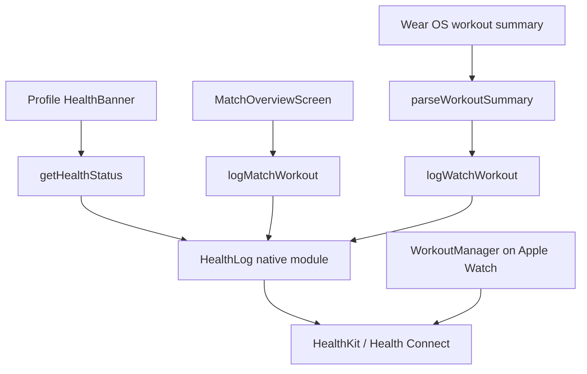

# Health and Workout Logging

The Health and Workout Logging module records completed padel matches as workouts in the platform health system while keeping scoring independent from health integration. It is optional, write-first, and best-effort: missing native modules, denied permissions, unsupported platforms, and runtime failures return `"unavailable"` or `false` instead of breaking match scoring.

The module spans:

- `apps/mobile/src/health/health-log.ts`: JavaScript boundary for the optional native `HealthLog` module.
- `apps/mobile/src/health/watch-workout.ts`: parser for Wear OS workout summaries.
- `apps/mobile/modules/health-log/android/.../HealthLogModule.kt`: Android Health Connect writer.
- `apps/mobile/modules/health-log/ios/HealthLogModule.swift`: iOS HealthKit writer for phone-logged workouts.
- `apps/mobile/targets/watch/WorkoutManager.swift`: Apple Watch live workout session manager.



## Design Principles

Health logging follows a few strict rules:

- Scoring must never depend on health APIs.
- The phone remains the source of truth for match state.
- Health logging is opt-in and one-way.
- The mobile app does not read historical health data.
- Native health platforms are optional.
- All public JS functions are defensive and non-throwing.

This is why `health-log.ts` wraps every native call in `try/catch`, treats a missing `HealthLog` module as unavailable, and returns simple values that screens can use without platform branching.

## JavaScript Boundary: `health-log.ts`

`health-log.ts` exposes the stable app-facing API over the native `HealthLog` module:

```ts
export type HealthStatus = "granted" | "denied" | "undetermined" | "unavailable";

export function isHealthLogAvailable(): boolean;
export async function getHealthStatus(): Promise<HealthStatus>;
export async function requestHealthAuthorization(): Promise<boolean>;
export async function logMatchWorkout(startMs: number, endMs: number): Promise<boolean>;
export async function logWatchWorkout(summaryJson: string): Promise<boolean>;
```

The native module is loaded with:

```ts
const native = requireOptionalNativeModule<HealthLogModule>("HealthLog");
```

That optional boundary is important. On web, or in builds without the native health module, `native` is `null` and every operation degrades cleanly.

### Availability and Authorization

`isHealthLogAvailable()` checks whether the native module exists and whether the underlying platform is available:

```ts
return native?.isAvailable() ?? false;
```

`getHealthStatus()` returns a coarse authorization state used by the Profile screen. If the native module is missing or throws, it returns `"unavailable"`.

`requestHealthAuthorization()` prompts for workout write access through the native implementation. It returns `false` on missing native support, denied permission, or any failure.

### Manual Match Logging

`logMatchWorkout(startMs, endMs)` writes a completed match interval as a workout. It returns `false` when:

- the native module is unavailable,
- `endMs <= startMs`,
- authorization fails,
- the platform write fails.

The function does not validate match identity or score state. It only receives a time interval and delegates platform-specific workout creation to native code.

### Watch Workout Logging

`logWatchWorkout(summaryJson)` passes a Wear OS workout summary JSON string to native Android Health Connect logging. On iOS it always resolves `false` because Apple Watch writes its own workout directly to HealthKit.

The JS wrapper does not parse the JSON itself. Validation is handled by `parseWorkoutSummary()` before this function is called from watch sync code.

## Wear OS Summary Parsing: `watch-workout.ts`

Wear OS sends rich workout summaries through the Data Layer path:

```ts
export const WORKOUT_PATH = "/holy-padel/workout";
```

The expected shape is represented by `WatchWorkoutSummary`:

```ts
export interface WatchWorkoutSummary {
  readonly startedAt: number;
  readonly endedAt: number;
  readonly kcal: number;
  readonly avgBpm: number;
  readonly maxBpm: number;
  readonly samples: readonly { readonly t: number; readonly bpm: number }[];
}
```

`parseWorkoutSummary(body)` parses and validates the message body defensively. It returns `undefined` instead of throwing when the body is malformed or not worth logging.

A summary is accepted only when:

- the body is valid JSON,
- the root value is an object,
- `startedAt` and `endedAt` are finite numbers,
- `endedAt > startedAt`,
- there is at least one measurable value: `kcal > 0` or a non-empty valid heart-rate sample list.

Invalid or missing optional numbers use safe defaults:

```ts
kcal: numberOr(record["kcal"], 0)
avgBpm: numberOr(record["avgBpm"], 0)
maxBpm: numberOr(record["maxBpm"], 0)
```

Heart-rate samples are filtered by `parseSamples()`. Each valid sample must be an object with finite numeric `t` and `bpm`, and `bpm > 0`.

This parser is intentionally stricter than the native Android writer. The sync path should drop malformed summaries before calling `logWatchWorkout()`.

## Android Native Module: Health Connect

Android implements `HealthLogModule` in Kotlin using Health Connect.

The module exports the same native functions consumed by `health-log.ts`:

- `isAvailable`
- `getAuthorizationStatus`
- `requestAuthorization`
- `logWorkout`
- `logWatchWorkout`

Health Connect does not currently expose a padel exercise type, so both manual and watch workouts are saved as:

```kotlin
ExerciseSessionRecord.EXERCISE_TYPE_TENNIS
```

with the title:

```kotlin
title = "Padel"
```

### Client Creation

`client()` returns a `HealthConnectClient?` only when:

- the React context exists,
- `HealthConnectClient.getSdkStatus(ctx) == HealthConnectClient.SDK_AVAILABLE`,
- `HealthConnectClient.getOrCreate(ctx)` succeeds.

Any failure returns `null`, causing public functions to resolve `"unavailable"` or `false`.

### Permissions

Android requires write permissions for all record types the module may insert:

```kotlin
private val writePermissions = setOf(
  HealthPermission.getWritePermission(ExerciseSessionRecord::class),
  HealthPermission.getWritePermission(HeartRateRecord::class),
  HealthPermission.getWritePermission(TotalCaloriesBurnedRecord::class),
)
```

`ensurePermission(client)` first checks already granted permissions. If any are missing, it manually drives Health Connect’s permission contract with `startActivityForResult()` because an Expo module is not an `ActivityResultCaller`.

After the permission result returns, the module re-checks `client.permissionController.getGrantedPermissions()` instead of trusting only the activity result.

The Android authorization state is intentionally coarse:

- all write permissions granted: `"granted"`
- Health Connect unavailable: `"unavailable"`
- otherwise: `"undetermined"`

Health Connect does not map cleanly to iOS-style `"denied"` for this use case.

### Manual Workout Logging

`logWorkout(startMs, endMs)`:

1. Creates a Health Connect client.
2. Ensures all write permissions are granted.
3. Converts `startMs` and `endMs` to `Instant`.
4. Creates an `ExerciseSessionRecord`.
5. Inserts the record with `client.insertRecords(listOf(session))`.

Manual records use deterministic metadata:

```kotlin
Metadata.manualEntry(clientRecordId = "holy-padel-${startMs.toLong()}")
```

That `clientRecordId` makes repeated logging of the same match idempotent from the app’s perspective: re-logging the same start time updates/replaces instead of creating an unrelated duplicate.

### Watch Workout Logging

`logWatchWorkout(json)` writes a richer Health Connect workout from a Wear OS summary. It may insert up to three records:

- `ExerciseSessionRecord`
- `HeartRateRecord`
- `TotalCaloriesBurnedRecord`

The function reads:

```kotlin
val startMs = summary.getLong("startedAt")
val endMs = summary.getLong("endedAt")
```

and rejects intervals where `endMs <= startMs`.

Watch records use actively recorded metadata:

```kotlin
Metadata.activelyRecorded(
  device = Device(type = Device.TYPE_WATCH),
  clientRecordId = "$recordId$suffix",
  clientRecordVersion = 1,
)
```

The base record id is:

```kotlin
val recordId = "holy-padel-$startMs"
```

Suffixes distinguish related records:

- session: `holy-padel-$startMs`
- heart rate: `holy-padel-$startMs-hr`
- calories: `holy-padel-$startMs-kcal`

Heart-rate samples are also filtered natively to the workout interval:

```kotlin
if (at.isBefore(start) || at.isAfter(end)) return@mapNotNull null
```

Calories are written only when `kcal > 0.0`.

## iOS Phone Native Module: HealthKit

The iOS phone `HealthLogModule` writes manually logged completed matches to HealthKit.

It exports the same native interface as Android, but `logWatchWorkout()` is a parity stub:

```swift
AsyncFunction("logWatchWorkout") { (_: String) async -> Bool in
  false
}
```

That is intentional. Apple Watch uses `WorkoutManager` to save its own `HKWorkoutSession` directly to HealthKit, so the phone does not receive or persist rich Apple Watch summaries.

### Authorization

`getAuthorizationStatus()` maps HealthKit workout sharing status into `HealthStatus` strings:

- `.sharingAuthorized`: `"granted"`
- `.sharingDenied`: `"denied"`
- anything else: `"undetermined"`
- unavailable HealthKit: `"unavailable"`

`requestAuthorization()` asks only for workout write access:

```swift
try await self.store.requestAuthorization(
  toShare: [HKObjectType.workoutType()],
  read: []
)
```

A return value of `true` means the request completed without throwing. Callers should re-read `getHealthStatus()` to know whether sharing was actually granted.

### Manual Workout Logging

`logWorkout(startMs, endMs)`:

1. Checks `HKHealthStore.isHealthDataAvailable()`.
2. Requests workout write authorization.
3. Verifies `.sharingAuthorized`.
4. Creates an `HKWorkoutConfiguration`.
5. Sets `activityType = .tennis`.
6. Uses `HKWorkoutBuilder` to create and finish a workout.

The workout is branded with:

```swift
HKMetadataKeyWorkoutBrandName: "Holy Padel"
```

Like Android, iOS uses tennis because HealthKit has no padel workout activity type.

## Apple Watch Workout Manager

`WorkoutManager` lives in the watch target and manages live HealthKit workout tracking during a match.

It is separate from the phone `HealthLog` module. The watch writes directly to HealthKit through `HKWorkoutSession` and `HKLiveWorkoutBuilder`.

Public state:

```swift
@Published private(set) var heartRate: Int = 0
@Published private(set) var isTracking = false
```

Public methods:

```swift
func start(startedAtMs: Double?)
func pause()
func resume()
func end()
```

### Starting a Session

`start(startedAtMs:)` is safe to call repeatedly and returns immediately when already tracking or HealthKit is unavailable.

It branches on current workout authorization:

- `.sharingAuthorized`: sets `isTracking = true` and calls `beginSession(startedAtMs:)`.
- `.notDetermined`: requests workout write access plus heart-rate and active-energy read access.
- `.sharingDenied` or future statuses: silently does nothing.

This keeps workout tracking opt-in and prevents permission state from affecting scoring.

`beginSession(startedAtMs:)` creates:

- `HKWorkoutSession`
- `HKLiveWorkoutBuilder`
- `HKLiveWorkoutDataSource`

The workout uses:

```swift
config.activityType = .tennis
config.locationType = .outdoor
```

The session starts at `Date()` rather than `startedAtMs`. The comment is explicit: HealthKit needs live sensing, while the padel ledger remains the source of truth for the true match start.

### Pausing, Resuming, and Ending

`pause()` and `resume()` forward to the active `HKWorkoutSession` only when `isTracking` is true.

`end()` stops activity, ends the session, and lets the delegate finalize the workout. If no session exists, it calls `finishTracking()` directly.

The delegate path is:

```text
end()
→ session.end()
→ workoutSession(_:didChangeTo:.ended,...)
→ builder.endCollection(...)
→ builder.finishWorkout(...)
→ finishTracking()
```

`finishTracking()` clears `session`, `builder`, `isTracking`, and `heartRate` on the main queue.

### Live Heart Rate

`WorkoutManager` implements `HKLiveWorkoutBuilderDelegate`.

When collected data includes `HKQuantityType(.heartRate)`, it reads the most recent quantity in beats per minute and publishes a rounded integer:

```swift
self.heartRate = Int(bpm.rounded())
```

This is used by the watch scoreboard while the workout session is active.

## Integration Points

The module is reached from a small number of app surfaces:

- `HealthBanner` in `app/(tabs)/profile.tsx` calls `getHealthStatus()` to decide whether to offer health connection.
- `connect` in `app/(tabs)/profile.tsx` calls `requestHealthAuthorization()` and then re-reads `getHealthStatus()`.
- `MatchOverviewScreen` in `app/match/[id].tsx` calls `isHealthLogAvailable()`.
- `logWorkout` in `app/match/[id].tsx` calls `logMatchWorkout(startMs, endMs)` after a match.
- `useWatchSync` calls `parseWorkoutSummary()` for `/holy-padel/workout` messages and then `logWatchWorkout(summaryJson)`.
- `ContentView` in the watch target calls `WorkoutManager.pause()` and `WorkoutManager.resume()`.
- `syncWorkout` in the watch target calls `WorkoutManager.start()` and `WorkoutManager.end()`.

The two main execution flows are:

```text
ProfileScreen
→ HealthBanner
→ getHealthStatus()
→ native HealthLog authorization state
```

and:

```text
syncWorkout
→ WorkoutManager.start()
→ beginSession()
→ workout session delegates
→ finishTracking()
```

## Error Handling Contract

Every public boundary is best-effort.

JS functions return safe fallbacks:

- unavailable platform: `"unavailable"` or `false`
- native exception: `"unavailable"` or `false`
- invalid manual interval: `false`

Native functions also avoid propagating errors to JS:

- Kotlin uses `runCatching { ... }.getOrDefault(false)` around platform calls.
- Swift catches authorization and workout-builder failures and returns `false`.

This contract lets callers treat health logging as an optional side effect. A failed health write should not block navigation, scoring, match persistence, or watch sync.

## Data Model and Idempotency

Manual phone logging stores only a workout interval.

Wear OS logging may store:

- session interval,
- heart-rate samples,
- calories.

Android uses deterministic `clientRecordId` values based on `startedAt`, so repeat writes for the same workout do not create independent records. Watch records use separate suffixes for related record types.

iOS phone logging uses `HKWorkoutBuilder` and does not define a deterministic client record id. Apple Watch sessions are saved directly by HealthKit through `HKLiveWorkoutBuilder`.

## Platform Differences

| Platform | Manual phone workout | Watch workout | Health API |
|---|---:|---:|---|
| iOS phone | Yes | No phone write | HealthKit |
| Apple Watch | N/A | Saves directly | HealthKit workout session |
| Android phone | Yes | Yes, from Wear OS summary | Health Connect |
| Wear OS | Sends summary to phone | Phone persists it | Health Services / Data Layer |
| Web | No-op | No-op | None |

## Testing Notes

`watch-workout.test.ts` covers `parseWorkoutSummary()`. Tests for this parser should focus on malformed JSON, invalid intervals, missing measurement data, invalid samples, and fallback handling for optional numeric fields.

Native health logging is intentionally difficult to unit test without platform services. When changing native behavior, verify the JS contract remains stable:

- no thrown errors reach JS callers,
- missing platform support returns unavailable/false,
- authorization states still match `HealthStatus`,
- invalid or denied writes do not affect scoring flows.