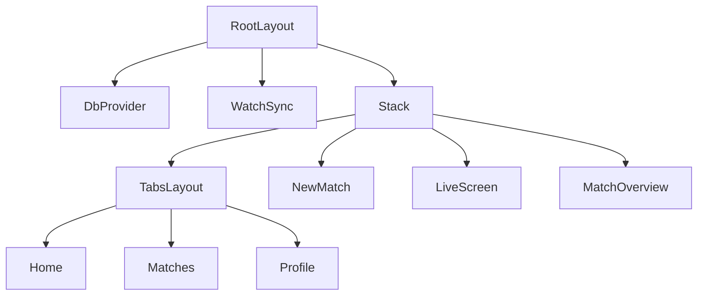

# Mobile App Screens

The mobile screens live under `apps/mobile/src/app` and are routed by Expo Router. They provide the primary phone UI for local match setup, live scoring, match history, profile management, data export/deletion, and finished-match review.

This module is intentionally thin around scoring rules: screens read persisted match data from `@holy-padel/db`, derive live state with `computeMatch(config, events)`, and write domain events or match metadata back through repository functions. The phone remains the source of truth; watch sync is mounted globally by `RootLayout`.



## Routing and App Shell

`RootLayout` in `app/_layout.tsx` is the top-level route component.

It performs four app-wide responsibilities:

- Loads the `Anton_400Regular` and `Archivo_*` font faces with `useFonts`.
- Holds the splash screen with `preventAutoHideAsync()` until fonts are ready, then calls `hideAsync()`.
- Wraps all screens in `TamaguiProvider` and `DbProvider`.
- Mounts `WatchSync`, so watch mirroring runs independently of the currently visible screen.

The stack routes are declared explicitly:

- `(tabs)` - main tab navigator
- `new-match` - modal match setup
- `edit-profile` - modal profile editor
- `data` - modal local data controls
- `live/[id]` - live scoring screen, with gestures disabled
- `match/[id]` - finished match overview

`unstable_settings.initialRouteName = "(tabs)"` ensures deep links land with the tab navigator underneath them, so back and dismiss behavior remains usable.

`TabsLayout` in `app/(tabs)/_layout.tsx` defines the bottom tab shell using `expo-router/ui` primitives: `Tabs`, `TabSlot`, `TabList`, and `TabTrigger`. Its local `TabButton` renders the label and the active lime dot. The tab bar is a custom floating dark pill positioned above the safe-area bottom inset.

The tab routes are:

- `/` -> `HomeScreen`
- `/matches` -> `MatchesScreen`
- `/profile` -> `ProfileScreen`

## Shared Screen Patterns

Most screens follow the same structure:

- Read safe-area insets with `useSafeAreaInsets()`.
- Query SQLite-backed data with `useDbQuery(...)`.
- Mutate SQLite through `useDbMutation()`.
- Navigate with Expo Router’s `router.push`, `router.replace`, `router.navigate`, or local helpers such as `goBack()` and `goHome()`.
- Use Tamagui layout primitives (`View`, `XStack`, `YStack`) and shared UI components from `@/components/ui.tsx`.

The screens do not hold canonical scoring state in React. A live score is reconstructed from events:

```ts
const events = useDbQuery((driver) => loadEvents(driver, id));
const snapshot = match === undefined ? undefined : computeMatch(match.config, events);
```

This pattern appears in `LiveScreen`, `HomeScreen`, `MatchesScreen`, and `MatchOverviewScreen`.

Optional fields are added with conditional object spreads, which matches the repository’s `exactOptionalPropertyTypes` convention:

```ts
createMatch(driver, {
  id,
  config: match.config,
  players: match.players,
  ...(match.court === undefined ? {} : { court: match.court }),
  ...(match.location === undefined ? {} : { location: match.location }),
  startedAt: Date.now(),
});
```

## Home Screen

`HomeScreen` in `app/(tabs)/index.tsx` is the dashboard.

It reads:

- `getOwner` for the greeting and avatar.
- `getLiveMatch` plus `loadEvents` and `computeMatch` for the current live card.
- `computeProfileStats(driver, "nico")` for form and record.
- `listMatches(driver)` filtered to finished matches for the recent list and rematch shortcut.

The local helpers are:

- `pointCallOf(snapshot, team)` - returns the current standard-game call (`15`, `30`, etc.) or tie-break point number.
- `LiveCard` - shows the live match score, set score line, elapsed clock, and routes to `/live/${match.id}`.
- `RecentRow` - displays a finished match summary and routes to `/match/${match.id}`.

`startRematch` creates a new match from the most recent finished match’s `config`, `players`, optional `court`, and optional `location`. A `useRef` guard prevents double creation from repeated taps.

## Matches Screen

`MatchesScreen` in `app/(tabs)/matches.tsx` lists all stored matches with simple filters.

Important local pieces:

- `Filter = "all" | "won" | "lost" | "rivals"`
- `opponentKey(match, ownerTeam)` creates an order-independent identity for an opposing pair by sorting player ids.
- `FILTER_PREDICATES` centralizes filter logic.
- `liveLine(driver, match)` computes the live score line for live matches using `computeMatch`.
- `MatchRow` routes live matches to `/live/${match.id}` and finished matches to `/match/${match.id}`.
- `FilterChip` renders the selectable filter pills.

The “rivals” filter is derived from finished matches by counting the most frequent opponent pair. Its label uses `pairInitials(opponentsOf(match, ownerTeam))`, while matching uses the stable id-based `opponentKey`.

Rows are built as `{ match, scoreLine }` so live matches can display a computed score while finished matches use persisted `match.scoreLine`.

## Profile Screen

`ProfileScreen` in `app/(tabs)/profile.tsx` shows player identity, aggregate statistics, partner records, head-to-head records, health integration, and local storage metadata.

It reads:

- `getOwner`
- `computeProfileStats(driver, "nico")`
- `countMatches`
- `databaseSizeBytes`

Local components:

- `HealthBanner` checks `getHealthStatus()` whenever the screen focuses via `useFocusEffect`. It renders only for actionable states: `"undetermined"` or `"denied"`. The connect action calls `requestHealthAuthorization()`, then refreshes status.
- `StatTile` renders the three top-level stats: played, record, win rate.
- `RecordBar` visualizes partner win/loss share.

Profile actions:

- `EDIT` navigates to `/edit-profile`.
- The “ON THIS PHONE” row navigates to `/data`.

Health integration is additive. It does not gate match display, scoring, or profile stats.

## New Match Screen

`NewMatchScreen` in `app/new-match.tsx` creates a match and enters live scoring.

It reads the owner with `getOwner` and the roster with `listRoster`. The owner defaults to id `"nico"` if the owner record is not loaded.

State held locally:

- `partner`
- `teamB`
- `picking`
- `bestOf`
- `thirdSet`
- `deuceMode`
- `firstServe`

Local helpers and components:

- `PlayerRow` displays either a selected player or “Pick a player”.
- `TeamCard` wraps each team selection block.
- `nameOf(id)` resolves a roster id to a display name.
- `togglePick(id)` selects the owner’s partner for team A or maintains a max-two selection for team B.
- `startMatch()` validates player selection, guards against duplicate taps, creates the match, and `router.replace`s to `/live/${id}`.

Match configuration is passed directly into `createMatch`:

```ts
config: { bestOf, deuceMode, thirdSet, firstServe }
```

Player selection happens through `PickerSheet`. Creating a new player calls `createPlayer(driver, { id, name, createdAt })`; the generated id currently uses `player-${Date.now()}`.

## Live Screen

`LiveScreen` in `app/live/[id].tsx` is the active scoring surface.

It reads:

- Route param `id` via `useLocalSearchParams`.
- `getMatch(driver, id)`
- `loadEvents(driver, id)`

It derives:

- `snapshot` with `computeMatch(match.config, events)`
- `finishedStats` with `computeStats(match.config, events)` once the snapshot is finished
- team display names with `teamNames(match)`
- status text with `statusLabel(snapshot.moment, names)`

If the match does not exist, it redirects home. If the computed snapshot is finished, it renders `MatchWon` instead of the live scoreboard.

### Scoring

`scorePoint(team)` writes a point through `scorePointDb(driver, id, team, Date.now())`. The repository function re-reads committed state and refuses scoring when the match is paused or already decided, which protects against rapid taps crossing the final point.

`undoPoint()` calls `removeLastEvent(driver, id)` when at least one event exists. This preserves the engine convention that undo is equivalent to dropping the last point event.

`togglePause()` switches between `pauseMatch(driver, id, Date.now())` and `resumeMatch(driver, id, Date.now())` based on `match.pausedAt`.

### Finish Persistence

`usePersistFinish(id, match, snapshot, events)` persists the final result once `computeMatch` reports a finished snapshot while the stored match is still `"live"`.

It calls `finishMatch(driver, id, { winner, endedAt, scoreLine })`, using:

- `snapshot.winner`
- the last event timestamp when available
- `finalScoreLine(snapshot)`

A `useRef` keyed by match id prevents repeated finish writes. This matters because rematch can replace the route parameter without unmounting the route component.

### Ending a Match Early

The `END` control opens `EndSheet`.

- `stopAndSave()` calls `stopAndSaveMatch(driver, id, Date.now())`, then `goHome()`.
- `discardMatch()` calls `deleteMatch(driver, id)`, then `goHome()`.

### Display Components

Local display components are small and scoreboard-specific:

- `SetChip` renders completed, current, or future set state.
- `SetChips` maps `match.config.bestOf` and the snapshot into a row of `SetChip`s. It labels a deciding super tie-break as `SUPER TB`.
- `TeamCard` renders the tappable scoring area for one team, including serving indicator and point display.

## Match Overview Screen

`MatchOverviewScreen` in `app/match/[id].tsx` is for finished matches only.

It redirects:

- Home if `getMatch(driver, id)` returns `undefined`.
- To `/live/${match.id}` if the stored match status is `"live"`.

It computes the final snapshot and stats from persisted events:

```ts
const snapshot = computeMatch(match.config, events);
const stats = computeStats(match.config, events);
```

Key derived values:

- `winner` from `match.winner`, then `snapshot.winner`, then fallback `"A"`.
- `loser` as the opposite team.
- pair initials with `pairInitials`.
- points share from `snapshot.totalPoints`.
- service totals from `stats.service[winner]`.
- longest game from `stats.longestGame`.

The local `setNote(set)` summarizes each set as one of:

- `Super tie-break`
- `Tie-break X-Y`
- `Break in game N`
- `Serve held throughout`

Actions:

- `exportMatch()` shares a one-line result summary through `Share.share`.
- `confirmDelete()` wraps `deleteMatch(driver, id)` in `confirmDestructive`.
- `logWorkout()` calls `logMatchWorkout(start, activeEnd)` when `isHealthLogAvailable()` is true. It excludes paused breaks by calculating `activeEnd` with `playedMs(match, endedAt)`.

## Edit Profile Screen

`EditProfileScreen` in `app/edit-profile.tsx` edits the owner’s player record.

It reads the owner with `getOwner`. If there is no owner, it redirects to `/`.

Local state is initialized from the owner:

- `name`
- `club`
- `side`

`save()` trims the name, refuses empty names, then calls:

```ts
updatePlayer(driver, owner.id, {
  name: trimmed,
  club: club.trim(),
  side,
});
```

The local `Field` component provides consistent label and input framing. Court side selection uses the `SIDES` constant:

```ts
const SIDES: readonly CourtSide[] = ["left", "right"];
```

## Data Screen

`DataScreen` in `app/data.tsx` exposes local SQLite data controls.

It reads:

- `listMatches`
- `countMatches`
- `databaseSizeBytes`

`exportAll()` formats every match as text and calls `Share.share`. Each line includes `fullDayLabel(match.startedAt)`, both pairs via `pairLabel`, and either `match.scoreLine` or `"in progress"`.

`deleteAll()` wraps deletion in `confirmDestructive`. On confirmation, it re-reads `listMatches(driver)` inside the mutation and calls `deleteMatch(driver, match.id)` for each match, then returns with `goBack()`.

## Data and Scoring Boundaries

The screen module connects three major packages:

- `@holy-padel/db` owns persistence, repositories, match lifecycle writes, roster/profile data, and profile aggregate stats.
- `@holy-padel/scoring` owns event-sourced scoring with `computeMatch`, `computeStats`, and `statusLabel`.
- `apps/mobile/src/lib` owns app-specific formatting and navigation helpers such as `durationLabel`, `liveScoreLine`, `finalScoreLine`, `playedMs`, `teamNames`, `goBack`, `goHome`, and `newMatchId`.

Screens should continue to treat scoring snapshots as derived data. New UI that needs the current score should load events and call `computeMatch`; it should not duplicate scoring rules or infer match completion independently.

## Contribution Notes

When adding or changing a screen:

- Keep route files aligned with Expo Router paths under `app/`.
- Use `useDbQuery` for reads and `useDbMutation` for writes.
- Recompute score state with `computeMatch(config, events)` instead of storing score state in React.
- Use repository functions such as `createMatch`, `scorePoint`, `finishMatch`, `removeLastEvent`, `pauseMatch`, `resumeMatch`, and `deleteMatch` for persistence changes.
- Preserve duplicate-submit guards with `useRef` when a tap can create a match or rematch.
- Prefer shared formatters from `@/lib/format.ts` for names, score lines, dates, durations, and match metadata.
- Keep optional object fields omitted rather than assigned `undefined`.
- Add stable `testID` values for controls used by e2e tests, as seen in `tab-*`, `point-A`, `point-B`, `pause-toggle`, `end-match`, `save-profile`, `export-data`, and `delete-all-data`.