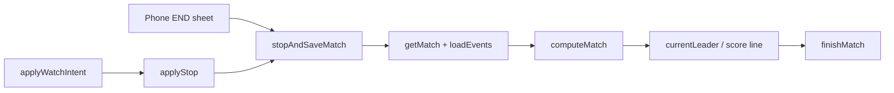

# Mobile App Utilities

`apps/mobile/src/lib` contains small, shared helpers used by the Expo mobile app, watch sync layer, and data screens. The module keeps UI-facing behavior centralized: confirmation prompts, display formatting, match-ending persistence, router fallbacks, local match IDs, and live time updates.

The utilities are intentionally thin. Scoring still comes from `@holy-padel/scoring`, persistence from `@holy-padel/db`, and navigation from `expo-router`.

## Files

- `confirm.ts` — cross-platform destructive confirmation.
- `format.ts` — labels for teams, dates, times, scores, points, durations, and file sizes.
- `match-actions.ts` — shared “stop and save” match finalization path.
- `navigation.ts` — safe router wrappers and local match ID generation.
- `use-now.ts` — React hook for periodically refreshed timestamps.

## Confirmation

### `confirmDestructive(...)`

```ts
confirmDestructive({
  title,
  message,
  confirmLabel,
  onConfirm,
});
```

`confirmDestructive` provides one destructive-confirmation API for native and web surfaces.

On iOS and Android it calls `Alert.alert` with:

- a `"Cancel"` button using `style: "cancel"`
- a destructive button using the caller-provided `confirmLabel`
- `onConfirm` wired to the destructive button’s `onPress`

On web it uses `globalThis.confirm(`${title}\n\n${message}`)`, because `react-native-web`’s `Alert` implementation is a no-op. If the browser confirm returns `true`, `onConfirm` runs synchronously.

Current callers include delete flows such as `confirmDelete` in `app/match/[id].tsx` and `deleteAll` in `src/app/data.tsx`.

## Formatting

`format.ts` is the shared presentation layer for match and team data. Most functions are pure and deterministic: they accept a `MatchSummary`, `MatchSnapshot`, timestamp, or primitive value and return a display string.

### Team Labels

```ts
pairLabel(["Nico", "Javi"]); // "Nico & Javi"
pairInitials(["Nico", "Javi"]); // "N&J"
```

`pairLabel` and `pairInitials` are the base helpers for rendering doubles teams. Higher-level helpers derive team-specific maps from `MatchSummary`:

```ts
teamNames(match); // { A: "Name A1 & Name A2", B: "Name B1 & Name B2" }
teamInitials(match); // { A: "A1&A2", B: "B1&B2" }
```

`opponentsOf(match, ownerTeam)` returns the pair facing the owner’s team.

`ownerTeamOf(match, ownerId)` returns `"B"` when `ownerId` appears in `match.players.B`; otherwise it returns `"A"`. This fallback means unknown or missing owner IDs are treated as team A.

These helpers are used heavily across the home tab, match list, match overview, live screen, export flow, and watch-state builder.

### Date and Time Labels

`dayLabel(timestamp, now)` returns the compact match-row date label:

- `"TODAY"` when `timestamp` is on or after the local start of `now`’s day
- weekday abbreviation such as `"TUE"` for the previous six days
- month/day label such as `"JUN 24"` for older dates

`fullDayLabel(timestamp)` returns a longer header style such as `"TUE JUN 30"`.

`timeLabel(timestamp)` returns local 24-hour time without zero-padding the hour, for example `"18:32"` or `"7:05"`.

`matchMetaLabel(match, now)` combines date, time, court, and location for match rows:

```ts
// Today:
"TODAY · 18:32 · COURT 4"

// Older match:
"TUE · CLUB PADEL NORTE"
```

For today’s matches it includes `dayLabel`, `timeLabel`, and `match.court ?? match.location`. For older matches it includes `dayLabel` and `match.court ?? match.location`. Undefined parts are filtered out before joining.

### Duration and Live Time

`durationLabel(durationMs)` formats elapsed match time as hours and minutes:

```ts
durationLabel(83 * 60_000); // "1:23"
```

It rounds to the nearest minute and clamps negative durations to zero.

`playedMs(match, at)` calculates elapsed play time while excluding pauses:

```ts
playedMs(
  {
    startedAt,
    pausedMs,
    pausedAt,
  },
  at,
);
```

The calculation is:

```ts
at - startedAt - pausedMs - openPause
```

where `openPause` is `at - pausedAt` when the match is currently paused. This keeps the live clock frozen during an active pause while still allowing `at` to be `Date.now()` for live matches or `endedAt` for completed matches.

### Score Labels

`liveScoreLine(snapshot)` renders completed sets plus the set currently in play:

```ts
"6-4 · 4-3"
```

For normal games it appends `snapshot.currentSetGames`. For a super tie-break it appends tie-break points instead:

```ts
"6-4 · 10-8"
```

`finalScoreLine(snapshot)` renders only completed sets:

```ts
"6-3 · 7-6"
```

This is intended for finished matches where the scoring engine has already completed all sets.

### Current Leader

`currentLeader(snapshot)` determines who is ahead when a match is stopped before the engine has a winner. It compares, in order:

1. completed sets won
2. games in the current set
3. total points

If all are tied, it returns `"A"`.

This function is not a replacement for engine winner logic. Finished matches should use `snapshot.winner`; `currentLeader` exists for partial-save cases such as “court time is up.”

### Point and Watch Labels

`pointDisplay(snapshot, team)` returns the point call for a team:

- standard game: `"0"`, `"15"`, `"30"`, `"40"`, or `"AD"` from `game.calls`
- tie-break: numeric point value from `game.points`

If there is no `currentGame`, it returns an empty string.

`watchSetLabel(snapshot)` returns the compact watch header label:

- `"SUPER TB"` for a super tie-break
- `"SET N"` otherwise, using `snapshot.setNumber`

### File Size

`megabytesLabel(bytes)` converts bytes to a one-decimal megabyte label:

```ts
megabytesLabel(1_048_576); // "1.0 MB"
```

## Match Actions

### `stopAndSaveMatch(driver, id, at)`

`stopAndSaveMatch` is the shared persistence path for stopping a match and saving whatever score exists at that moment.

It is used by both phone and watch-initiated stop flows so that the phone remains the single writer and both surfaces persist the same result.

```ts
stopAndSaveMatch(driver, matchId, Date.now());
```

Behavior:

1. Loads the match with `getMatch(driver, id)`.
2. Returns immediately if the match no longer exists.
3. Loads events with `loadEvents(driver, id)`.
4. Computes the authoritative snapshot with `computeMatch(match.config, events)`.
5. Calls `finishMatch(driver, id, ...)`.

For the persisted result:

- `winner` is `snapshot.winner` when the engine has one.
- otherwise `winner` falls back to `currentLeader(snapshot)`.
- `scoreLine` is `finalScoreLine(snapshot)` for finished matches.
- otherwise `scoreLine` is `liveScoreLine(snapshot)`.
- `endedAt` is the caller-provided `at`.



The important boundary is that `stopAndSaveMatch` does not score directly. It folds stored events through `computeMatch`, then formats and persists the resulting snapshot.

## Navigation

### `goHome()`

`goHome` sends the user to the home tab regardless of how the current screen was reached.

```ts
goHome();
```

It uses `router.dismissAll()` when the current stack can dismiss. Otherwise it falls back to `router.replace("/")`.

This avoids an unhandled `POP_TO_TOP` when the current screen is the only route, which can happen after a deep link, page reload, or replace from the setup modal.

### `goBack()`

`goBack` performs a safe back navigation:

```ts
goBack();
```

It calls `router.back()` when history exists, otherwise `router.replace("/")`.

Use this instead of calling `router.back()` directly when a screen may be opened as the first route.

### `newMatchId()`

`newMatchId` creates a local match ID:

```ts
const id = newMatchId();
// "match-1783263512345-1"
```

The ID includes `Date.now()` and an incrementing module-level counter. The counter prevents collisions from two taps in the same millisecond.

IDs are local app identifiers; this function does not touch the database.

## Live Time Hook

### `useNow(intervalMs = 30_000)`

`useNow` returns the current timestamp and refreshes it on an interval:

```ts
const now = useNow();
const fastNow = useNow(1_000);
```

It initializes state with `Date.now()`, then starts a `setInterval` in `useEffect`. The interval is cleared when the component unmounts or when `intervalMs` changes.

The hook drives live clocks and watch sync freshness. One execution flow is:

```text
RootLayout
→ WatchSync
→ useWatchSync
→ useNow
```

Use a shorter interval for second-level UI updates and the default `30_000` milliseconds for coarse live labels.

## Integration Points

The utility module sits between UI surfaces and domain packages:

- UI screens call formatting helpers to render match rows, live cards, overview headers, and export data.
- Watch state uses `teamInitials`, `opponentsOf`, `ownerTeamOf`, `finalScoreLine`, and related formatters to build compact mirrored state.
- Stop intents from the watch route through `stopAndSaveMatch`, keeping persistence on the phone.
- Destructive actions use `confirmDestructive` so native and web builds share the same call site.
- Navigation wrappers isolate `expo-router` stack edge cases from screens.

## Contribution Notes

Keep `format.ts` pure unless there is a strong reason to add side effects. Formatting helpers are reused by screens, tests, exports, and watch state, so small behavior changes can have broad visible impact.

When changing score display behavior, check both finished and live paths:

- `liveScoreLine`
- `finalScoreLine`
- `pointDisplay`
- `watchSetLabel`
- `currentLeader`

When changing stop behavior, preserve the current ownership model: the phone writes the result, watches only initiate mirrored intents. Use `computeMatch` as the source of scoring truth, not duplicated scoring logic in mobile utilities.