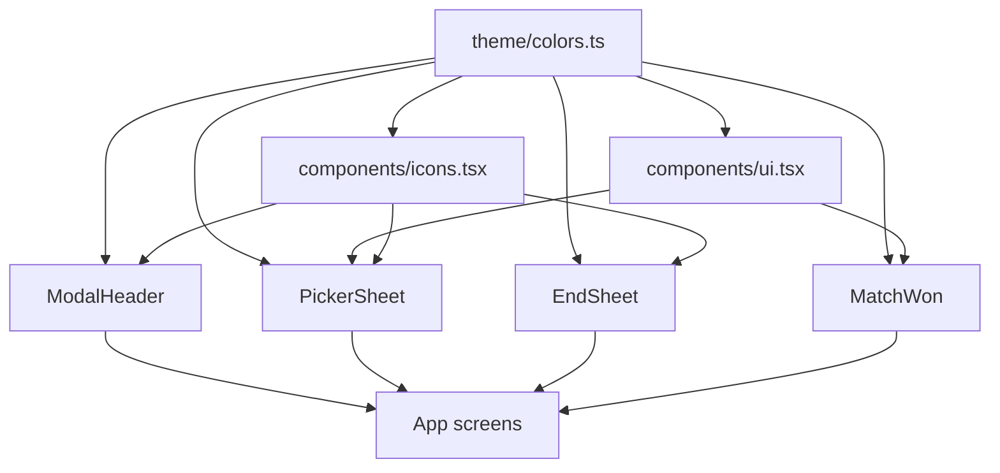

# Mobile UI System

The Mobile UI System is the shared presentation layer for the Expo app. It defines the app’s palette, typography primitives, icon wrappers, repeated controls, bottom sheets, and match-state screens used by feature routes under `apps/mobile/src/app` and `apps/mobile/app`.

The module is intentionally small and concrete: components compose Tamagui primitives, React Native inputs, lucide icons, and design tokens from `src/theme/colors.ts`. It does not own scoring, persistence, routing state, or data fetching.

## Architecture



Most components follow the same pattern:

- Use `colors` and alpha helpers directly instead of local color literals, except for one-off overlay rgba values.
- Use `Display`, `Body`, or `Overline` instead of raw `Text`.
- Use wrapped icons from `components/icons.tsx` instead of importing `lucide-react-native` at call sites.
- Keep behavior in callbacks passed by the owning screen.

## Design Tokens

`apps/mobile/src/theme/colors.ts` is the token source consumed throughout the mobile app.

`colors` contains named values for the “Court Bold” palette:

- `ink`, `inkDeep`, `inkCard`, `inkRaised`, `inkChip`, `inkButton` for dark surfaces and text.
- `lime` and `limeInk` for primary action, live, and active states.
- `cream`, `sheet`, `input`, `row`, `toggle`, `greige`, `white` for light screens and controls.
- `teamBlue` for Team B accents.
- `danger` for destructive actions.

Alpha helpers return rgba strings:

```ts
inkAlpha(alpha: number): string
whiteAlpha(alpha: number): string
limeAlpha(alpha: number): string
```

These helpers are intentionally used across app screens, not only shared components. For example, `inkAlpha` appears in `HomeScreen`, `MatchesScreen`, `LiveScreen`, `NewMatchScreen`, `DataScreen`, `EditProfileScreen`, and `MatchOverviewScreen`. `whiteAlpha` is used on dark surfaces such as match overview, live cards, tab buttons, profile, and match-won UI. `limeAlpha` marks live or serving emphasis in places like `TeamCard` and `HealthBanner`.

## Typography and Base Primitives

`apps/mobile/src/components/ui.tsx` defines the text and small visual primitives used by higher-level UI.

`Display` is a Tamagui-styled `Text` using `fontFamily: "$heading"` and `fontWeight: "400"`. It is used for Anton headings, numerals, team names, score lines, and CTA labels. Do not set a tight `lineHeight` on `Display`; Anton’s rounded glyphs can clip if the line height is near the font size.

`Body` is a Tamagui-styled `Text` using `fontFamily: "$body"` for Archivo UI copy.

`Overline` is a tiny uppercase label with `fontWeight: "800"`, `fontSize: 10`, `letterSpacing: 1.5`, and muted `inkAlpha(0.4)` color.

`Card` is a white rounded `View` with the standard soft shadow.

`Pill` is a fully rounded row container for chips, tab bars, and status pills.

`Avatar({ letter, size, background, color })` renders a circular monogram using `Display`. `RosterRow` uses it for player rows, changing the background to `colors.teamBlue` and text to `colors.white` when a picked player belongs to Team B.

`ResultBadge({ won, size })` renders the compact W/L badge used in form strips and match rows. Wins use `colors.lime`; losses use `colors.greige` with muted ink.

`LiveDot({ size })` renders the small lime circular indicator used for live state and serving-pair state. One execution flow is `TabsLayout → TabButton → LiveDot`.

## Icons

`apps/mobile/src/components/icons.tsx` wraps `lucide-react-native` icons behind stable app-level components:

- `ArrowRight`
- `Plus`
- `Undo`
- `ChevronLeft`
- `ChevronRight`
- `Check`
- `Search`
- `Pause`
- `Play`
- `Heart`
- `X`
- `Square`

All wrappers accept the same `IconProps` shape:

```ts
interface IconProps {
  readonly size?: number;
  readonly color?: string;
  readonly strokeWidth?: number;
}
```

Defaults preserve the app’s visual weight, usually `size = 15`, `color = colors.ink`, and a slightly bold `strokeWidth`. `Square` also sets `fill={color}` and is used as the stop-and-save glyph in `EndSheet`.

Screens should import these wrappers from `@/components/icons.tsx`; direct lucide imports stay centralized here. Existing consumers include `MatchesScreen`, `HomeScreen`, `NewMatchScreen`, and `LiveCard`.

## ModalHeader

`ModalHeader` in `components/modal-header.tsx` provides the shared header pattern for slide-out and modal screens.

```tsx
<ModalHeader
  title="New match"
  onClose={onClose}
  variant="close"
  label="Close"
/>
```

Props:

- `title`: text rendered with `Display`.
- `onClose`: callback invoked by the left icon button.
- `variant`: `"close"` or `"back"`, defaulting to `"close"`.
- `label`: accessible name, defaulting to `"Back"` for back variant and `"Close"` otherwise.
- `right`: optional right-side React node.
- `titleSize`: `Display` font size, defaulting to `26`.

Internally, `ModalHeader` uses a private `IconButton` helper. `IconButton` renders a 40x40 circular Tamagui `XStack` with `role="button"`, `aria-label`, and a muted `inkAlpha` background. The execution flows `NewMatchScreen → ModalHeader → IconButton → inkAlpha`, `EditProfileScreen → ModalHeader → IconButton → inkAlpha`, and `DataScreen → ModalHeader → IconButton → inkAlpha` show that this header is the shared path for modal dismissal UI.

## SegmentedRow

`SegmentedRow<T extends string | number>` renders a settings row with a label on the left and a pill segmented control on the right.

```ts
export interface Segment<T extends string | number> {
  readonly value: T;
  readonly label: string;
}
```

`SegmentedRow` receives `options`, the current `value`, and `onChange(next)`. Each segment is a React Native `Pressable` containing a Tamagui `View`; active options use `colors.ink` with white text, inactive options use transparent background and `inkAlpha(0.45)` text.

Use it for compact enum settings where every option can be shown at once.

## PickerSheet

`PickerSheet` in `components/picker-sheet.tsx` is the player-selection bottom sheet used over match setup.

It owns only transient UI state:

- `query` filters the supplied `roster`.
- `NewPlayerRow` owns its local `newName` input state.

All durable selection and roster mutation stays with the parent through callbacks:

```tsx
<PickerSheet
  team="A"
  stepLabel="1/4"
  roster={roster}
  selected={selectedIds}
  taken={takenIds}
  onToggle={togglePlayer}
  onCreate={createPlayer}
  onDone={closeSheet}
/>
```

Filtering excludes already-taken players and then applies a case-insensitive name match:

```ts
!taken.includes(entry.id) &&
(query === "" || entry.name.toLowerCase().includes(query.toLowerCase()))
```

`RosterRow` renders each selectable player. It calls `onToggle(entry.id)` when pressed, highlights picked rows with a lime border, and shows either a lime check circle or an empty outlined circle. `RosterRow` calls `Avatar` and `Check`.

`NewPlayerRow` renders a dashed plus avatar and a `TextInput`. On submit, it trims the name, calls `onCreate(name)`, clears the input, and calls `onCreated()`. `PickerSheet` passes an `onCreated` handler that clears the search query.

The sheet includes:

- Full-screen absolute overlay.
- Backdrop with `testID="picker-backdrop"`, `role="button"`, `aria-label="Close"`, and `onPress={onDone}`.
- Safe-area-aware bottom padding from `useSafeAreaInsets`.
- Search row using the wrapped `Search` icon.
- Scrollable roster rows.
- Lime `DONE` CTA.

## EndSheet

`EndSheet` is the live-match confirmation sheet shown when ending a match from `LiveScreen`.

It is designed around the product rule that stopping should save by default:

```tsx
<EndSheet
  onStopSave={stopAndSave}
  onDiscard={discardMatch}
  onCancel={keepPlaying}
/>
```

The component renders an absolute full-screen overlay with a dark backdrop and a cream bottom sheet. The backdrop and “KEEP PLAYING” action both call `onCancel`, so END does not trap the user.

Actions:

- `STOP & SAVE`: lime primary CTA, `testID="end-stop-save"`, `aria-label="Stop and save"`, includes the filled `Square` icon.
- `DISCARD MATCH`: outlined destructive button, `testID="end-discard"`, `aria-label="Discard match"`.
- `KEEP PLAYING`: tertiary text button, `testID="end-keep-playing"`, `aria-label="Keep playing"`.

The component uses `useSafeAreaInsets` to keep the sheet clear of the device bottom inset.

## MatchWon

`MatchWon` renders the final victory screen after a match is complete.

It receives already-loaded domain data:

```ts
readonly match: MatchSummary;
readonly snapshot: MatchSnapshot;
readonly stats: MatchStats;
readonly now: number;
readonly onRematch: () => void;
```

The component does not compute scoring. It formats scoring and metadata through existing utilities:

- `teamNames(match)` returns display names for teams.
- `finalScoreLine(snapshot)` renders the final score string.
- `dayLabel(match.startedAt, now)` contributes the date label.
- `durationLabel(stats.durationMs)` contributes match duration.
- `goHome()` is called by the “SAVE & CLOSE” button.

The winner defaults to `"A"` if `snapshot.winner` is absent, and the loser is derived as the other `TeamId`. The metadata line joins date, optional court name, and duration with ` · ` after filtering out `undefined`.

`StatTile` is a private helper used three times for games, points, and breaks. It uses `whiteAlpha` for muted labels and dark raised surfaces from `colors.inkRaised`.

The execution flow `MatchWon → teamNames → pairLabel` means player-name formatting follows the shared formatting module rather than local string assembly.

## Accessibility and Test Hooks

The module uses lightweight accessibility metadata on tappable Tamagui stacks and React Native pressables:

- Button-like stacks set `role="button"`.
- Modal and sheet dismissal controls use stable `aria-label` values such as `"Close"`, `"Back"`, `"Stop and save"`, `"Discard match"`, and `"Keep playing"`.
- E2E selectors are present where flows need direct interaction: `picker-backdrop`, `end-stop-save`, `end-discard`, `end-keep-playing`, and `won-score`.

When adding new shared controls, keep labels stable. They serve both assistive technology and tests.

## Contribution Guidelines

Use `Display`, `Body`, and `Overline` for text unless a native `TextInput` requires inline font styles. When styling `TextInput`, match the existing pattern: set `fontFamily`, `fontSize`, `color`, and `padding: 0` directly.

Import visual tokens from `@/theme/colors.ts`. Prefer semantic token names like `colors.sheet`, `colors.input`, or `colors.toggle` over literal hex values. Use `inkAlpha`, `whiteAlpha`, and `limeAlpha` for opacity variants.

Import icons from `@/components/icons.tsx`. Add a wrapper there when a new lucide glyph becomes part of the app UI, and preserve the `{ size, color, strokeWidth }` prop pattern.

Keep shared components controlled by parent callbacks. Components in this module may own ephemeral UI state such as search text or a draft input, but navigation, persistence, scoring, and roster ownership belong to app screens and data modules.

For bottom sheets and full-screen states, account for safe areas with `useSafeAreaInsets`, keep dismissal obvious, and expose stable test IDs for critical match flows.