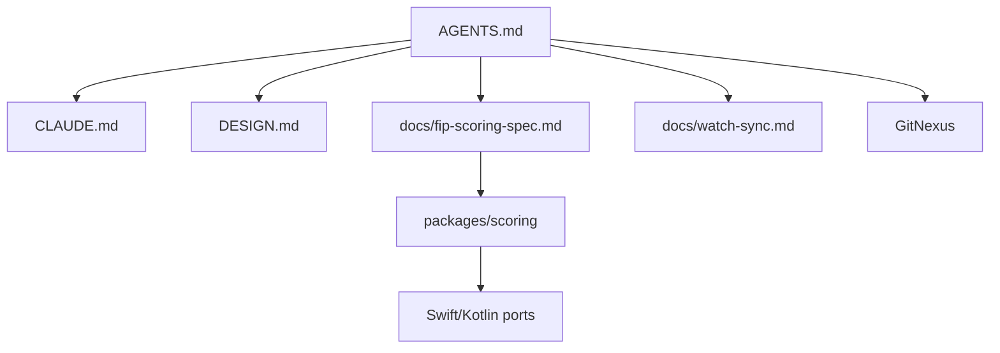

# Other — AGENTS.md

`AGENTS.md` is the repository-level operating guide for coding agents working on Holy Padel. It is not executable code and has no runtime call graph, imports, exports, or execution flows. Its role is to define project boundaries, contribution rules, verification commands, and code-intelligence workflow before an agent edits the codebase.

## Purpose

This file is the tool-neutral entry point for agent behavior in the repository. It summarizes the project architecture, points agents to deeper documentation, and records rules that protect the scoring engine, native companion apps, design system, and CI workflow.

Agents that support the [`AGENTS.md`](https://agents.md) convention should read this file first. Claude Code also reads `CLAUDE.md` and the committed `.claude/` workspace, but `AGENTS.md` is the shared baseline for all agents.

## Repository Context

Holy Padel is a local-first padel score tracker with:

- `apps/mobile`: Expo / React Native phone app using expo-router and Tamagui.
- `apps/watch-wear`: Wear OS companion app built with Kotlin and Compose.
- `apps/mobile/targets/watch`: Apple Watch target.
- `packages/scoring`: pure TypeScript scoring engine.
- `packages/db`: SQLite schema and typed repositories.
- `packages/scoring-swift` and `packages/scoring-kotlin`: native scoring engine ports kept aligned with TypeScript golden vectors.

The central scoring API called out by this guide is:

```ts
computeMatch(config, events)
```

`computeMatch` folds a `PointEvent[]` into a match snapshot. The guide explicitly documents the undo model as “drop the last event,” which reflects the event-sourced design of `packages/scoring`.

## Architectural Rules

The most important architectural constraint is:

**The phone is the single source of truth; watches only mirror it.**

That rule affects how contributors should approach changes across the mobile and watch code:

- Scoring logic belongs in the phone-side source of truth, not in watch apps.
- Apple Watch and Wear OS companions should mirror phone state.
- Sync behavior should follow the contract documented in `docs/watch-sync.md`.
- Any scoring behavior change must be reflected consistently across TypeScript, Swift, and Kotlin scoring implementations.

For scoring changes, the required update path is:

1. Update `docs/fip-scoring-spec.md`.
2. Regenerate golden vectors with:

   ```sh
   node packages/scoring/scripts/write-vectors.ts
   ```

3. Keep `packages/scoring-swift` and `packages/scoring-kotlin` passing against those vectors.

## Documentation Map

`AGENTS.md` links the main sources of truth for contributors:

- `CLAUDE.md`: richer Claude Code guide and workspace map.
- `.claude/`: committed agent workspace with subagents, slash commands, path rules, and skills.
- `DESIGN.md`: design token source of truth.
- `apps/mobile/src/theme/colors.ts`: mobile theme color implementation.
- `docs/fip-scoring-spec.md`: scoring behavior contract.
- `docs/watch-sync.md`: phone-to-watch sync contract.
- `design/`: includes the FIP Rules of Padel PDF.

A contributor should treat `AGENTS.md` as the orientation layer, then follow the linked documents for detailed implementation rules.



## Code Style And Contribution Rules

The guide establishes these repository-wide conventions:

- TypeScript runs in strict mode.
- `exactOptionalPropertyTypes` is enabled.
- Optional object keys should be omitted instead of assigned `undefined`.
- App code should use the `@/` import alias.
- Formatting and linting use Biome with the `all` preset and nursery rules.
- File-level autofix should use:

  ```sh
  pnpm exec biome check --write <file>
  ```

- Changes should be small gitmoji micro-commits.
- Work should branch from protected `main`.
- Contributions should land through PRs.

The design warning about Anton/Display text is also part of the contribution contract: avoid tight `lineHeight` values because round glyphs can clip, causing `"0"` to read like `"U"`.

## Verification Workflow

Before pushing, agents and contributors should run:

```sh
pnpm install
pnpm check
pnpm --filter @holy-padel/mobile e2e
```

`pnpm check` covers Biome, TypeScript, and unit/property tests across packages. The mobile e2e command runs Playwright against the Expo web build.

CI distinguishes required and non-required jobs:

Required:

- `quality`
- `e2e`
- `web-build`

Native jobs are not required for auto-merge, but they matter for native-touching PRs:

- `watch-wear`
- `watchos`
- `watch-bridge`
- `compile-android`
- `compile-ios`
- `native-e2e`
- `engine-ports`

For native-touching changes, the guide requires manual merge only after native jobs report green.

## GitNexus Section

The `gitnexus` block is auto-generated and must not be edited manually. To refresh it, run:

```sh
node .gitnexus/run.cjs analyze
```

If `.gitnexus/run.cjs` does not exist, use:

```sh
npx gitnexus analyze
```

The block records the indexed repository name, symbol count, relationship count, and execution-flow count. It also defines required workflows for agents using GitNexus:

- Run `impact({target: "symbolName", direction: "upstream"})` before editing a function, class, or method.
- Warn the user before proceeding if impact analysis reports `HIGH` or `CRITICAL` risk.
- Run `detect_changes()` before committing.
- Use `query({search_query: "concept"})` when exploring unfamiliar code.
- Use `context({name: "symbolName"})` for symbol-specific callers, callees, and flow participation.
- Use `explain({target: "fileOrSymbol"})` for security and taint-flow review when PDG analysis is available.

Because `AGENTS.md` itself has no executable symbols, the module has no internal calls, outgoing calls, incoming calls, or detected execution flows. Its “dependencies” are procedural: it points humans and agents toward the correct commands, contracts, and code-intelligence tools.

## Maintenance Rules

Manual edits should stay above the GitNexus markers:

```md
<!-- gitnexus:start -->
...
<!-- gitnexus:end -->
```

Do not hand-edit content inside that block. Regenerate it with GitNexus instead.

When updating this guide, keep it concise and operational. It should answer the first questions an agent needs before touching the repository:

- What kind of project is this?
- Where does each major subsystem live?
- What rules are dangerous to violate?
- Which docs are authoritative?
- Which commands verify the work?
- Which code-intelligence workflow is required before edits?