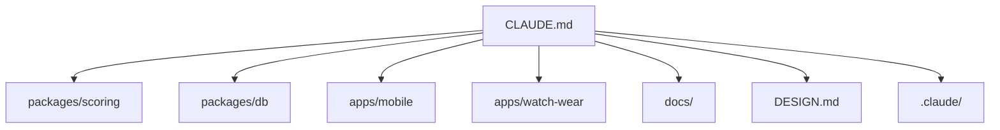

# Other — CLAUDE.md

# CLAUDE.md

`CLAUDE.md` is the repository’s operational guide for AI agents and developers working on Holy Padel. It is documentation-only: there are no runtime calls, imported symbols, incoming callers, or execution flows for this module.

Its purpose is to encode the project’s architecture, contributor rules, verification commands, native build constraints, and agent-specific workspace conventions in one place.

## Role In The Repository

`CLAUDE.md` is the richer companion to `AGENTS.md`. It explains how to work safely in the monorepo and points contributors to the authoritative sources for each area:



The file is not used by application code. Its value is procedural: it tells contributors what must remain true when editing scoring, watch sync, native modules, CI, design, or agent automation.

## Core Architectural Contracts

### Event-Sourced Scoring

The scoring model is centered on `packages/scoring`.

The primary API is:

```ts
computeMatch(config, events)
```

`computeMatch` folds a `MatchConfig` and append-only `PointEvent[]` into a match snapshot. Undo is modeled by dropping the last event, not by mutating derived state.

Related scoring APIs referenced by the guide include:

- `computeStats`
- `watchStatusLabel`

The guide makes the FIP rulebook and `docs/fip-scoring-spec.md` the source of truth for scoring behavior. Any scoring change must preserve parity across the TypeScript engine and the Swift/Kotlin ports by regenerating golden vectors with:

```sh
node packages/scoring/scripts/write-vectors.ts
```

### Phone As Source Of Truth

The mobile app owns match state. Watches mirror phone state and return user intents only.

The relevant watch sync files are:

- `apps/mobile/src/watch/build-state.ts` builds the watch payload.
- `apps/mobile/src/watch/apply-intent.ts` applies watch-originated intents.
- `apps/mobile/modules/watch-bridge` provides the optional native transport.
- `docs/watch-sync.md` defines the phone-to-watch contract.

The guide explicitly forbids scoring logic on watch clients. Watch apps may send intents such as `score`, `undo`, `start-last`, and `pause`, but the phone applies those intents through the shared state model.

### Health And Workout Tracking

Health integrations are opt-in and write-only. Live watch tracking records workout data such as heart rate and calories, while the phone persists Wear summaries.

Duration logic is centralized through:

```ts
playedMs()
```

in `apps/mobile/src/lib/format.ts`, which excludes paused breaks from played time.

### Owner Identity

The current owner is hard-coded as `"nico"` in app flows. New sync code should use that constant pattern and avoid introducing new `getOwner` usage.

## Monorepo Areas

`CLAUDE.md` describes the repo as a Turborepo/pnpm workspace:

| Path | Responsibility |
| --- | --- |
| `packages/scoring` | Pure FIP scoring engine, stats, watch labels, golden vectors |
| `packages/db` | SQLite schema, migrations, typed repositories, `SqlDriver` |
| `apps/mobile` | Expo app, screens, watch sync, health, native modules, watchOS target |
| `apps/watch-wear` | Wear OS app using Kotlin, Compose, and Wearable Data Layer |
| `docs/` | Rules and contracts, especially scoring and watch sync |
| `design/` | Source design material and FIP rules PDF |

For developer navigation, the guide maps common questions to entry points:

- Scoring behavior: `packages/scoring/src` and `docs/fip-scoring-spec.md`
- Watch behavior: `docs/watch-sync.md`, `apps/mobile/src/watch`, and watch apps
- Rendering behavior: `apps/mobile/src/app` and `apps/mobile/src/lib/format.ts`
- Design tokens: `DESIGN.md` and `apps/mobile/src/theme/colors.ts`

## Coding Conventions

The guide records project-wide constraints contributors must preserve.

TypeScript is strict, with `exactOptionalPropertyTypes` enabled. Optional properties should be omitted rather than assigned `undefined`. The document specifically calls out the `courtField` spread pattern in `build-state.ts` as the preferred style.

App code should import via the `@/` alias, which is mirrored in `vitest.config.ts`.

Formatting and linting are handled by Biome with the `all` preset and nursery rules. Native directories under `apps/mobile/targets` and `apps/mobile/modules` are excluded.

Useful commands:

```sh
pnpm lint
pnpm exec biome check --write <file>
```

## Verification Workflow

Before pushing, the documented baseline is:

```sh
pnpm install
pnpm check
pnpm --filter @holy-padel/mobile e2e
```

`pnpm check` covers Biome, TypeScript, and unit/property tests across packages. Mobile e2e tests run Playwright against the Expo web build.

Per-package tests are run with filter commands such as:

```sh
pnpm --filter @holy-padel/db test
```

DB tests use `vitest` and `node:sqlite` via `test/memory-driver.ts`.

## Native Build Constraints

The app is a custom Expo dev-client app. Expo Go cannot run it because the project includes custom native modules and a watch target.

The documented iOS setup requires:

```sh
export DEVELOPER_DIR=/Applications/Xcode.app/Contents/Developer
export LANG=en_US.UTF-8 LC_ALL=en_US.UTF-8
cd apps/mobile && npx expo run:ios --device "<iPhone UDID>"
```

CocoaPods must be installed through Homebrew because the system Ruby is too old.

For watch simulator testing, iPhone and watch simulators must be paired first:

```sh
xcrun simctl pair <watch-udid> <iphone-udid>
```

Android is run through:

```sh
pnpm --filter @holy-padel/mobile android
```

## CI And Branch Protection

`CLAUDE.md` distinguishes required checks from native advisory checks.

Required checks for protected `main` are:

- `quality`
- `e2e`
- `web-build`

Native workflows are not required branch protection checks:

- `watch-wear`
- `watchos`
- `compile-android`
- `compile-ios`
- `native-e2e`

For native-touching PRs, contributors should wait for native jobs to pass and merge manually instead of relying on auto-merge.

## Known Failure Modes

The guide captures several repository-specific gotchas:

- Local Expo modules need a `package.json`, a `link:` dependency in the app, and `.gitignore` negation for native directories.
- AndroidX API signatures must be verified against pinned release AARs, not unreleased source.
- `androidx.core` is pinned to `1.18.0`.
- New pnpm dependency approvals may update `minimumReleaseAgeExclude` in `pnpm-workspace.yaml`; that file must be committed with the lockfile.
- `apps/mobile/patches` contains an `expo-sqlite` web patch for a length truncation bug.

## Agentic Workspace

The `.claude/` directory contains repo-specific automation and guidance. `CLAUDE.md` documents these pieces so agents can use existing workflows instead of inventing new ones.

Key components:

- `.claude/agents/`: task-focused subagents such as `scoring-guardian`, `watch-sync-specialist`, `design-system-keeper`, and `verify-gate`
- `.claude/commands/`: reusable workflows including `/verify`, `/regen-vectors`, `/ship-pr`, and `/new-native-module`
- `.claude/skills/`: specialized procedures such as `ios-build-run` and GitNexus skills
- `.claude/rules/`: path-based rules for scoring, watch, design, native modules, and TypeScript files
- `.claude/settings.json`: shared agent permissions, environment, and hooks
- `.mcp.json`: GitNexus MCP server configuration

Personal overrides belong in `.claude/settings.local.json`, which is git-ignored.

## GitNexus Integration

The GitNexus block is generated and should not be edited manually.

It documents that the repo is indexed as `holy-padel` and provides workflow rules for code intelligence:

- Run impact analysis before editing symbols.
- Use `detect_changes()` before committing.
- Use `query({search_query: "concept"})` for unfamiliar code.
- Use `context({name: "symbolName"})` for symbol-level callers, callees, and flows.
- Use `explain({target: "fileOrSymbol"})` for security-oriented taint findings.

Because `CLAUDE.md` is documentation, GitNexus reports no call graph or execution flows for this module itself. Its GitNexus content is operational guidance for editing other modules.