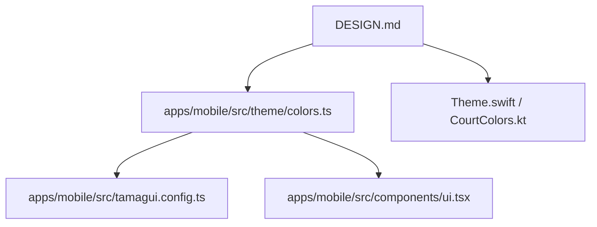

# Other — DESIGN.md

# DESIGN.md — Court Bold Design Contract

## Purpose

`DESIGN.md` is the durable design-system contract for Holy Padel’s “Court Bold” visual language. It defines the palette, typography, shape scale, spacing rhythm, component rules, and platform-mirroring expectations for the Expo phone app, Apple Watch target, and Wear OS app.

This module is documentation, not executable code. GitNexus reports no internal calls, outgoing calls, incoming calls, or execution flows for it. Its influence is contractual: implementation files manually mirror the values and rules it defines.

## File Structure

`DESIGN.md` has two layers:

- YAML front matter for token-like data: `colors`, `typography`, `rounded`, `spacing`, and `components`.
- Markdown prose for intent, constraints, platform rules, and contribution guidance.

Token names in the document use kebab-case, for example `ink-deep`, `lime-ink`, and `team-blue`. The TypeScript runtime mirror uses camelCase in `apps/mobile/src/theme/colors.ts`, for example `colors.inkDeep`, `colors.limeInk`, and `colors.teamBlue`.

## Runtime Connections



The phone implementation is the fullest runtime expression of the contract:

- `apps/mobile/src/theme/colors.ts` exports `colors`, `inkAlpha(alpha)`, `whiteAlpha(alpha)`, and `limeAlpha(alpha)`.
- `apps/mobile/src/tamagui.config.ts` wires `colors` into `tokens.color`, defines the `$heading` Anton font, and defines the `$body` Archivo font.
- `apps/mobile/src/app/_layout.tsx` loads Anton and Archivo with `useFonts`, wraps the app in `TamaguiProvider`, sets `defaultTheme="light"`, and uses `colors.cream` as the stack content background.
- `apps/mobile/src/components/ui.tsx` provides shared atoms: `Display`, `Body`, `Overline`, `Card`, `Pill`, `Avatar`, `ResultBadge`, and `LiveDot`.

The wearable implementations are visual mirrors, not separate design systems:

- `apps/mobile/targets/watch/Theme.swift` defines `enum Court` with `ink`, `lime`, and `white`.
- `apps/watch-wear/app/src/main/java/com/holypadel/wear/ui/Colors.kt` defines `object CourtColors`.
- `apps/watch-wear/app/src/main/java/com/holypadel/wear/ui/Text.kt` defines `DisplayText`, `LabelText`, `BodyText`, `ResultBadge`, and `Dot`.

## Key Rules

Lime is the signal color. Use `colors.lime` for live state, serving state, the primary CTA, wins, and active accents. Do not use it as a neutral surface or body-text color on white; use `colors.limeInk` when lime must be readable on a light background.

Muted colors should come from alpha helpers, not new hex values. Use `inkAlpha(...)`, `whiteAlpha(...)`, and `limeAlpha(...)` instead of inventing tints.

Anton display text must not receive a tight `lineHeight`. `Display` in `ui.tsx` intentionally leaves line height unset because Anton round glyphs can clip when constrained.

The app is light-first on phone: `colors.cream` is the default screen background, with dark ink surfaces used deliberately for cards, tab bars, avatars, live surfaces, and match-won views.

Shapes follow the documented radius scale: `8`, `14`, `18`, `22`, `28`, and fully round `9999`/circle equivalents. Components should not mix sharp and rounded corners within the same view.

## Common Code Patterns

Phone screens should import tokens and atoms directly:

```tsx
import { Body, Display, LiveDot, Pill } from "@/components/ui.tsx";
import { colors, inkAlpha } from "@/theme/colors.ts";
```

Use `Display` for Anton numerals, headings, team names, score labels, and compact CTA text. Use `Body` for Archivo UI text. Use `Overline` for small uppercase section labels.

Use `ResultBadge` for W/L form indicators and match results. Use `Avatar` for team/player monograms, with Team A defaulting to ink + lime and Team B using `colors.teamBlue` + `colors.white`.

## Updating The Contract

When adding or changing a design token, update the contract and all relevant mirrors together:

1. Update `DESIGN.md`.
2. Update `apps/mobile/src/theme/colors.ts`.
3. Update `apps/mobile/src/tamagui.config.ts` if typography or Tamagui token wiring changes.
4. Update `apps/mobile/src/components/ui.tsx` if shared atoms change.
5. Mirror shared wearable values in `Theme.swift` and `Colors.kt`.

Keep exact anchor values aligned across platforms: ink `#0E1116`, lime `#C6F135`, and white `#FFFFFF`.