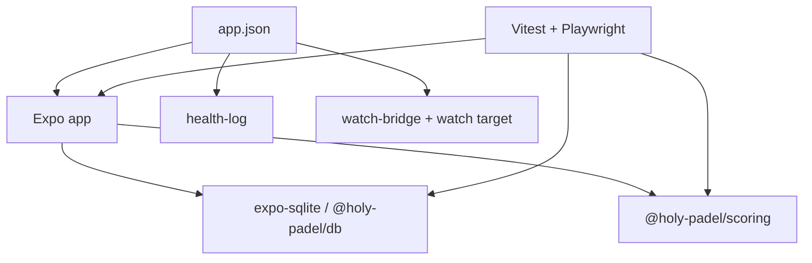

# Other — mobile

This module contains the mobile app’s platform configuration, local native-module wiring, design-system runtime config, and regression test harnesses. It does not implement the main screens or scoring logic directly; instead it defines how `apps/mobile` is built, how native integrations are exposed, and how the app’s user journeys are verified.

## Responsibilities

- Configure the Expo app in `app.json`, including routing, SQLite, HealthKit, Health Connect, splash screen, web output, and Apple Watch target generation.
- Define package scripts and dependencies for the Expo app in `package.json`.
- Configure Metro, TypeScript, Vitest, and Playwright.
- Package two local Expo native modules:
  - `health-log` for HealthKit / Health Connect workout logging.
  - `watch-bridge` for Apple Watch / Wear OS sync transport.
- Configure the watchOS companion target under `targets/watch`.
- Provide unit tests for formatting, seeding, watch intent handling, watch state payloads, workout parsing, and sync-loop behavior.
- Provide Playwright E2E coverage for the main mobile flows.



## Expo app configuration

`apps/mobile/app.json` is the source of truth for the managed Expo app.

The app identity is:

- Name: `Holy Padel`
- Slug: `holy-padel`
- URL scheme: `holy-padel`
- iOS bundle identifier: `com.holypadel.app`
- Android package: `com.holypadel.app`

The app is portrait-only, light-mode only, and uses `#F1F0EA` as the app background.

### Plugins

The configured Expo plugins define most native behavior:

- `expo-router` enables file-based routing.
- `expo-sqlite` enables the local SQLite ledger.
- `expo-splash-screen` configures the dark splash screen with `splash-icon.png`.
- `@bacons/apple-targets` generates the watchOS target from `targets/watch`.
- `expo-build-properties` raises Android `minSdkVersion` to `26`, required by Health Connect.
- `./plugins/with-health-connect.js` injects Health Connect manifest entries that Expo does not expose directly in `app.json`.

Typed Expo Router routes are enabled through:

```json
"experiments": {
  "typedRoutes": true
}
```

### Health permissions

On iOS, `app.json` enables HealthKit and declares both HealthKit usage strings:

- `NSHealthUpdateUsageDescription`
- `NSHealthShareUsageDescription`

On Android, the app declares Health Connect write permissions:

- `android.permission.health.WRITE_EXERCISE`
- `android.permission.health.WRITE_HEART_RATE`
- `android.permission.health.WRITE_TOTAL_CALORIES_BURNED`

The native module itself lives in `modules/health-log`.

## Health Connect config plugin

`apps/mobile/plugins/with-health-connect.js` exports `withHealthConnect(config)`. It wraps `withAndroidManifest` and mutates the Android manifest to add the Health Connect wiring that is not covered by `app.json`.

It updates three manifest areas:

- Adds `<queries>` for `com.google.android.apps.healthdata`, needed to discover the Health Connect APK on Android 13 and below.
- Adds the `androidx.health.ACTION_SHOW_PERMISSIONS_RATIONALE` intent filter to `MainActivity`.
- Adds a `ViewPermissionUsageActivity` activity alias for Android 14+ Health Connect permission usage.

The plugin uses Expo’s `AndroidConfig.Manifest.getMainApplicationOrThrow()` and `getMainActivityOrThrow()` helpers, so failures surface during config/plugin evaluation rather than producing a silently incomplete manifest.

## Metro configuration

`apps/mobile/metro.config.js` extends Expo’s default Metro config.

The important app-specific behavior is:

```js
config.resolver.assetExts.push("wasm");
```

`expo-sqlite` ships a WASM build for web, so `.wasm` must be treated as an asset.

The server middleware also sets:

- `Cross-Origin-Embedder-Policy: credentialless`
- `Cross-Origin-Opener-Policy: same-origin`

These headers are required for the SQLite web worker / OPFS path used by the Expo web E2E suite.

## Package scripts

`apps/mobile/package.json` defines the app-level commands:

- `pnpm --filter @holy-padel/mobile dev` runs `expo start`.
- `android`, `ios`, and `web` start Expo for each target.
- `lint` runs `biome check .`.
- `typecheck` runs TypeScript for the app, E2E tests, and unit tests.
- `test` runs Vitest.
- `e2e` runs Playwright against the Expo web build.
- `e2e:native` runs Maestro tests from `.maestro`.

The package depends on the workspace scoring and database packages:

- `@holy-padel/scoring`
- `@holy-padel/db`

Those packages remain the source of truth for scoring and persistence. The mobile app consumes them rather than reimplementing match rules or SQLite access patterns.

## Tamagui configuration

`apps/mobile/src/tamagui.config.ts` creates the app’s Tamagui runtime config.

The file defines two fonts:

- `headingFont`, using `Anton_400Regular`
- `bodyFont`, using Archivo weights `400`, `500`, `600`, `700`, and `800`

The exported `tamaguiConfig` starts from `defaultConfig`, keeps React Native animations from `@tamagui/config/v5-rn`, and injects app color tokens from `./theme/colors.ts`.

The config intentionally disables strict shorthand/value restrictions:

```ts
settings: {
  onlyAllowShorthands: false,
  allowedStyleValues: false,
}
```

This matches the design-led implementation style in the mobile screens, where exact pixel values and RGBA colors are common.

The module also declares:

```ts
declare module "tamagui" {
  interface TamaguiCustomConfig extends AppTamaguiConfig {}
}
```

This lets Tamagui infer the app’s custom tokens and font config in TypeScript.

## Local Expo native modules

The app links two local native modules through `package.json`:

```json
"health-log": "link:./modules/health-log",
"watch-bridge": "link:./modules/watch-bridge"
```

Both modules use `expo-module.config.json` to expose iOS and Android implementations to Expo.

### `modules/health-log`

`health-log` packages workout logging support.

Its package metadata describes the intent directly: “Log finished padel matches as workouts — HealthKit on iOS, Health Connect on Android”.

The iOS podspec is `modules/health-log/ios/HealthLog.podspec`:

- Pod name: `HealthLog`
- iOS deployment target: `15.1`
- Swift version: `5.9`
- Depends on `ExpoModulesCore`
- Links `HealthKit`
- Builds as a static framework

The Android Gradle module is `modules/health-log/android/build.gradle`:

- Namespace: `expo.modules.healthlog`
- Uses Expo Modules Core
- `minSdkVersion 26`
- Depends on `androidx.health.connect:connect-client:1.1.0`
- Depends on `kotlinx-coroutines-android:1.10.2`

The Android min SDK is deliberately aligned with the `expo-build-properties` setting in `app.json`.

### `modules/watch-bridge`

`watch-bridge` packages phone-to-watch transport.

Its package metadata describes the module as the “Phone-side WatchConnectivity / Wearable Data Layer bridge for Holy Padel”.

The iOS podspec is `modules/watch-bridge/ios/WatchBridge.podspec`:

- Pod name: `WatchBridge`
- iOS deployment target: `15.1`
- Swift version: `5.9`
- Depends on `ExpoModulesCore`
- Builds as a static framework

The Android Gradle module is `modules/watch-bridge/android/build.gradle`:

- Namespace: `expo.modules.watchbridge`
- Uses Expo Modules Core
- Depends on `com.google.android.gms:play-services-wearable:20.0.1`

The dependency comment is important: the phone app and `apps/watch-wear` must stay in lockstep because both ends speak the same Wearable Data Layer contract.

## Apple Watch target

`apps/mobile/targets/watch` is an `@bacons/apple-targets` watch target.

`targets/watch/expo-target.config.js` defines:

- Target type: `watch`
- Target name: `HolyPadelWatch`
- Display name: `Holy Padel`
- Bundle identifier suffix: `.watchkitapp`
- Deployment target: `11.0`
- Icon source: `../../assets/images/icon.png`
- Frameworks: `WatchConnectivity`, `HealthKit`
- HealthKit entitlement
- Accent color: `#C6F135`

The watch target is intentionally a mirror. The README states the key architectural rule: the watch runs no scoring engine. It displays phone-rendered match state and sends intents back.

The target also includes:

- `Info.plist` with HealthKit usage descriptions and `workout-processing`.
- `generated.entitlements` with HealthKit entitlement.
- asset catalogs for app icon, accent color, and previews.

The sync contract described in the README is:

- Phone to watch: `updateApplicationContext(["state": "<json>"])`
- Watch to phone: `score`, `undo`, and `start-last` messages, falling back to `transferUserInfo`

These intent names map conceptually to the tested phone-side intent handling in `src/watch/apply-intent.ts`.

## Unit test harness

Vitest is configured in `apps/mobile/vitest.config.ts`.

It includes `test/**/*.test.ts` and mirrors the app alias:

```ts
alias: {
  "@": fileURLToPath(new URL("./src", import.meta.url)),
}
```

The test TypeScript config in `test/tsconfig.json` includes the tested app files directly, including:

- `../src/db/seed.ts`
- `../src/lib/format.ts`
- `../vitest.config.ts`

### In-memory SQLite driver

`test/memory-driver.ts` exports `memoryDriver()`.

It uses Node’s `DatabaseSync` from `node:sqlite` and adapts it to the `SqlDriver` interface from `@holy-padel/db`:

- `execute(sql, params)` prepares and runs a statement.
- `queryAll(sql, params)` prepares and returns all rows.

This is the bridge that lets unit tests run real migrations, seeds, match creation, event appends, and profile queries without a device database.

### Seed tests

`test/seed.test.ts` verifies `seedIfEmpty(driver)` from `src/db/seed.ts`.

The helper `seeded()` creates a `memoryDriver()`, runs `migrate(driver)`, then seeds the database.

Coverage includes:

- Owner creation through `getOwner()`
- Roster creation through `listPlayers()`
- Idempotency through `countMatches()`
- Seeded live match reconstruction using `computeMatch()`
- Finished match score lines using `finalScoreLine(snapshot)`
- Profile stats through `computeProfileStats(driver, "nico")`

These tests connect seed data, database repositories, and scoring replay. A seeded match is not trusted by fixture text alone; its events are replayed through `computeMatch()`.

### Format tests

`test/format.test.ts` verifies helpers from `src/lib/format.ts`:

- `pairLabel()`
- `pairInitials()`
- `dayLabel()`
- `timeLabel()`
- `fullDayLabel()`
- `durationLabel()`
- `liveScoreLine()`
- `finalScoreLine()`
- `megabytesLabel()`

The score-line tests build snapshots through `computeMatch()`, then assert display strings. This keeps formatter expectations tied to the scoring engine’s real snapshot shape.

### Watch intent tests

`test/watch-intent.test.ts` verifies `applyWatchIntent()` and `INTENT_PATHS` from `src/watch/apply-intent.ts`.

The local `freshDb()` helper creates a migrated in-memory DB and inserts the players required by match foreign keys.

The tests cover these intent paths:

- `INTENT_PATHS.score`
- `INTENT_PATHS.undo`
- `INTENT_PATHS.startLast`
- `INTENT_PATHS.pause`
- `INTENT_PATHS.stop`
- `INTENT_PATHS.cancel`
- `INTENT_PATHS.end`

Important behaviors:

- Score bodies must be valid team IDs.
- Undo removes the last point event.
- `startLast` creates a rematch only when no match is already live.
- Pause toggles `pausedAt` and banks `pausedMs`.
- Score intents are ignored while paused.
- Stop saves either the engine winner or, for partial matches, the current leader.
- Cancel discards the live match.
- Legacy `end` remains an alias for stop-and-save.

### Watch state tests

`test/watch-state.test.ts` verifies `buildWatchState()` from `src/watch/build-state.ts`.

The tests construct `MatchSummary` objects and scoring snapshots, then assert the watch payload shape.

Covered states include:

- Live match display with serving team, point calls, clock, court, and status.
- Paused match display with frozen play time.
- Super tie-break display using numeric points and `SUPER TB`.
- Finished match display with `phase: "won"`.
- Idle display with no history.
- Idle quick-start hint from the last finished match.

The tests use `pairInitials` behavior indirectly through expected watch labels like `N&J` and `M&L`.

### Watch sync-loop tests

`test/watch-sync-loop.test.ts` ties the pure intent and state layers together.

`currentState(driver)` mirrors the production sync loop shape:

1. Read the live match with `getLiveMatch(driver)`.
2. Load events with `loadEvents(driver, live.id)`.
3. Recompute the snapshot with `computeMatch(live.config, events)`.
4. Build the watch payload with `buildWatchState()`.

The tests then apply watch intents through `applyWatchIntent()` and assert the next payload reflects the mutation. This guards the contract between inbound watch commands and outbound watch state.

### Watch workout tests

`test/watch-workout.test.ts` verifies `parseWorkoutSummary()` from `src/health/watch-workout.ts`.

The parser accepts valid workout JSON with:

- `startedAt`
- `endedAt`
- `kcal`
- `avgBpm`
- `maxBpm`
- `samples`

It drops malformed heart-rate samples while keeping the workout if the summary remains measurable. It rejects invalid JSON, non-objects, inverted intervals, missing required timing, and summaries with no useful calories or heart-rate samples.

## Playwright E2E harness

`apps/mobile/playwright.config.ts` runs E2E tests against the Expo web build.

Key settings:

- Test directory: `./e2e`
- Base URL: `http://localhost:8092`
- Viewport: `402x874`, matching a phone-shaped layout
- Fully parallel tests
- CI retries: `2`
- CI workers capped at `2`
- Web server command: `npx expo start --offline --port 8092`
- Web server timeout: `420_000`

Each Playwright test runs in a fresh browser context. Because the web build uses fresh OPFS storage per context, tests start from the same seeded demo database.

### E2E helpers

`e2e/helpers.ts` centralizes repeated browser actions.

Constants:

- `TEAM_A = "Nico & Javi"`
- `TEAM_B = "Marta & Leo"`

Navigation helpers:

- `gotoHome(page)` opens `/` and waits for `HOLA, NICO`.
- `gotoLive(page, id)` opens `/live/${id}` and waits for `point-A`.

Scoring helpers:

- `pointButton(page, team)` returns the team score button.
- `score(page, team, count)` clicks `pointButton()` repeatedly.
- `winLoveGame(page, team)` scores four straight rallies.
- `winLoveGames(page, team, games)` repeats `winLoveGame()`.
- `expectPoints(page, a, b)` asserts `point-A` and `point-B`.
- `statusPill(page)` returns the `status-pill` locator.

Setup helpers:

- `startNewMatch(page, options)` drives the seeded new-match flow:
  - Selects Javi for Team A.
  - Selects Marta and Leo for Team B.
  - Applies optional `bestOf`, `thirdSet`, `deuce`, and `firstServe`.
  - Clicks `START MATCH`.
  - Waits for a fresh `0 / 0` scoreboard.

Dialog helper:

- `armConfirm(page, accept)` registers the next browser confirm handler.

The call graph is intentionally shallow: most specs depend on these helpers, and the helpers depend only on Playwright locators plus each other. For example, `winLoveGames()` calls `winLoveGame()`, which calls `score()`, which calls `pointButton()`.

## E2E coverage map

The E2E specs document expected app behavior at the user-journey level.

- `home.spec.ts` verifies seeded home state, resume scoring, rematch creation, recent match navigation, and tab navigation.
- `new-match.spec.ts` covers match setup defaults, incomplete setup prevention, player search, capped selection, creating players, first-serve selection, and picker backdrop dismissal.
- `live-scoring.spec.ts` covers scoreboard rendering, point progression, deuce/advantage, serve rotation, undo, game/set/match point labels, end-sheet behavior, and set banking.
- `tiebreak.spec.ts` covers normal tie-breaks, tie-break serve rotation, super tie-breaks, full third-set tie-breaks, and undo through tie-break boundaries.
- `full-match.spec.ts` covers complete match flow from setup to save, golden point, rematch from match-won, and loss display.
- `journeys.spec.ts` covers rematch chains, multiple live matches, auto-saving finished results, stale ID recovery, live-overview redirect, super tie-break display on home, and undo across set boundaries.
- `matches.spec.ts` covers ledger ordering, filters, row navigation, and the `NEW` pill.
- `overview.spec.ts` covers match overview hero, set notes, totals, super tie-break labels, and delete behavior.
- `profile.spec.ts` covers seeded profile stats and immediate stat updates after a new win.
- `edit-profile.spec.ts` covers editing and canceling profile changes.
- `pause.spec.ts` covers pause/resume behavior and scoring lockout while paused.
- `navigation.spec.ts` covers deep-link/reload navigation regressions around save, discard, overview back, and live-score reload.
- `nav-exits.spec.ts` covers modal escape paths and the data-management screen.
- `edge-cases.spec.ts` covers player picker exclusions, double-start prevention, final-point race safety, all-new-player matches, filtered player creation, blank-name rejection, team slot replacement, and empty-ledger behavior.

These specs use visible text, roles, and `data-testid` values as the public testing contract for the mobile UI. Changes to screen copy or test IDs should be treated as behavior-affecting unless the tests are updated deliberately.

## How this module connects to the rest of the codebase

This module sits around the mobile app rather than inside a single feature boundary.

It connects to `@holy-padel/scoring` in tests through `computeMatch()`. The scoring package remains the source of truth for point, game, set, tie-break, super tie-break, and match completion behavior.

It connects to `@holy-padel/db` in tests through repository functions such as:

- `migrate()`
- `createMatch()`
- `appendEvent()`
- `finishMatch()`
- `getLiveMatch()`
- `getMatch()`
- `loadEvents()`
- `listMatches()`
- `computeProfileStats()`

It connects to app source modules through direct tests of:

- `seedIfEmpty()`
- `finalScoreLine()`
- `liveScoreLine()`
- `buildWatchState()`
- `applyWatchIntent()`
- `parseWorkoutSummary()`

It connects to native platforms through Expo config, config plugins, linked local modules, podspecs, Gradle modules, and the generated watch target.

## Contributing notes

When changing app configuration, check whether the change belongs in `app.json`, a local Expo config plugin, a native module config, or the watch target config. Health Connect manifest entries that cannot be represented in `app.json` belong in `plugins/with-health-connect.js`.

When changing score display behavior, update or add coverage near the formatter tests and E2E scoreboard tests. The expected pattern is to replay real events through `computeMatch()` and assert the rendered display value.

When changing watch sync behavior, update the pure unit tests first:

- `watch-intent.test.ts` for inbound commands.
- `watch-state.test.ts` for outbound payloads.
- `watch-sync-loop.test.ts` for the complete intent-to-payload loop.

When changing seeded data, keep `seed.test.ts` aligned with the design expectations. The seed must remain idempotent, and stored score lines must agree with replayed scoring snapshots.

When changing UI flows, prefer extending the existing E2E helpers instead of duplicating long Playwright setup sequences. The current pattern is to drive screens through accessible roles, visible text, and stable `data-testid` attributes where exact score assertions are required.