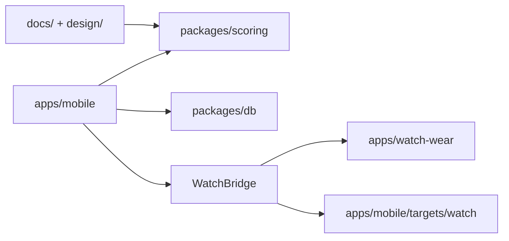

# Other — README.md

# README.md

`README.md` is the repository-level developer entry point for Holy Padel. It explains the product, monorepo layout, local commands, testing strategy, watch architecture, CI expectations, and important implementation notes.

This file is documentation only. It has no internal calls, outgoing calls, incoming calls, or detected execution flows. Its value is in accurately linking developers to the executable modules that implement the app.

## Purpose

The README establishes the top-level mental model:

- Holy Padel is a local-first padel score tracker.
- The phone owns match state and persistence.
- Scoring follows the FIP rules through `@holy-padel/scoring`.
- Matches are stored locally through SQLite.
- Apple Watch and Wear OS apps mirror phone state and send user intents back to the phone.
- CI separates required quality gates from heavier native/watch checks.

It is the first place a contributor should look before opening package-specific code.

## Repository Map

The README describes the main workspaces:



`apps/mobile` is the main Expo / React Native application. It owns screens, navigation, SQLite integration, watch sync orchestration, and the phone-side source of truth.

`packages/scoring` contains the pure scoring engine. The README names `computeMatch(config, events)` as the central fold operation over `PointEvent[]`. Undo is represented by dropping the last point event and recomputing.

`packages/db` provides schema, migrations, and typed repositories over SQLite. The README calls out repository tests that guard against adding point events after a match is finished.

`apps/watch-wear` contains the Wear OS companion built with Kotlin and Jetpack Compose.

`apps/mobile/targets/watch` contains the Apple Watch companion built with SwiftUI and generated into the iOS project by `@bacons/apple-targets`.

`docs/watch-sync.md` defines the shared phone-to-watch JSON payload contract.

`design/` contains the source design artifacts and the official FIP rules PDF.

## Scoring Model

The README summarizes the project’s central domain pattern:

```ts
computeMatch(config, events)
```

A match is modeled as:

- a `MatchConfig`
- an append-only list of point events
- a computed snapshot derived by replaying those events

The scoring engine is event-sourced. It does not persist state itself and does not perform I/O. The app can resume a match by replaying stored events, and undo is implemented by removing the last event from the list.

The README also names `computeStats`, which derives overview data such as breaks, service games held, longest game, per-set durations, and other match summary values.

Scoring behavior is grounded in the FIP rules:

- sets to 6 games
- tie-break at 6-6
- advantage or golden-point deuce
- optional super tie-break third set
- serve rotation and tie-break handoff rules
- legal set-score boundaries
- no play after the final point

When scoring changes, contributors should treat `docs/fip-scoring-spec.md`, the generated golden vectors, and the Swift/Kotlin scoring ports as part of the same contract.

## Watch Architecture

The README is explicit that watches are companions, not independent scoring engines.

The phone remains the single source of truth:

- SQLite ledger in `apps/mobile`
- scoring through `@holy-padel/scoring`
- watch payload construction in `apps/mobile/src/watch`
- native transport through `apps/mobile/modules/watch-bridge`

The watch apps render state and send intents such as:

- `score`
- `undo`
- `start-last`

Those intents are applied on the phone, which recomputes the authoritative match state and sends updated payloads back to the watches.

Platform transports are documented as:

- Wear OS: `DataClient` for state and `MessageClient` for intents
- Apple Watch: `updateApplicationContext` for state and `sendMessage` / `transferUserInfo` for intents

The shared payload contract lives in `docs/watch-sync.md`.

## Development Commands

The README defines the core local workflow:

```sh
pnpm install
pnpm dev
pnpm check
pnpm --filter @holy-padel/mobile e2e
```

`pnpm dev` starts the Expo development server.

`pnpm check` runs the broad local quality gate: Biome, TypeScript, and unit/property tests across the workspace.

`pnpm --filter @holy-padel/mobile e2e` runs the Playwright suite against the Expo web build.

For native shell behavior, the README documents:

```sh
pnpm --filter @holy-padel/mobile e2e:native
```

Those Maestro flows require a dev build installed on a simulator or emulator.

## Testing Strategy

The README groups tests into several layers:

Engine tests in `packages/scoring/test` verify FIP scoring behavior, edge cases, and property invariants. These tests are the closest guardrail around `computeMatch`.

DB tests in `packages/db/test` exercise repositories against `node:sqlite`, including finished-match write guards.

App unit tests in `apps/mobile/test` verify seeded data and formatter contracts.

Playwright E2E tests in `apps/mobile/e2e` validate the Expo web app with a fresh browser context and fresh OPFS-backed database per spec.

Native E2E tests in `apps/mobile/.maestro` validate flows that the web build cannot cover, including OS dialogs, cold-start persistence, native tab/back navigation, and keyboard-driven picker behavior.

## CI Contract

The README documents GitHub Actions workflows under `.github/workflows`.

Required gates on protected `main` are:

- `quality`
- `e2e`
- `web-build`

Native and watch workflows are intentionally not required for every PR:

- `native-e2e`
- `watch-wear`
- `watchos`
- `watch-bridge`

They still matter for native-touching work. The README explains that these heavier workflows are kept outside the required set to avoid slowing every PR, but can be promoted to required checks if the team wants them gating merges.

## Local-First Data Boundary

The README reinforces the project’s privacy and persistence model:

- matches never leave the phone by default
- SQLite is local storage
- first launch seeds the demo ledger with real point events
- seeded match stats are replayed through the scoring engine, not mocked
- health logging is opt-in per finished match
- Apple Health / Health Connect writes are write-only from the app’s perspective

The health integration is implemented by the local `health-log` module and records workouts as Tennis titled “Padel”.

## Important Implementation Notes

`patches/expo-sqlite@57.0.0.patch` fixes an upstream Expo SQLite web sync issue where result lengths over 255 bytes were truncated, causing JSON parsing failures.

`apps/mobile/metro.config.js` serves the SQLite WASM asset and configures cross-origin isolation headers needed by the web build.

These notes are part of the README because they explain otherwise surprising infrastructure decisions that affect local development and CI behavior.

## Maintenance Guidance

Update `README.md` when repository-level behavior changes:

- workspace layout changes
- primary commands change
- test counts or test layers change
- CI required checks change
- watch transport or ownership changes
- scoring architecture changes
- local-first or health-data behavior changes
- major infrastructure patches are added or removed

Keep the README high-level. Package-specific details should live beside the code or in focused docs such as `docs/fip-scoring-spec.md` and `docs/watch-sync.md`.