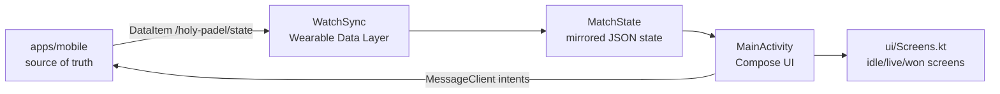

# Other — watch-wear

`apps/watch-wear` is the Wear OS companion for Holy Padel. It is a Kotlin + Jetpack Compose Android app that mirrors the phone’s live match state and sends user intents back to the phone.

The watch does not run the scoring engine. The phone remains the single source of truth for FIP scoring, match progression, undo, and rendered match state. The watch displays state received from the phone and sends lightweight commands such as score, undo, and start-last.

## Architecture



The synchronization contract is shared with the mobile app and documented in `docs/watch-sync.md`.

## Runtime Responsibilities

The watch app has three runtime responsibilities:

1. Receive match state from the phone.
2. Render the current match screen.
3. Send user intents back to the phone.

It must not derive scoring state locally. Undo is handled by the phone by dropping the latest scoring event from the event stream; the watch only requests the undo action.

## Wearable Data Layer Integration

The app uses Google Play services Wearable Data Layer APIs through:

```kotlin
implementation("com.google.android.gms:play-services-wearable:20.0.1")
```

The README defines the two synchronization directions:

| Direction | Transport | Path | Purpose |
| --- | --- | --- | --- |
| Phone to watch | `DataClient` / `DataItem` | `/holy-padel/state` | Push rendered match-state JSON |
| Watch to phone | `MessageClient` | score / undo / start-last paths | Send user intents |

`WatchSync` is the Data Layer boundary. It acts as a `DataClient.OnDataChangedListener`, decodes the `/holy-padel/state` payload into `MatchState`, and exposes the latest mirrored state through a `StateFlow` for Compose to collect.

Because this app relies on Data Layer pairing, the watch application ID is intentionally the same as the phone app:

```kotlin
applicationId = "com.holypadel.app"
```

Do not change this to `com.holypadel.wear`. The Gradle namespace is `com.holypadel.wear`, but the installed application ID must match the phone app so Android can pair the phone and watch apps correctly.

## Key Components

### `MatchState.kt`

`MatchState` is the watch-side representation of the rendered phone state. It is decoded from JSON delivered through the `/holy-padel/state` `DataItem`.

This model should stay aligned with `docs/watch-sync.md` and the mobile watch-sync payload. If the phone changes the state shape, update `MatchState` and the shared sync documentation together.

### `WatchSync.kt`

`WatchSync` owns Data Layer communication.

Expected responsibilities:

- Listen for phone-published `DataItem` updates.
- Decode the match-state JSON.
- Publish the current `MatchState` via `StateFlow`.
- Send watch actions back to the phone with `MessageClient`.

Keep all Wearable Data Layer code isolated here. Compose screens should consume state and invoke intent callbacks, not deal with `DataClient`, `MessageClient`, paths, or JSON decoding directly.

### `MainActivity.kt`

`MainActivity` hosts the Compose UI and controls the lifecycle of watch synchronization.

It should be the bridge between Android lifecycle, `WatchSync`, and UI rendering. The activity starts and stops sync with the activity lifecycle and passes the collected state into the screen layer.

### `ui/Screens.kt`

`Screens.kt` contains the watch UI states, including idle, live, and won screens.

The UI is built with core Compose dependencies:

```kotlin
implementation("androidx.compose.ui:ui")
implementation("androidx.compose.foundation:foundation")
implementation("androidx.activity:activity-compose:1.13.0")
```

The module intentionally avoids `wear.compose` to keep the dependency surface small and builds reproducible.

## Build Configuration

The Wear OS app is an independent Gradle project under `apps/watch-wear`.

Important versions:

| Tool | Version |
| --- | --- |
| Gradle wrapper | `9.4.1` |
| Android Gradle Plugin | `9.2.0` |
| Kotlin Compose plugin | `2.4.0` |
| Compile SDK | `36` |
| Target SDK | `36` |
| Min SDK | `30` |
| Java toolchain | `17` |

AGP 9 bundles Kotlin, so the app does not apply `kotlin.android` directly. The root `build.gradle.kts` pins the Kotlin Gradle plugin to `2.4.0` so it matches the Compose compiler plugin version.

`androidx.core:core-ktx` is pinned to `1.18.0` because `1.19.0` requires compile SDK 37 while this app builds against stable API 36.

## Android Manifest

The manifest declares the app as a watch app:

```xml
<uses-feature android:name="android.hardware.type.watch" />
```

It requires the Wear OS shared library:

```xml
<uses-library
    android:name="com.google.android.wearable"
    android:required="true" />
```

It also marks the app as standalone:

```xml
<meta-data
    android:name="com.google.android.wearable.standalone"
    android:value="true" />
```

`MainActivity` is the launcher activity.

## Permissions

The app currently declares permissions for three areas:

| Permission | Purpose |
| --- | --- |
| `WAKE_LOCK` | Keep watch behavior reliable during active match tracking |
| `VIBRATE` | Local feedback for score, undo, pause, and end taps |
| `BODY_SENSORS` | Heart rate access on API 35 and below |
| `android.permission.health.READ_HEART_RATE` | Granular heart-rate permission on API 36+ |
| `ACTIVITY_RECOGNITION` | Activity context for live match tracking |

Health Services dependencies are present for workout-grade heart rate and calories:

```kotlin
implementation("androidx.health:health-services-client:1.0.0")
implementation("org.jetbrains.kotlinx:kotlinx-coroutines-guava:1.10.2")
implementation("androidx.lifecycle:lifecycle-runtime-ktx:2.9.4")
```

Any code that starts using these APIs should preserve the phone-as-source-of-truth rule: health data can enrich the watch experience, but it must not influence scoring state.

## Resources and Theme

The app uses a minimal resource set:

| Path | Purpose |
| --- | --- |
| `res/values/colors.xml` | Defines `ink`, `lime`, and `black` |
| `res/values/strings.xml` | Defines `app_name` as `Holy Padel` |
| `res/values/themes.xml` | Uses `Theme.DeviceDefault` with a black background |
| `res/drawable/ic_launcher_foreground.xml` | Lime ball launcher foreground |
| `res/mipmap-anydpi-v26/ic_launcher.xml` | Adaptive launcher icon |

The theme keeps the watch background black:

```xml
<item name="android:windowBackground">@color/black</item>
<item name="android:colorBackground">@color/black</item>
```

## Relationship to the Rest of the Monorepo

`apps/watch-wear` connects to the rest of Holy Padel through the watch-sync contract, not through shared scoring code.

Relevant modules:

| Module | Relationship |
| --- | --- |
| `apps/mobile` | Owns match state, scoring, undo, and Data Layer publishing |
| `packages/scoring` | Defines scoring behavior used by the phone, not by the watch |
| `docs/watch-sync.md` | Shared phone-watch payload and message contract |
| `docs/fip-scoring-spec.md` | Scoring source of truth for the engine, not implemented in this app |

When changing scoring behavior, update the scoring package, golden vectors, docs, and native ports. Do not add scoring rules to `apps/watch-wear`.

When changing watch payloads or command paths, update both the mobile sync implementation and the Wear OS side together.

## Development Notes

Build locally from `apps/watch-wear` with the Gradle wrapper or from Android Studio. The environment needs JDK 17 and Android SDK platform 36 with build-tools 36.0.0.

The CI workflow for this module is `watch-wear` and runs `gradle assembleDebug`.

Before changing this module, check whether the change affects:

- Data Layer paths or payload shape.
- `applicationId` pairing with the phone app.
- Android SDK or dependency compatibility.
- Runtime permissions.
- Health Services behavior.
- UI state handling for idle, live, or won match screens.

The safest pattern is to keep platform integration in `WatchSync`, lifecycle wiring in `MainActivity`, and rendering in `ui/Screens.kt`.