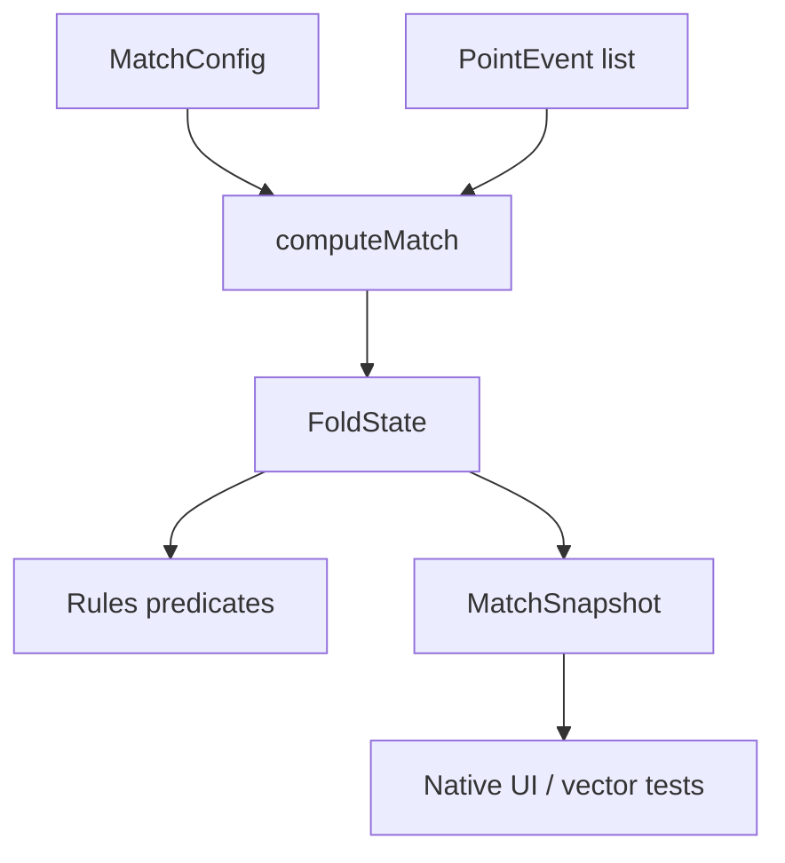

# Scoring Engine Ports

The scoring engine ports are pure Kotlin and Swift implementations of the canonical TypeScript scoring engine in `packages/scoring/src/{engine,rules,types}.ts`. Their job is to reproduce the TypeScript fold exactly so native code and golden-vector tests can reason about the same FIP scoring state without platform dependencies.

The ports live in:

- `packages/scoring-kotlin/src/main/kotlin/com/holypadel/engine`
- `packages/scoring-swift/Sources/HolyPadelEngine`

They implement the same model: a match is derived by folding `PointEvent` values through `computeMatch(...)`. There is no mutable match object, no persistence, and no I/O. Undo is event-sourced: remove the last event and fold again with `undoLastPoint(...)`.



## Public Surface

Both ports expose the same core concepts.

### Match Input

`MatchConfig` describes the scoring format:

- `bestOf`
  - Kotlin: `Int` with supported values `1` or `3`
  - Swift: `BestOf.one` or `BestOf.three`
- `deuceMode`
  - `advantage`
  - `starPoint`
  - `goldenPoint`
- `thirdSet`
  - `fullSet`
  - `advantageSet`
  - `superTieBreak`
- `firstServe`
  - `TeamId.A` or `TeamId.B`

`PointEvent` is the only scoring event:

- `winner`: team that won the rally
- `at`: epoch milliseconds, carried for timing/duration use but ignored by scoring logic

### Match Output

`computeMatch(config, events)` returns a `MatchSnapshot`.

Kotlin:

```kotlin
fun computeMatch(config: MatchConfig, events: List<PointEvent>): MatchSnapshot
fun undoLastPoint(events: List<PointEvent>): List<PointEvent>
```

Swift:

```swift
public func computeMatch(config: MatchConfig, events: [PointEvent]) -> MatchSnapshot
public func undoLastPoint(_ events: [PointEvent]) -> [PointEvent]
```

`MatchSnapshot` contains everything a native UI needs to render the current state:

- `finished`
- `winner`
- `completedSets`
- `setNumber`
- `currentSetGames`
- `currentGame`
- `servingTeam`
- `moment`
- `totalPoints`
- `totalGames`

Once a match is finished, `currentGame` is `null`/`nil`, `currentSetGames` is zeroed, and `moment` becomes `Moment.Finished` / `.finished`.

## Data Model

The ports use small value types only.

### Teams

`TeamId` has exactly two values: `A` and `B`.

Kotlin provides a top-level helper:

```kotlin
fun otherTeam(team: TeamId): TeamId
```

Swift keeps the same helper under `Rules`:

```swift
Rules.otherTeam(_:)
```

Per-team values are represented by `TeamValues<T>`.

Kotlin fields are lowercase:

```kotlin
TeamValues(a = 1, b = 2)
values[TeamId.A]
```

Swift fields are uppercase to match the serialized team names:

```swift
TeamValues(A: 1, B: 2)
values[.A]
```

### Current Game

`CurrentGame` has two shapes:

- standard game: raw point counts plus display calls
- tie-break game: tie-break kind, target, and raw tie-break points

Kotlin:

```kotlin
CurrentGame.Standard(points, calls)
CurrentGame.TieBreakGame(tieBreakKind, target, points)
```

Swift:

```swift
CurrentGame.standard(points: calls:)
CurrentGame.tieBreak(tieBreakKind: target: points:)
```

Standard point display calls are derived by `pointCalls(...)`, not stored in events. Calls are `0`, `15`, `30`, `40`, and `AD`.

### Moment

`Moment` describes what the current point means:

- normal play
- game point
- set point
- match point
- deuce
- advantage
- golden point
- star point
- set tie-break
- super tie-break
- finished

This value drives status UI. It is derived from the current fold state in `deriveMoment(...)`, which delegates normal-game logic to `standardGameMoment(...)`.

## Fold Architecture

The engine is centered on a private `FoldState`.

`FoldState` tracks the mutable-in-the-fold state:

- completed sets
- games in the current set
- points in the current game or tie-break
- active tie-break kind
- tie-break starter
- current/next standard-game server
- set number
- finished flag and winner
- total rally points
- total games

`computeMatch(...)` initializes this state with `initialState(config)`, then applies each event in order:

```text
computeMatch
  -> initialState
  -> applyPoint for each event
  -> toSnapshot
```

If the match becomes finished during the loop, later events are ignored. This mirrors the canonical TypeScript behavior and makes overlong event lists non-fatal at the public API boundary.

Internally, `applyPoint(...)` increments `totalPoints` and routes to one of two handlers:

- `applyStandardPoint(...)`
- `applyTieBreakPoint(...)`

Calling `applyPoint(...)` on an already-finished state is considered a programming error and throws/fatals, but `computeMatch(...)` prevents that by breaking the loop.

## Standard Games

`applyStandardPoint(...)` handles normal game scoring.

The flow is:

1. Increment the current game point count with `bump(...)`.
2. Ask `standardGameWon(...)` whether the point won the game.
3. If not won, keep the updated point count.
4. If won:
   - reset points to zero
   - increment `setGames`
   - increment `totalGames`
   - rotate `gameServer` with `otherTeam(...)`
5. Check whether the game also won the set with `setWon(...)`.
6. If the set is not complete, check whether a tie-break is due with `tieBreakDue(...)`.

The rule predicate lives in `Rules.kt` / `Rules.swift`:

```kotlin
fun standardGameWon(mode: DeuceMode, winnerPoints: Int, loserPoints: Int): Boolean
```

```swift
Rules.standardGameWon(_:_:_:)
```

Deuce modes behave as follows:

- `advantage`: at least 4 points and a two-point margin
- `goldenPoint`: at least 4 points; 3-3 is the deciding point
- `starPoint`: normal advantage cycles until 5-5, then the next point wins

`isDecidingPoint(...)` is used for moment derivation, not for mutating state. It reports:

- golden point at `3-3`
- star point at `5-5`

## Sets and Third-Set Modes

Set completion is checked by `setWon(...)`.

A set is won when either:

- a team has at least 6 games and leads by 2, or
- tie-break sets reach `7-6`

`currentSetHasTieBreak(...)` determines whether the current set uses a tie-break at `6-6`.

For best-of-three matches, set 3 is special:

- `ThirdSetMode.fullSet`: normal third set with tie-break at 6-6
- `ThirdSetMode.advantageSet`: no tie-break; two clear games are required
- `ThirdSetMode.superTieBreak`: when the match reaches one set all, the third set is replaced by a super tie-break to 10

`startNextSet(...)` detects the super tie-break case:

- next set is the deciding set
- `thirdSet == superTieBreak`
- completed sets are tied one set each

When true, it starts the next state with `tieBreak = superTieBreak` and no standard games.

## Tie-Breaks

Tie-break behavior is handled by `applyTieBreakPoint(...)`.

There are two tie-break kinds:

- `TieBreakKind.setTieBreak`: normal tie-break at 6-6, target 7
- `TieBreakKind.superTieBreak`: deciding match tie-break, target 10

The win condition is shared:

```kotlin
fun tieBreakWon(target: Int, winnerPoints: Int, loserPoints: Int): Boolean
```

```swift
Rules.tieBreakWon(_:_:_:)
```

A tie-break is won when the winner reaches the target and leads by 2. Tie-breaks are unbounded.

### Set Tie-Break

When a set tie-break is won:

- `totalGames` increments for the winner
- `setGames` increments to make the final set score `7-6`
- `SetSummary.tieBreak` stores the tie-break points
- `SetSummary.kind` is `set`
- the next standard-game server becomes the team that did not start the tie-break

The server rule is encoded in `applyTieBreakPoint(...)`:

```text
gameServer = otherTeam(tieBreakStarter)
```

### Super Tie-Break

When a super tie-break is won:

- it completes the deciding set directly
- `SetSummary.games` stores the super tie-break points
- `SetSummary.tieBreak` is null/nil
- `SetSummary.kind` is `superTieBreak`
- `totalGames` still increments by one for the winner

This means a super tie-break counts as the deciding set in `completedSets`, but not as a standard `7-6` set.

## Serving Logic

For standard games, `servingTeamOf(...)` returns `gameServer`.

`gameServer` is initialized from `config.firstServe` and flips after every completed standard game.

For tie-breaks, serving is derived from:

```kotlin
fun tieBreakServer(starter: TeamId, pointIndex: Int): TeamId
```

```swift
Rules.tieBreakServer(_:_:)
```

The point index is `points.A + points.B`, so it represents the next point to be played.

The serving pattern follows FIP tie-break order:

```text
1 point by starter, then 2 points per server, alternating teams
```

For example, if `A` starts the tie-break:

```text
point index: 0 1 2 3 4 5 6
server:      A B B A A B B
```

## Snapshot Derivation

The fold state is private. External code only receives `MatchSnapshot`, created by `toSnapshot(...)`.

`toSnapshot(...)` derives:

- `currentGame` through `currentGameOf(...)`
- `servingTeam` through `servingTeamOf(...)`
- `moment` through `deriveMoment(...)`

This separation is important: mutation happens while applying events; display state is derived only at the end.

`standardGameMoment(...)` looks ahead one rally for the current leader to decide whether the current point is a game, set, or match point. It uses:

- `isDecidingPoint(...)`
- `leaderOf(...)`
- `standardGameWon(...)`
- `currentSetHasTieBreak(...)`
- `setWon(...)`
- `setsWonBy(...)`
- `setsToWin(...)`

Tie-break moments are simpler:

- active set tie-break: `Moment.TieBreak(setNumber)` / `.tieBreak(setNumber:)`
- active super tie-break: `Moment.SuperTieBreak` / `.superTieBreak`
- finished match: `Moment.Finished(winner)` / `.finished(winner:)`

## Rules Modules

`Rules.kt` and `Rules.swift` hold the pure FIP predicates and constants used by the fold.

Key constants:

- `GAME_TARGET` / `gameTarget`: 4
- `SET_TARGET` / `setTarget`: 6
- `EXTENDED_SET_TARGET` / `extendedSetTarget`: 7
- `TIE_BREAK_TARGET` / `tieBreakTarget`: 7
- `SUPER_TIE_BREAK_TARGET` / `superTieBreakTarget`: 10
- `WIN_BY_TWO` / `winByTwo`: 2
- `DEUCE_POINTS` / `deucePoints`: 3
- `STAR_POINT_POINTS` / `starPointPoints`: 5

Key predicates:

- `standardGameWon`
- `isDecidingPoint`
- `setWon`
- `tieBreakDue`
- `tieBreakWon`
- `tieBreakServer`
- `thirdSetWithoutTieBreak`
- `setsToWin`

Keep these functions small and side-effect free. They are the shared vocabulary between the fold and the FIP scoring spec.

## Golden Vector Contract

The TypeScript engine is canonical. The ports are verified against golden vectors generated from the TypeScript implementation.

Kotlin includes `Vectors.kt`, which serializes a `MatchSnapshot` into the language-neutral JSON shape defined by `SerializedSnapshot` in `packages/scoring/src/vectors.ts`.

The main entry point is:

```kotlin
fun serializeSnapshot(snap: MatchSnapshot): JsonElement
```

It serializes:

- teams as `"A"` / `"B"`
- team values as `{ "A": ..., "B": ... }`
- standard games with `kind: "standard"`
- tie-break games with `kind: "tieBreak"`
- moments as tagged objects with `kind`
- completed sets with `games`, `tieBreak`, `winner`, and `kind`

Swift vector tests call `computeMatch(config:events:)` from `Tests/HolyPadelEngineTests/VectorTests.swift` after decoding `MatchConfig`, `PointEvent`, and related enums from the golden vector input.

When scoring behavior changes, update the canonical TypeScript engine first, regenerate the golden vectors, then update the Kotlin and Swift ports to match.

## Porting Conventions

The ports intentionally mirror the TypeScript structure rather than using idiomatic platform abstractions.

Preserve these patterns when editing:

- keep the engine pure
- keep scoring state private to `FoldState`
- keep public output as `MatchSnapshot`
- keep rule checks in `Rules.kt` / `Rules.swift`
- keep event timestamps out of scoring decisions
- do not add Android, WatchKit, HealthKit, Foundation, database, or networking dependencies to the core engine
- prefer explicit value copying over hidden mutation
- keep Kotlin, Swift, and TypeScript behavior structurally aligned

Swift uses public value types marked `Sendable` and `Equatable` so native clients can move snapshots safely across concurrency boundaries. Kotlin uses plain JVM data classes and sealed classes.

## Integration Notes

The ports are language-native mirrors of the scoring engine. The product-level source of truth remains the phone-side event log and computed match state; watch companions should mirror state rather than become independent scoring authorities.

Native code should treat `computeMatch(...)` as a deterministic projection:

```text
MatchConfig + ordered PointEvent list -> MatchSnapshot
```

That makes the module safe for:

- rendering native scoring UI from a known event list
- validating native behavior against golden vectors
- deriving current server, moment, set summaries, and totals without duplicating UI logic

Do not persist `FoldState`. Persist or transmit events and recompute snapshots instead.