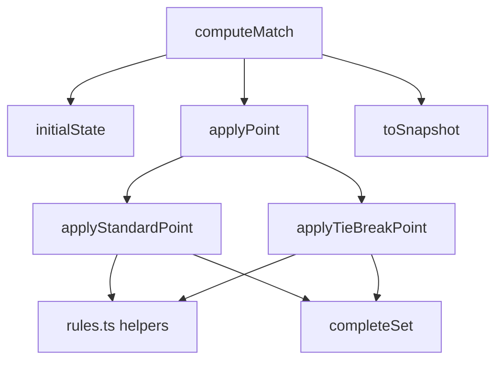

# Scoring Engine

The scoring engine in `packages/scoring` is the canonical implementation of Holy Padel match scoring. It is a pure, event-sourced module: given a `MatchConfig` and the full ordered list of `PointEvent`s, it derives the current `MatchSnapshot`.

The core rule is:

```ts
computeMatch(config, events)
```

No match state is mutated or persisted inside the engine. Undo is implemented by dropping the last event:

```ts
undoLastPoint(events)
```

`PointEvent.at` is ignored for scoring and used only by statistics code for durations.

## Public Surface

`packages/scoring/src/index.ts` exports the module API:

```ts
export { computeMatch, undoLastPoint } from "./engine.ts";
export { statusLabel, watchStatusLabel } from "./labels.ts";
export { computeStats } from "./stats.ts";
```

It also exports rule constants and helpers:

```ts
GAME_TARGET
SET_TARGET
EXTENDED_SET_TARGET
TIE_BREAK_TARGET
SUPER_TIE_BREAK_TARGET
otherTeam
tieBreakServer
```

And the main domain types:

```ts
MatchConfig
PointEvent
MatchSnapshot
CurrentGame
Moment
SetSummary
TeamId
TeamValues
DeuceMode
ThirdSetMode
TieBreakKind
```

## Core Model

A match is configured by `MatchConfig`:

```ts
interface MatchConfig {
  readonly bestOf: 1 | 3;
  readonly deuceMode: "advantage" | "starPoint" | "goldenPoint";
  readonly thirdSet: "fullSet" | "advantageSet" | "superTieBreak";
  readonly firstServe: "A" | "B";
}
```

A match advances only through `PointEvent`:

```ts
interface PointEvent {
  readonly winner: TeamId;
  readonly at: number;
}
```

`computeMatch()` folds all events into a `MatchSnapshot`, which contains everything the app needs to render live state:

```ts
interface MatchSnapshot {
  readonly config: MatchConfig;
  readonly finished: boolean;
  readonly winner: TeamId | undefined;
  readonly completedSets: readonly SetSummary[];
  readonly setNumber: number;
  readonly currentSetGames: TeamValues<number>;
  readonly currentGame: CurrentGame | undefined;
  readonly servingTeam: TeamId;
  readonly moment: Moment;
  readonly totalPoints: TeamValues<number>;
  readonly totalGames: TeamValues<number>;
}
```

The engine distinguishes between raw point counts and display calls. Standard-game raw points are stored as `0`, `1`, `2`, `3`, etc. `pointCalls()` converts those into `"0"`, `"15"`, `"30"`, `"40"`, or `"AD"` for display.

## Fold Architecture

Internally, `computeMatch()` starts from `initialState(config)` and applies each event through `applyPoint()` until the match is finished.



The internal `FoldState` keeps transient fold-only data:

```ts
interface FoldState {
  completedSets: SetSummary[];
  setGames: TeamValues<number>;
  points: TeamValues<number>;
  tieBreak: TieBreakKind | undefined;
  tieBreakStarter: TeamId;
  gameServer: TeamId;
  setNumber: number;
  finished: boolean;
  winner: TeamId | undefined;
  totalPoints: TeamValues<number>;
  totalGames: TeamValues<number>;
}
```

This state is not exported. Consumers should treat `MatchSnapshot` as the stable read model.

## Point Application

`applyPoint()` is the central dispatcher.

It first rejects direct scoring on a finished state:

```ts
if (state.finished) {
  throw new Error("cannot score a point: the match is already finished");
}
```

Then it increments `totalPoints` with `bump()` and routes to the correct scoring branch:

```ts
if (counted.tieBreak !== undefined) {
  return applyTieBreakPoint(counted, config, winner);
}
return applyStandardPoint(counted, config, winner);
```

`computeMatch()` itself stops folding once `state.finished` is true. That means extra events after match point are ignored rather than fatal. This is intentional: late or duplicate taps from a device should not crash a fold once the match has already been decided.

## Standard Games

`applyStandardPoint()` handles normal game scoring.

It increments the current game points, then asks `standardGameWon()` whether the game is complete under the configured `deuceMode`:

```ts
standardGameWon(config.deuceMode, points[winner], points[loser])
```

The supported deuce modes live in `rules.ts`:

- `advantage`: win at least 4 points and by 2.
- `goldenPoint`: the first point after 3-3 wins.
- `starPoint`: normal advantage cycles until 5-5; the next point wins.

When a standard game is won, `applyStandardPoint()`:

1. Increments `setGames`.
2. Increments `totalGames`.
3. Resets `points` to `ZERO`.
4. Switches `gameServer` with `otherTeam(state.gameServer)`.
5. Checks whether the set is won with `setWon()`.
6. Otherwise checks whether a 6-6 tie-break is due with `tieBreakDue()`.

If `tieBreakDue()` is true, the next state enters a set tie-break:

```ts
return { ...afterGame, tieBreak: "setTieBreak", tieBreakStarter: afterGame.gameServer };
```

The tie-break starter is the team that would serve the next standard game.

## Tie-Breaks

`applyTieBreakPoint()` handles both set tie-breaks and super tie-breaks.

It requires `state.tieBreak` to be set. If called outside a tie-break, it throws:

```ts
throw new Error("not in a tie-break");
```

The target depends on `TieBreakKind`:

```ts
const target = kind === "superTieBreak" ? SUPER_TIE_BREAK_TARGET : TIE_BREAK_TARGET;
```

Set tie-breaks use `TIE_BREAK_TARGET` (`7`). Super tie-breaks use `SUPER_TIE_BREAK_TARGET` (`10`). Both are won by two clear points through `tieBreakWon()`.

A completed set tie-break:

- Counts as one game in `totalGames`.
- Increments `setGames` to produce a 7-6 set.
- Stores the tie-break point score in `SetSummary.tieBreak`.
- Sets the next standard game server to `otherTeam(state.tieBreakStarter)`.

That last rule is encoded directly in `applyTieBreakPoint()`:

```ts
gameServer: otherTeam(state.tieBreakStarter)
```

A completed super tie-break:

- Counts as one game in `totalGames`.
- Produces a `SetSummary` with `kind: "superTieBreak"`.
- Stores its points in `games`, not `tieBreak`.

## Sets and Match Completion

Set completion is centralized in `completeSet()`.

It appends the new `SetSummary`, then checks whether the set winner has won enough sets for the configured match length:

```ts
setsWonBy(completedSets, summary.winner) === setsToWin(config.bestOf)
```

`setsToWin()` returns:

- `1` for `bestOf: 1`
- `2` for `bestOf: 3`

If the match is complete, `completeSet()` sets:

```ts
finished: true
winner: summary.winner
points: ZERO
```

If not, it delegates to `startNextSet()`.

## Third Set Modes

Third-set behavior is controlled by `ThirdSetMode`.

```ts
type ThirdSetMode = "fullSet" | "advantageSet" | "superTieBreak";
```

The engine treats the deciding set of a best-of-3 match specially:

```ts
function isDecidingSet(config: MatchConfig, setNumber: number): boolean {
  return config.bestOf === 3 && setNumber === 3;
}
```

`currentSetHasTieBreak()` returns false only for a deciding third set configured as `advantageSet`:

```ts
return !(isDecidingSet(config, setNumber) && thirdSetWithoutTieBreak(config.thirdSet));
```

For `superTieBreak`, `startNextSet()` starts the third set directly in tie-break mode, but only when the match is tied one set all:

```ts
const superTieBreakDue =
  isDecidingSet(config, setNumber) &&
  config.thirdSet === "superTieBreak" &&
  setsWonBy(state.completedSets, "A") === setsWonBy(state.completedSets, "B");
```

## Serving Logic

Standard-game serving is tracked by `gameServer`. It starts as `config.firstServe` and alternates after each completed standard game.

Tie-break serving is derived rather than stored per point:

```ts
servingTeamOf(state)
```

If the match is in a tie-break, `servingTeamOf()` calls:

```ts
tieBreakServer(state.tieBreakStarter, state.points.A + state.points.B)
```

`tieBreakServer()` implements the FIP tie-break pattern:

- Starter serves point 0.
- Opponent serves points 1 and 2.
- Then teams alternate every two points.

The implementation uses a 0-based `pointIndex`:

```ts
const serverBlock = Math.floor((pointIndex + 1) / WIN_BY_TWO);
return serverBlock % WIN_BY_TWO === 0 ? starter : otherTeam(starter);
```

## Moments

`Moment` describes what the current point means for UI status.

Examples:

```ts
{ kind: "normal" }
{ kind: "gamePoint", team: "A" }
{ kind: "setPoint", team: "B" }
{ kind: "matchPoint", team: "A" }
{ kind: "deuce" }
{ kind: "advantage", team: "B" }
{ kind: "goldenPoint" }
{ kind: "starPoint" }
{ kind: "tieBreak", setNumber: 2 }
{ kind: "superTieBreak" }
{ kind: "finished", winner: "A" }
```

`deriveMoment()` selects the high-level state:

1. Finished match.
2. Super tie-break.
3. Set tie-break.
4. Standard-game moment via `standardGameMoment()`.

`standardGameMoment()` handles deuce, advantage, deciding points, and point-at-stake detection. It simulates the leading team winning the next point to decide whether the current point is a game point, set point, or match point:

```ts
if (!standardGameWon(config.deuceMode, points[leader] + 1, points[loser])) {
  return { kind: "normal" };
}
```

If that next point would win the game, it then checks whether it would also win the set with `setWon()`, and whether that set would win the match with `setsToWin()`.

## Labels

`labels.ts` converts `Moment` into UI copy.

`statusLabel()` is the long phone-facing label:

```ts
statusLabel(moment, teamNames)
```

Examples:

- `GAME POINT — NICO & JAVI`
- `SET POINT — NICO & JAVI`
- `MATCH POINT — NICO & JAVI`
- `DEUCE`
- `ADVANTAGE — NICO & JAVI`
- `TIE-BREAK — SET 2`
- `SUPER TIE-BREAK`
- `MATCH WON`

`watchStatusLabel()` is the compact watch-facing label:

```ts
watchStatusLabel(moment, shortNames)
```

Examples:

- `GAME PT`
- `SET PT`
- `MATCH PT`
- `DEUCE`
- `AD · N&J`
- `GOLDEN PT`
- `STAR PT`
- `TIE-BREAK`
- `SUPER TB`
- `WON`

Both functions return `undefined` for `{ kind: "normal" }`.

## Statistics

`stats.ts` derives match statistics by replaying the same event stream through `computeMatch()`.

The public entry point is:

```ts
computeStats(config, events)
```

It returns `MatchStats`:

```ts
interface MatchStats {
  readonly games: readonly GameRecord[];
  readonly sets: readonly SetStats[];
  readonly breaks: TeamValues<number>;
  readonly service: TeamValues<ServiceRecord>;
  readonly longestGame: GameRecord | undefined;
  readonly totalPoints: TeamValues<number>;
  readonly durationMs: number;
}
```

`computeStats()` compares snapshots before and after each event:

```ts
const before = computeMatch(config, events.slice(0, index));
const after = computeMatch(config, events.slice(0, index + 1));
```

This keeps stats aligned with the canonical engine instead of duplicating scoring rules.

The recorder flow is:

1. `openGameIfNeeded()` starts a `GameRecord` using the `before` snapshot.
2. The current event increments the open game’s point count.
3. `closeGameIfFinished()` detects game completion by comparing `after.totalGames` with `previousTotalGames`.
4. `closeSetIfFinished()` detects set completion by comparing `after.completedSets.length` with `previousSetCount`.

Breaks and service holds are computed only from standard games:

```ts
const standardGames = recorder.games.filter((game) => game.kind === "standard");
```

Tie-breaks and super tie-breaks are recorded as games, but they do not count as service games for break/hold statistics.

## Golden Vectors

`vectors.ts` generates deterministic golden vectors for the TypeScript engine.

The public generator is:

```ts
goldenVectors()
```

Each vector contains:

```ts
interface GoldenVector {
  readonly config: MatchConfig;
  readonly winners: string;
  readonly snapshot: SerializedSnapshot;
}
```

`goldenVectors()` iterates across:

- `bestOf`: `1`, `3`
- `deuceMode`: `advantage`, `starPoint`, `goldenPoint`
- `thirdSet`: `fullSet`, `advantageSet`, `superTieBreak`
- `firstServe`: `A`, `B`
- deterministic winner sequences with different biases
- fixed prefixes to capture mid-match and finished states

Snapshots are serialized with `serializeSnapshot()` into language-neutral JSON. The Swift and Kotlin ports compare against the committed golden vectors so the native watch engines stay byte-identical to the TypeScript source of truth.

## Rule Helpers

`rules.ts` contains the low-level scoring predicates used by the engine.

Important constants:

```ts
GAME_TARGET = 4
SET_TARGET = 6
EXTENDED_SET_TARGET = 7
TIE_BREAK_TARGET = 7
SUPER_TIE_BREAK_TARGET = 10
WIN_BY_TWO = 2
DEUCE_POINTS = 3
STAR_POINT_POINTS = 5
```

Important helpers:

```ts
otherTeam(team)
standardGameWon(mode, winnerPoints, loserPoints)
isDecidingPoint(mode, pointsA, pointsB)
setWon(winnerGames, loserGames, withTieBreak)
tieBreakDue(gamesA, gamesB, withTieBreak)
tieBreakWon(target, winnerPoints, loserPoints)
tieBreakServer(starter, pointIndex)
thirdSetWithoutTieBreak(mode)
setsToWin(bestOf)
```

These helpers are intentionally small and rule-focused. Higher-level match transitions stay in `engine.ts`.

## Snapshot Construction

`toSnapshot()` converts internal `FoldState` into the exported `MatchSnapshot`.

It derives:

- `currentGame` through `currentGameOf()`
- `servingTeam` through `servingTeamOf()`
- `moment` through `deriveMoment()`

When the match is finished:

- `setNumber` is the number of completed sets.
- `currentSetGames` is reset to `{ A: 0, B: 0 }`.
- `currentGame` is `undefined`.
- `moment` is `{ kind: "finished", winner }`.

During a tie-break, `currentGameOf()` returns:

```ts
{
  kind: "tieBreak",
  tieBreakKind,
  target,
  points
}
```

During a standard game, it returns:

```ts
{
  kind: "standard",
  points,
  calls
}
```

## Integration Points

The scoring package is consumed by:

- Live match UI through `computeMatch()`.
- Undo flows through `undoLastPoint()`.
- Phone and watch status text through `statusLabel()` and `watchStatusLabel()`.
- Match overview/statistics screens through `computeStats()`.
- Golden-vector generation through `goldenVectors()`.
- Swift and Kotlin scoring ports through the committed serialized vectors.

`computeStats()` and `goldenVectors()` both depend on `computeMatch()`, so changes to scoring behavior naturally flow into derived stats and vector output.

The incoming test coverage exercises:

- `computeMatch()` through helper snapshots, undo tests, invariant tests, and edge-case tests.
- `undoLastPoint()` through undo and invariant tests.
- `tieBreakServer()` through serving tests.
- `statusLabel()` and `watchStatusLabel()` through moment and critic edge tests.
- `computeStats()` through stats tests.
- `goldenVectors()` through vector drift tests and the vector-writing script.

## Change Guidelines

Scoring behavior should change in one place: the TypeScript engine and rule helpers.

When changing match behavior:

1. Update the relevant helper in `rules.ts` or transition logic in `engine.ts`.
2. Keep `computeMatch()` pure and event-sourced.
3. Avoid duplicating scoring rules in `stats.ts`; derive from snapshots instead.
4. Update `docs/fip-scoring-spec.md` when the scoring contract changes.
5. Regenerate golden vectors with the existing vector script.
6. Keep Swift and Kotlin ports aligned with the regenerated vectors.

Do not add watch-specific scoring behavior. Watches mirror phone state, and native ports exist to reproduce the canonical TypeScript outputs, not to define independent rules.