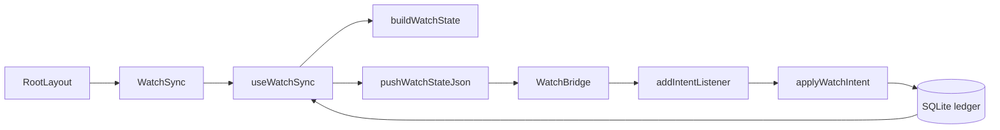

# Watch Sync and Intent Handling

The watch sync module keeps Apple Watch and Wear OS companions aligned with the phone’s match ledger. The phone remains the single source of truth: watches display state, send high-level intents, and never compute or mutate scoring themselves.

The module has three responsibilities:

1. Build a transport-neutral watch state payload from the current match ledger.
2. Push that payload through the optional native `WatchBridge`.
3. Apply incoming watch intents by reusing the same database mutations as the phone UI.



## Runtime Entry Point

`WatchSync` is mounted once from `RootLayout` inside the app’s database provider:

```ts
export function WatchSync(): ReactNode {
  useWatchSync();
  return null;
}
```

`useWatchSync()` owns the full loop:

- reads the current ledger state with `useDbQuery(gatherWatchInput)`
- recomputes watch display state with `buildWatchState`
- pushes serialized JSON through `pushWatchStateJson`
- subscribes to native watch intents with `addIntentListener`
- applies scoring intents inside `useDbMutation`

The hook also uses `useNow(CLOCK_REFRESH_MS)` with a 30 second interval so the watch clock refreshes even when the ledger is unchanged.

## Building Watch State

`buildWatchState(input: WatchStateInput): WatchState` is pure and transport-agnostic. It does not know whether the payload will be sent through WatchConnectivity, the Wearable Data Layer, or tests.

The state schema is versioned with `v: 1` and has three phases:

- `idle`: no live match; may include a quick-start hint from the latest finished match
- `live`: active unfinished match
- `won`: just-finished match result display

The input shape is:

```ts
export interface WatchStateInput {
  readonly ownerId: string;
  readonly now: number;
  readonly live?: { readonly match: MatchSummary; readonly snapshot: MatchSnapshot };
  readonly last?: MatchSummary;
}
```

`gatherWatchInput(driver)` prepares this input from the database. If a live match exists, it loads the match events with `loadEvents(driver, live.id)` and folds them with `computeMatch(live.config, events)`. If there is no live match, it finds the most recent finished match from `listMatches(driver)`.

### Live State

`liveState(match, snapshot, now)` builds the active scoring view:

- `clock` comes from `durationLabel(playedMs(match, now))`
- `setLabel` comes from `watchSetLabel(snapshot)`
- team labels come from `teamInitials(match)`
- point labels come from `pointDisplay(snapshot, "A" | "B")`
- game score comes from `liveScoreLine(snapshot)`
- serving markers use `snapshot.servingTeam`
- status text comes from `watchStatusLabel(snapshot.moment, shorts)`
- `paused` is present when `match.pausedAt !== undefined`
- `startedAt` is included for workout start time and cross-device deduplication

Optional fields are omitted rather than set to `undefined`, matching the repo’s `exactOptionalPropertyTypes` convention. `courtField(match)` encapsulates that pattern for `court`.

### Won State

`wonState(match, snapshot, now)` builds the completed-match display. It uses:

- `snapshot.winner` for the winning team, falling back to `"A"` defensively
- `finalScoreLine(snapshot)` for the score
- `durationLabel(playedMs(match, match.endedAt ?? now))` for duration
- `teamInitials(match)` for the winner label

The resulting state has `phase: "won"`, clears live-only point fields, and includes:

```ts
won: {
  winnerShort,
  scoreLine,
  duration,
}
```

### Idle State

`idleState(last, ownerId)` returns an empty idle payload when there is no previous finished match. When a last match exists, it adds a quick-start hint:

```ts
last: {
  line: `${last.scoreLine ?? ""} vs ${opponentShort}`.trim(),
  won: last.winner === ownerTeam,
}
```

The owner’s team is resolved with `ownerTeamOf(last, ownerId)`, and the opponent label is built through `opponentsOf` and `pairInitials`.

`OWNER_ID` is currently hard-coded as `"nico"` in `use-watch-sync.ts`, matching the rest of the app’s owner assumptions.

## Native Bridge Boundary

`bridge.ts` is the JavaScript boundary over the optional native `WatchBridge` module:

```ts
const native = requireOptionalNativeModule<WatchBridgeModule>("WatchBridge");
```

Because it uses `requireOptionalNativeModule`, the module is safe on web and in builds where the native bridge is not linked. In those cases:

- `isWatchBridgeAvailable()` returns `false`
- `pushWatchStateJson()` becomes a no-op
- `addIntentListener()` returns an unsubscribe function that does nothing

All bridge operations are best-effort. `pushWatchStateJson(json)` catches native errors so a missing watch, unavailable Play services, or bridge failure cannot break the phone app. The next successful push self-heals the watch state.

`pushWatchState(state)` is a convenience wrapper that serializes a `WatchState` before delegating to `pushWatchStateJson`.

## Intent Handling

Watch intents are defined by `INTENT_PATHS` in `apply-intent.ts`:

```ts
export const INTENT_PATHS = {
  score: "/holy-padel/score",
  undo: "/holy-padel/undo",
  startLast: "/holy-padel/start-last",
  pause: "/holy-padel/pause",
  stop: "/holy-padel/stop",
  cancel: "/holy-padel/cancel",
  end: "/holy-padel/end",
} as const;
```

`applyWatchIntent(driver, intent, ctx)` dispatches by path and intentionally treats unknown paths as no-ops.

Supported intents:

- `score`: scores one point for body `"A"` or `"B"`
- `undo`: removes the last event from the live match
- `pause`: toggles pause/resume
- `stop`: stops and saves the live match in its current state
- `end`: back-compat alias for `stop`
- `cancel`: deletes the live match entirely
- `startLast`: starts a rematch using the last finished match’s setup

Impossible states are also no-ops. For example, scoring with no live match, undoing with no live match, or starting the last match while another match is live does nothing.

### Scoring

`applyScore(driver, body, now)` only accepts `"A"` or `"B"`:

```ts
if (body !== "A" && body !== "B") {
  return;
}
```

It then fetches the live match and calls:

```ts
scorePoint(driver, live.id, body, now);
```

`scorePoint` re-reads fresh state and refuses paused or finished matches. This is important for bursty watch taps: even if several score intents arrive quickly, the database mutation path prevents appending points past match point.

### Undo

`applyUndo(driver)` fetches the live match and calls:

```ts
removeLastEvent(driver, live.id);
```

Undo follows the engine’s event-sourced model: removing the last event is the undo operation.

### Pause Toggle

`applyPauseToggle(driver, now)` uses one watch intent as a toggle:

- if `live.pausedAt === undefined`, call `pauseMatch(driver, live.id, now)`
- otherwise call `resumeMatch(driver, live.id, now)`

The watch does not send separate pause and resume commands.

### Stop vs Cancel

`applyStop(driver, now)` saves the live match in its current state:

```ts
stopAndSaveMatch(driver, live.id, now);
```

This shares the phone UI’s stop behavior, so ending from the watch and ending from the phone persist identically. The match leaves the live state and the watch returns to idle after the next sync.

`applyCancel(driver)` is destructive for the current live match:

```ts
deleteMatch(driver, live.id);
```

This discards the match rather than saving a partial result.

### Start Last

`applyStartLast(driver, ctx)` starts a new match only when there is no live match. It finds the latest finished match and copies:

- `config`
- `players`
- optional `court`
- optional `location`

It assigns a fresh id from `ctx.newMatchId()` and uses `ctx.now` as `startedAt`.

## Workout Messages

`useWatchSync()` handles one non-scoring message path before passing intents to `applyWatchIntent`:

```ts
if (intent.path === WORKOUT_PATH) {
  const summary = parseWorkoutSummary(intent.body);
  if (summary !== undefined) {
    void logWatchWorkout(JSON.stringify(summary));
  }
  return;
}
```

Workout summaries are persisted through the health integration and do not touch the match ledger. Invalid workout payloads are ignored.

## iOS Bridge

`apps/mobile/modules/watch-bridge/ios/WatchBridgeModule.swift` exposes the native `WatchBridge` module to Expo.

`WatchBridgeModule` owns a `PhoneWatchSync` instance and wires it to JS:

- `Events("onIntent")` declares the JS event
- `OnCreate` sets `sync.onIntent` and calls `sync.activate()`
- `Function("pushState")` forwards JSON to `sync.pushState(json)`

`PhoneWatchSync` wraps `WCSession`:

- `activate()` sets the delegate and activates the session when supported
- `pushState(_:)` stores `lastStateJSON`, updates application context, and sends a live message when reachable
- `didReceiveMessage` and `didReceiveUserInfo` both emit `{ path, body }` back to JS
- `sessionReachabilityDidChange` replays the last state on reconnect
- `sessionDidDeactivate` reactivates for a newly paired watch

The iOS bridge uses latest-wins semantics. `updateApplicationContext(["state": json])` survives relaunch, while `sendMessage(["state": json])` nudges reachable watches immediately.

## Android Bridge

`apps/mobile/modules/watch-bridge/android/src/main/java/expo/modules/watchbridge/WatchBridgeModule.kt` exposes the same `WatchBridge` module name on Android.

The module implements `MessageClient.OnMessageReceivedListener`:

- `OnCreate` registers the message listener
- `OnDestroy` removes it
- `Function("pushState")` caches `lastState` and calls `putState(json)`

`putState(json)` writes a Wearable Data Layer item at `/holy-padel/state` with key `"json"`. It also writes a `"ts"` timestamp so an identical-looking state still propagates as a change.

Inbound messages call `onMessageReceived(event)`, which:

1. re-puts `lastState` if available, refreshing a reconnecting watch
2. emits `onIntent` to JS with `event.path` and the UTF-8 body

All Wearable API interactions are wrapped with `runCatching`, preserving the rule that watch connectivity must never crash the phone app.

## Data Flow Guarantees

The module relies on a few important invariants:

- The phone is the only writer of match state.
- Watches send intent paths and bodies, not scoring events.
- `applyWatchIntent` mutates only through database APIs such as `scorePoint`, `pauseMatch`, `resumeMatch`, `removeLastEvent`, `deleteMatch`, and `createMatch`.
- `buildWatchState` uses existing phone formatters, so watch wording and scoring display stay aligned with the app.
- Native bridge failures are non-fatal and self-healing on the next state push.
- Optional fields are omitted instead of set to `undefined`.

## Testing Surface

The module is covered directly by watch-focused tests:

- `watch-intent.test.ts` exercises `applyWatchIntent`
- `watch-sync-loop.test.ts` exercises the sync loop behavior around intents and state rebuilds
- `watch-state.test.ts` exercises `buildWatchState`

When changing intent behavior, update the tests around `applyWatchIntent` first. When changing payload shape or display strings, update `buildWatchState` tests and verify that both native bridges still transport the same serialized JSON contract.