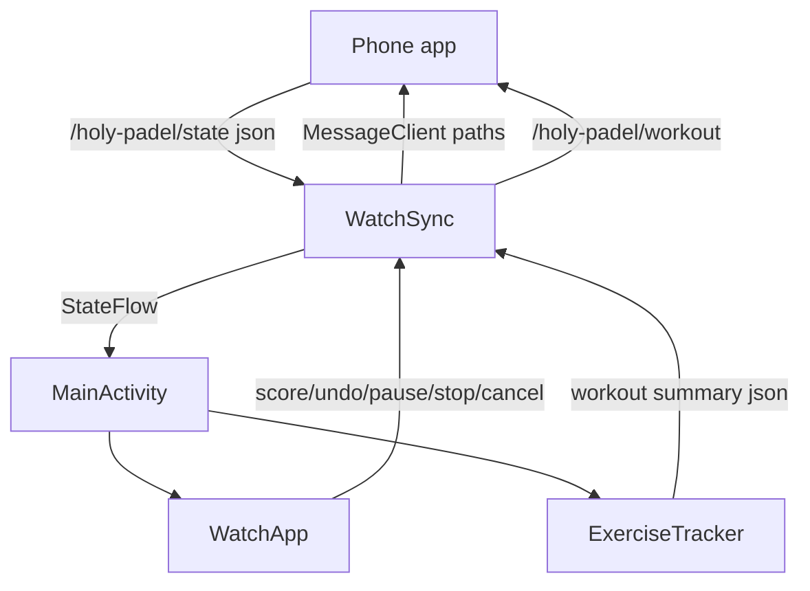
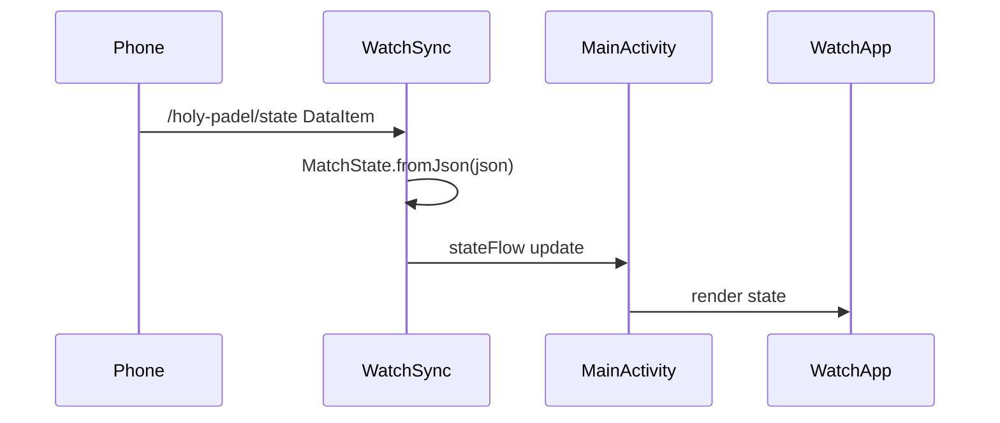

# Wear OS App

The Wear OS app is a companion scoreboard for Holy Padel. It mirrors the phone’s live match state, sends user intents such as scoring and undo back to the phone, and optionally tracks the match as a Health Services exercise while the scoreboard is active.

The watch does **not** compute scoring. The phone remains the single source of truth for the scoring engine, match lifecycle, persistence, and Health Connect writes. The watch renders `MatchState` payloads pushed by the phone and sends fire-and-forget commands over the Wearable Data Layer.



## Responsibilities

The module has three main responsibilities:

1. Mirror the phone’s match state through `WatchSync`.
2. Render the current phase through Compose UI in `WatchApp`.
3. Track optional heart-rate and calorie data through `ExerciseTracker`.

The separation is intentional:

- `MatchState` is the only scoreboard model used by the UI.
- `WatchSync` owns Data Layer read/write behavior.
- `MainActivity` wires lifecycle, sync state, workout tracking, and UI callbacks.
- `ExerciseTracker` is best-effort and must never block or degrade the scoreboard.
- `apps/watch-wear` contains no scoring engine logic.

## Match State Model

`MatchState.kt` defines the mirrored payload from the phone.

```kotlin
enum class Phase { IDLE, LIVE, WON }

data class MatchState(...)
```

`MatchState.phase` drives the entire UI:

- `Phase.IDLE` shows `IdleScreen`
- `Phase.LIVE` shows `LiveScoreScreen`
- `Phase.WON` shows `MatchWonScreen`

`MatchState.fromJson(json: String)` parses the phone payload with `JSONObject`. It maps the phone’s string phase values:

- `"live"` to `Phase.LIVE`
- `"won"` to `Phase.WON`
- anything else to `Phase.IDLE`

Nested payloads are parsed into:

- `TeamState`
- `WonState`
- `LastState`

The watch uses permissive `opt*` parsing throughout. Missing fields become empty strings, `false`, `0L`, or `null`, allowing older or partial phone payloads to keep the watch UI functional.

`MatchState.IDLE` is the local fallback state before the first phone state arrives.

## Data Layer Sync

`WatchSync` bridges Google Play Services Wearable APIs to a `StateFlow<MatchState>`.

```kotlin
class WatchSync(context: Context) : DataClient.OnDataChangedListener
```

It uses:

- `Wearable.getDataClient(appContext)` for mirrored state
- `Wearable.getMessageClient(appContext)` for commands
- `Wearable.getNodeClient(appContext)` to find connected phone nodes
- `Vibrator` for immediate tap feedback

### Paths

`SyncPaths` defines all Wearable Data Layer paths and must stay aligned with the phone side:

```kotlin
object SyncPaths {
    const val STATE = "/holy-padel/state"
    const val SCORE = "/holy-padel/score"
    const val UNDO = "/holy-padel/undo"
    const val START_LAST = "/holy-padel/start-last"
    const val PAUSE = "/holy-padel/pause"
    const val STOP = "/holy-padel/stop"
    const val CANCEL = "/holy-padel/cancel"
    const val END = "/holy-padel/end"
    const val WORKOUT = "/holy-padel/workout"
    const val STATE_KEY = "json"
}
```

### Receiving State

`WatchSync.start()` registers the `DataClient.OnDataChangedListener` and immediately reads existing `dataItems`. This handles the case where the phone published state before the watch started listening.

Incoming state is handled by `onDataChanged(events: DataEventBuffer)`:

1. Ignore events that are not `DataEvent.TYPE_CHANGED`.
2. Ignore items whose path is not `SyncPaths.STATE`.
3. Read `SyncPaths.STATE_KEY` from the `DataMapItem`.
4. Parse the JSON with `MatchState.fromJson`.
5. Assign the result to `stateFlow.value`.

The exposed state is:

```kotlin
val state: StateFlow<MatchState>
```

### Sending Commands

User actions are sent as messages, not local state mutations.

Public command methods call `tap(...)`:

```kotlin
fun score(team: String) = tap(SyncPaths.SCORE, team)
fun undo() = tap(SyncPaths.UNDO, "")
fun startLast() = tap(SyncPaths.START_LAST, "")
fun pause() = tap(SyncPaths.PAUSE, "")
fun stopMatch() = tap(SyncPaths.STOP, "")
fun cancelMatch() = tap(SyncPaths.CANCEL, "")
fun end() = tap(SyncPaths.END, "")
```

`tap(path, body)` provides local haptic feedback with `buzz()` and then calls `broadcast(path, body)`.

`broadcast(path, body)` sends the message body to every connected phone node:

```kotlin
messageClient.sendMessage(node.id, path, body.toByteArray())
```

The visible score only updates after the phone processes the command and publishes the next `/holy-padel/state` payload.

## Activity Wiring

`MainActivity` is the composition root for the Wear app.

```kotlin
class MainActivity : ComponentActivity()
```

In `onCreate`, it creates:

```kotlin
sync = WatchSync(this)
tracker = ExerciseTracker(this)
tracker.onSummary = { summary -> sync.sendWorkout(summary) }
```

It then launches a lifecycle coroutine that collects `sync.state` and drives workout tracking from match phase transitions.

### Phase-Driven Exercise Lifecycle

The activity tracks the previous phase and pause state:

```kotlin
private var lastPhase = Phase.IDLE
private var lastPaused = false
```

When the phone state enters `Phase.LIVE`, `MainActivity` calls:

```kotlin
startTracking(state.startedAt)
```

When the state leaves `Phase.LIVE`, it calls:

```kotlin
tracker.end()
```

While live, pause transitions are mirrored onto Health Services:

```kotlin
if (state.paused) tracker.pause() else tracker.resume()
```

The code only calls pause/resume when `state.paused` changes, avoiding repeated calls into the exercise client.

### Compose Setup

`setContent` collects both sync and workout state:

```kotlin
val state by sync.state.collectAsState()
val stats by tracker.stats.collectAsState()
```

Then it renders:

```kotlin
WatchApp(
    state = state,
    liveBpm = if (stats.tracking) stats.bpm else 0,
    onScore = { team -> sync.score(team) },
    onUndo = { sync.undo() },
    onStartLast = { sync.startLast() },
    onPause = { sync.pause() },
    onStop = { sync.stopMatch() },
    onCancel = { sync.cancelMatch() },
    onEnd = { sync.end() },
)
```

This keeps UI callbacks thin: each UI event maps directly to a `WatchSync` command.

### Activity Lifecycle

`MainActivity.onResume()` starts sync listening:

```kotlin
sync.start()
```

`MainActivity.onPause()` stops sync listening:

```kotlin
sync.stop()
```

`MainActivity.onDestroy()` ends workout tracking:

```kotlin
tracker.end()
```

Leaving the app ends the workout session because the scoreboard and workout are treated as the same active session.

## Exercise Tracking

`ExerciseTracker` tracks the live match as a Health Services exercise.

```kotlin
class ExerciseTracker(context: Context)
```

It exposes live fitness stats through:

```kotlin
data class LiveStats(val bpm: Int, val kcal: Double, val tracking: Boolean)

val stats: StateFlow<LiveStats>
```

The tracker is deliberately best-effort. If permissions are missing, sensors are unavailable, or Health Services calls fail, the scoreboard continues normally.

### Permissions

`ExerciseTracker.hasHeartRatePermission()` checks the heart-rate permission before starting:

- API 36 and above: `"android.permission.health.READ_HEART_RATE"`
- Older versions: `Manifest.permission.BODY_SENSORS`

`MainActivity.startTracking(startedAt)` also performs permission handling. It requests the heart-rate permission and `Manifest.permission.ACTIVITY_RECOGNITION` at most once per process:

```kotlin
private var permissionRequested = false
```

If permission is already granted, it starts tracking immediately. If permission is declined, `ExerciseTracker.start(...)` self-gates and remains idle.

### Starting an Exercise

`ExerciseTracker.start(startedAt: Long)` returns early if already tracking or missing heart-rate permission.

When starting, it resets session state:

- `matchStartedAt`
- `maxBpm`
- `samples`
- `lastSampleAt`

It then registers the update callback and starts a Health Services exercise:

```kotlin
client.startExerciseAsync(
    ExerciseConfig(
        exerciseType = ExerciseType.RACQUETBALL,
        dataTypes = setOf(DataType.HEART_RATE_BPM, DataType.CALORIES_TOTAL),
        isAutoPauseAndResumeEnabled = false,
        isGpsEnabled = false,
        exerciseGoals = emptyList(),
    ),
).await()
```

`ExerciseType.RACQUETBALL` is used because Health Services does not provide a padel exercise type.

### Live Metrics

The internal `ExerciseUpdateCallback` reads:

- `DataType.HEART_RATE_BPM`
- `DataType.CALORIES_TOTAL`

For heart rate, it updates `maxBpm` and stores downsampled samples once every 15 seconds:

```kotlin
const val SAMPLE_INTERVAL_MS = 15_000L
```

Downsampling keeps long matches under Wear Data Layer message size limits.

Each update writes a new `LiveStats` value:

```kotlin
statsFlow.value = LiveStats(
    bpm = bpm ?: statsFlow.value.bpm,
    kcal = kcal ?: statsFlow.value.kcal,
    tracking = true,
)
```

The UI uses this to replace the match clock with live BPM when available.

### Pause, Resume, and End

`pause()` and `resume()` are no-ops unless currently tracking. They call:

```kotlin
client.pauseExerciseAsync().await()
client.resumeExerciseAsync().await()
```

`end()` marks tracking false, calls `client.endExerciseAsync()`, builds a summary, resets live stats, and invokes:

```kotlin
onSummary?.invoke(summary)
```

`MainActivity` wires `onSummary` to `sync.sendWorkout(summary)`, which broadcasts the summary to the phone on `/holy-padel/workout`.

### Workout Summary

`buildSummary()` returns `null` if there are no heart-rate samples and no calories. Otherwise it returns JSON containing:

- `startedAt`
- `endedAt`
- `kcal`
- `avgBpm`
- `maxBpm`
- `samples`

Sample entries use the shape:

```json
{ "t": 1234567890, "bpm": 142 }
```

The phone owns the Health Connect write. Wear OS does not write to Health Connect directly.

## Compose UI

The UI lives under `com.holypadel.wear.ui`.

`WatchApp` is the top-level composable:

```kotlin
fun WatchApp(
    state: MatchState,
    liveBpm: Int,
    onScore: (String) -> Unit,
    onUndo: () -> Unit,
    onStartLast: () -> Unit,
    onPause: () -> Unit,
    onStop: () -> Unit,
    onCancel: () -> Unit,
    onEnd: () -> Unit,
)
```

It renders a black full-screen surface and routes by `state.phase`.

### Idle Screen

`IdleScreen` shows:

- “NO LIVE MATCH”
- optional last-match result from `state.last`
- a `START MATCH` button that calls `onStartLast`
- “or set up on phone”

If `state.last` exists, it displays `ResultBadge(last.won)` and the last score line.

### Live Score Screen

`LiveScoreScreen` uses `HorizontalPager` with two pages:

1. `ControlsPage`
2. `ScorePage`

It starts on page 1, the score face:

```kotlin
val pagerState = rememberPagerState(initialPage = 1) { 2 }
```

`PagerDots` shows which page is active.

### Score Page

`ScorePage` displays a compact header and two tappable team rows.

The header shows:

- live BPM when `liveBpm > 0`, otherwise `state.clock`
- set and games from `state.setLabel` and `state.games`
- `LIVE` or `PAUSED`

Team rows call:

```kotlin
onScore("A")
onScore("B")
```

When `state.paused` is true, the rows are dimmed and taps are disabled. The phone would reject paused scoring anyway, but the watch UI reflects that state locally.

### Controls Page

`ControlsPage` provides:

- undo
- pause/resume
- stop and save
- guarded cancel

Undo is disabled while paused:

```kotlin
CircleIconButton(ControlIcon.UNDO, onClick = onUndo, enabled = !paused)
```

Pause and resume share the same callback:

```kotlin
onPause()
```

The phone owns whether that means pause or resume.

Cancel uses an inline confirmation state:

```kotlin
var confirmingCancel by remember { mutableStateOf(false) }
```

The first tap reveals `DISCARD` and `KEEP`; only `DISCARD` calls `onCancel`.

### Match Won Screen

`MatchWonScreen` renders the winner, score line, duration, and a `DONE` button.

`DONE` calls `onEnd`, which maps to `WatchSync.end()`. The phone treats this as the legacy end/stop flow and publishes a new state that returns the watch to idle.

## Shared UI Primitives

`Colors.kt` defines the watch palette in `CourtColors`.

Important colors include:

- `Black`
- `Ink`
- `Lime`
- `White`
- translucent white variants

`Text.kt` defines text and small visual primitives:

- `DisplayText`
- `LabelText`
- `BodyText`
- `ResultBadge`
- `Dot`

`DisplayText` uses heavy `FontWeight.Black` and slight letter spacing to approximate the app’s display typeface on Wear. `LabelText` is uppercase-style, extra-bold, and widely tracked.

`Screens.kt` also defines local controls:

- `CircleIconButton`
- `drawControlIcon`
- `PillButton`
- `LabeledControl`
- `PagerDots`
- `TeamRow`

`drawControlIcon` draws the control icons directly with `Canvas` instead of relying on an icon dependency.

## Key Flows

### State Mirroring



### Scoring a Point

1. User taps a team half in `ScorePage`.
2. `ScorePage` calls `onScore("A")` or `onScore("B")`.
3. `MainActivity` maps that to `sync.score(team)`.
4. `WatchSync.score` calls `tap(SyncPaths.SCORE, team)`.
5. `tap` calls `buzz()` and `broadcast(...)`.
6. The phone receives the message, updates the real match, and publishes new state.
7. The watch updates only after receiving the next `/holy-padel/state`.

### Workout Summary

1. Phone publishes a transition into `Phase.LIVE`.
2. `MainActivity` calls `startTracking(state.startedAt)`.
3. `ExerciseTracker.start` starts a Health Services exercise if permitted.
4. Health Services updates `ExerciseTracker.stats`.
5. UI shows live BPM when available.
6. Phone publishes a transition out of `Phase.LIVE`.
7. `MainActivity` calls `tracker.end()`.
8. `ExerciseTracker.buildSummary()` creates JSON.
9. `tracker.onSummary` calls `sync.sendWorkout(summary)`.
10. The phone receives `/holy-padel/workout` and owns the Health Connect write.

## Extension Notes

When changing the Wear app, preserve these boundaries:

- Do not add scoring rules to `apps/watch-wear`.
- Add new phone/watch commands through `SyncPaths` and keep the phone side in sync.
- Keep `MatchState.fromJson` tolerant of missing fields unless a protocol migration explicitly requires stricter behavior.
- Keep `ExerciseTracker` best-effort; missing sensors or permissions must not affect scoring.
- Do not mutate visible score locally after a tap. Wait for the phone’s next state push.
- If adding Health Services metrics, update both `ExerciseConfig.dataTypes` and the summary payload consumed by the phone.
- If changing phase behavior, check `MainActivity` because phase transitions drive workout start/end and pause/resume.