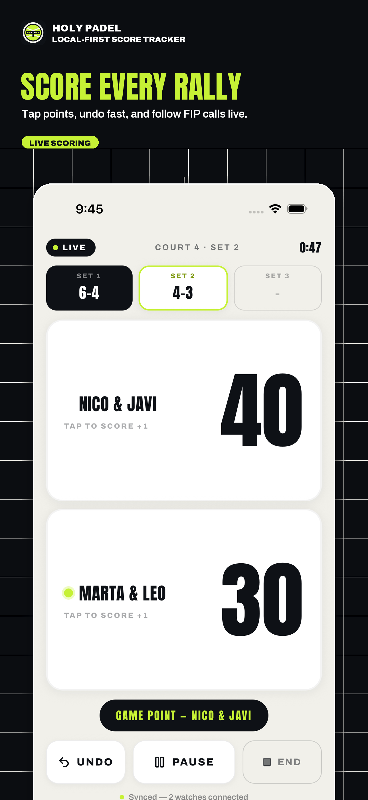
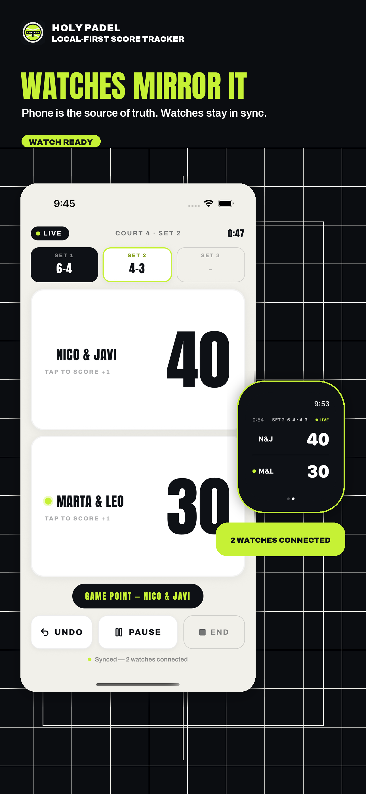
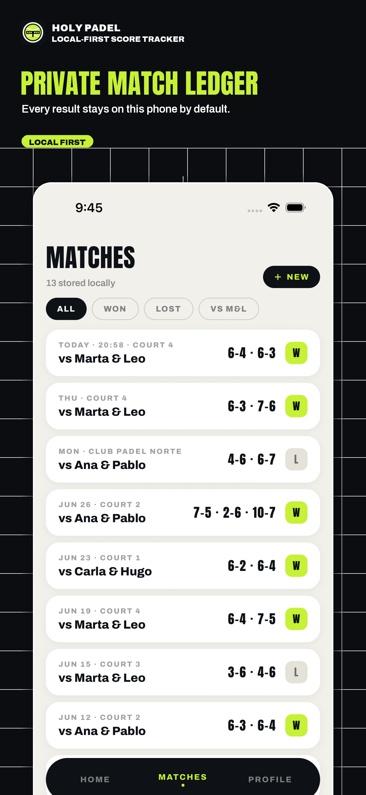
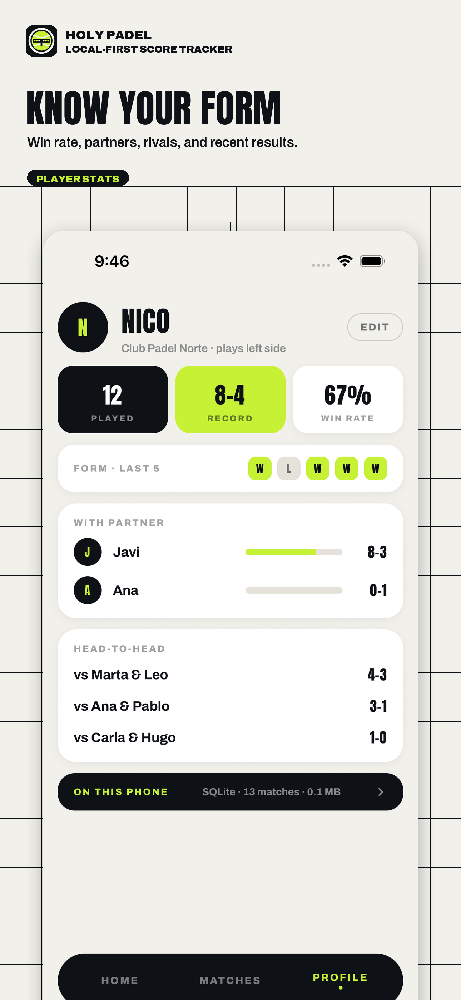

# Holy Padel Project Guide

Holy Padel is an open-source score tracker for padel matches. It is made for real
club play: quick points, quick undo, a clean match history, watches for court-side
scoring, and privacy by default.

<p align="center">
  
  
  
  
</p>

You do not need to know the code to understand the project. This page explains
what the app does and what kind of project it is.

## The Short Version

Holy Padel helps players track a padel match from start to finish.

It can:

- Start a new match with teams, format, court, and first server.
- Score points for Team A or Team B.
- Show games, sets, serving side, and match moments like game point or tie-break.
- Undo accidental taps.
- Pause and resume a match.
- Save a full or partial match when court time ends.
- Keep a private match ledger on the device.
- Show recent form and match history.
- Mirror the live match to Apple Watch and Wear OS.
- Optionally log completed matches as workouts.

## What Makes It Different

### It Understands Padel

Padel scoring is close to tennis, but the details matter. Holy Padel supports
the formats players actually use:

- normal advantage scoring,
- golden point,
- best-of-1 or best-of-3 matches,
- tie-breaks at 6-6,
- super tie-break third sets,
- partial matches that still need to be saved when a booking ends.

The app is built from the official FIP rules, not from a generic scoreboard.

### It Is Local First

Matches are stored locally on the device. There is no required account, no
default upload, and no server deciding the score.

That means the project is useful as a private sports diary as much as a live
scoreboard.

### The Phone Is The Source Of Truth

The phone owns the match. Watches are companions.

When you tap a point on a watch, the watch sends a simple request to the phone:

```text
Team A won a point
```

The phone applies that point, recomputes the match, saves it, and sends the new
display state back to the watch. This avoids two devices disagreeing about the
score.

### Undo Is Honest

The app stores point events. Undo removes the most recent point event and
replays the match.

That is simpler and safer than trying to patch a scoreboard after the fact. It
also makes match resume reliable: the app can always rebuild the current score
from the saved events.

## A Match In The App

1. Choose the teams and match settings.
2. Start the match.
3. Score each rally from the phone or watch.
4. The app updates the current game, set score, serving team, and status.
5. If a mistake happens, undo the last point.
6. If the match ends naturally, save the result.
7. If court time ends early, stop and save the partial result.
8. Review the match later in the ledger and profile stats.

## Screens

The app is organized around a few practical surfaces:

| Screen | Purpose |
| --- | --- |
| Home | Continue a live match, start a match, see recent form |
| Live scoring | Score every rally and see the current state clearly |
| New match | Pick teams, scoring format, first serve, court details |
| Matches | Browse previous matches and live match entries |
| Match overview | Review a saved match and optionally log it as a workout |
| Profile | See player identity, form, and local stats |
| Watch app | Score from the wrist while the phone remains authoritative |

## Privacy And Health

Holy Padel does not need a cloud account to work. The match ledger lives on the
device.

Workout logging is optional. When used, the app writes a completed match to the
platform health system:

- Apple Health on iOS / Apple Watch,
- Health Connect on Android.

The app does not read your health history. It writes only the workout you choose
to log.

## For Open-Source Readers

This project is a good example of:

- a local-first mobile app,
- event-sourced domain logic,
- shared rules across TypeScript, Swift, and Kotlin,
- watch companion apps that mirror state instead of owning state,
- strict TypeScript in a mobile monorepo,
- generated code intelligence docs committed as Markdown.

If you want the technical version, read [Technical overview](technical-overview.md).
