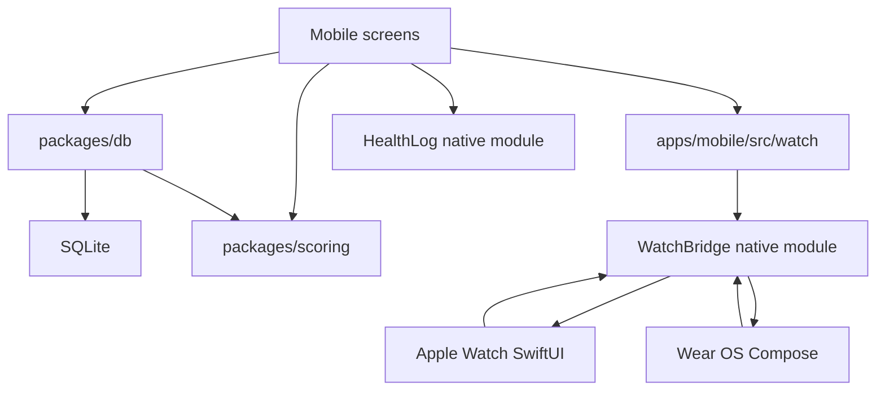

# Holy Padel Technical Overview

This is the human technical map of Holy Padel. It explains how the system works
without requiring you to read every file first.

For generated module-by-module code documentation, see the
[GitNexus wiki](gitnexus-wiki/README.md).

## Core Principles

### 1. The Phone Owns The Match

The phone is the single source of truth. It owns:

- the SQLite database,
- the point-event ledger,
- the scoring engine,
- match lifecycle decisions,
- watch sync state,
- optional health logging from the phone.

Watches never compute scoring. They render state and send intents.

### 2. Scoring Is Pure

The scoring package has no database, UI, network, or device APIs. Its core shape
is:

```ts
computeMatch(config, events)
```

Input:

- `MatchConfig`
- ordered `PointEvent[]`

Output:

- `MatchSnapshot`

Undo is:

```text
events without the last event -> compute again
```

This makes scoring deterministic and easy to test across platforms.

### 3. Persistence Stores Events, Not Derived Truth

SQLite stores the match setup and the point events. Screens derive the current
score by loading events and folding them through the scoring engine.

Derived fields like final score lines can be cached when a match is finished,
but the event stream remains the reliable source for score reconstruction.

### 4. Watches Mirror, Then Ask

The phone sends a compact display payload to Apple Watch and Wear OS. Watches
send back intent messages like:

- score Team A,
- score Team B,
- undo,
- pause,
- stop and save,
- discard.

The phone applies the intent, writes to SQLite, recomputes the match, and pushes
the next state.

## System Map



## Packages And Apps

| Area | Path | Role |
| --- | --- | --- |
| Mobile app | `apps/mobile` | Expo app, routes, UI, DB adapter, watch sync |
| Scoring engine | `packages/scoring` | Pure TypeScript FIP scoring logic |
| Database package | `packages/db` | SQLite schema, migrations, repositories |
| Apple Watch | `apps/mobile/targets/watch` | SwiftUI watch companion |
| Wear OS | `apps/watch-wear` | Kotlin + Compose watch companion |
| Swift scoring port | `packages/scoring-swift` | Native scoring parity against golden vectors |
| Kotlin scoring port | `packages/scoring-kotlin` | Native scoring parity against golden vectors |
| Health module | `apps/mobile/modules/health-log` | Expo native module for workout writes |
| Watch bridge | `apps/mobile/modules/watch-bridge` | Expo native module for watch transport |

## Match Data Flow

### Starting A Match

The mobile app creates a row in `matches` with:

- match id,
- scoring config,
- team player ids,
- start time,
- optional court/location,
- live status.

No score is stored yet. Score begins as an empty event list.

### Scoring A Point

When a user scores a point:

1. UI or watch intent requests a point for Team A or Team B.
2. The DB repository verifies the match exists, is live, and is not paused.
3. The repository loads existing events.
4. `computeMatch(config, events)` confirms the match is still playable.
5. A new point event is appended.
6. Screens and watch sync reload and recompute the snapshot.

### Undo

Undo deletes the latest point event for the match. The next render recomputes the
score from the remaining event list.

### Pause

Pause is stored on the match row using accumulated paused time plus an optional
open pause timestamp. Display duration uses `playedMs()` so live clocks exclude
paused time.

### Stop And Save

The app supports real court behavior: a match may need to be saved before the
official final point.

The shared stop-and-save path recomputes the snapshot and finishes the match:

- if the engine says the match is finished, keep its winner and final score;
- if the match is partial, credit the current leader and save the live score line.

Discard is a separate destructive path.

## Scoring Engine

The canonical engine lives in `packages/scoring`.

It handles:

- standard games,
- advantage deuce,
- golden point,
- star point support,
- set wins,
- 7-5 sets,
- tie-breaks,
- super tie-breaks,
- serving team,
- score moments like game point, set point, match point, deuce, advantage,
- finished state.

Golden vectors are generated from the TypeScript engine and consumed by the Swift
and Kotlin ports. When scoring behavior changes, update the FIP spec, regenerate
vectors, and keep all ports passing.

## Database Layer

The shared database package depends on a tiny `SqlDriver` interface:

```ts
execute(sql, params)
queryAll(sql, params)
```

That lets the app use Expo SQLite while tests use an in-memory Node SQLite
driver.

Main repository responsibilities:

- player roster,
- owner profile,
- match creation/list/detail,
- point event append/load/delete,
- pause/resume,
- finish/reopen/delete,
- profile stats.

## Watch Sync

The shared contract is documented in [watch-sync.md](watch-sync.md).

Phone-to-watch state has three phases:

- `idle`: no live match, maybe quick-start from the last match;
- `live`: current score, clock, serving team, status, points, games;
- `won`: match result screen.

Watch-to-phone messages use paths like:

- `/holy-padel/score`,
- `/holy-padel/undo`,
- `/holy-padel/pause`,
- `/holy-padel/stop`,
- `/holy-padel/cancel`,
- `/holy-padel/start-last`.

Platform transport differs, but payloads stay the same:

| Platform | State transport | Intent transport |
| --- | --- | --- |
| Apple Watch | WatchConnectivity `updateApplicationContext` / `sendMessage` | `sendMessage` with `transferUserInfo` fallback |
| Wear OS | Wearable Data Layer `DataClient` | Wearable Data Layer `MessageClient` |

## Health Logging

Health logging is optional and write-only.

On iOS, the app writes workouts through HealthKit. The Apple Watch can also run
its own workout session.

On Android, the phone writes to Health Connect. Wear OS can track heart rate and
calories with Health Services, then send a workout summary to the phone so the
phone remains the single Health Connect writer.

Scoring does not depend on health APIs.

## Testing Strategy

| Layer | Location | Purpose |
| --- | --- | --- |
| Scoring unit/property tests | `packages/scoring/test` | FIP rules, invariants, undo, vectors |
| DB tests | `packages/db/test` | Repositories, migrations, finished-match guards |
| Mobile unit tests | `apps/mobile/test` | Formatters, seed data, watch state, watch intents |
| Web E2E | `apps/mobile/e2e` | Full user flows through Expo web |
| Native E2E | `apps/mobile/.maestro` | Device shell behavior not covered by web |
| Engine ports | `packages/scoring-swift`, `packages/scoring-kotlin` | Native parity with TypeScript vectors |
| Watch builds | GitHub Actions | SwiftUI and Wear OS compile coverage |

## Generated Code Intelligence

GitNexus indexes the repo and generates a Markdown wiki under
`docs/gitnexus-wiki`.

Use:

```sh
pnpm gitnexus:wiki
```

Useful variants:

```sh
pnpm gitnexus:status
pnpm gitnexus:check
GITNEXUS_WIKI_SKIP_GENERATE=1 pnpm gitnexus:wiki
```

The generated wiki is committed for readers, but excluded from GitNexus analysis
through `.gitnexusignore` so the graph does not index its own generated output.

## Change Guide

| If you change | Also update |
| --- | --- |
| Scoring behavior | `docs/fip-scoring-spec.md`, golden vectors, Swift/Kotlin ports |
| Watch payloads or intents | `docs/watch-sync.md`, mobile watch code, watch apps |
| Database schema | migrations, repository tests, seed tests |
| Design tokens | `DESIGN.md`, `apps/mobile/src/theme/colors.ts`, affected screenshots |
| Native modules | relevant compile workflow and native tests where possible |

## Current Known Graph Finding

`pnpm gitnexus:check` currently reports one file-level cycle between:

- `apps/watch-wear/app/src/main/java/com/holypadel/wear/MainActivity.kt`
- `apps/watch-wear/app/src/main/java/com/holypadel/wear/ui/Screens.kt`

The finding is recorded in `docs/gitnexus-wiki/gitnexus-check.json`.
